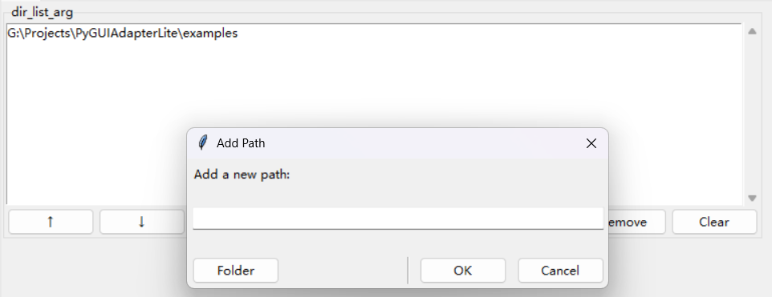

# PyGUIAdapterLite


## 目录

- [PyGUIAdapterLite](#pyguiadapterlite)
  - [0. 一些背景](#0-一些背景)
  - [1. 安装](#1-安装)
  - [2. 快速入门](#2-快速入门)
  - [3. 进阶用法](#3-进阶用法)
    - [3.1 更多类型](#31-更多类型)
      - [3.1.1 基于int的扩展类型](#311-基于int的扩展类型)
        - [(1)`int_r`类型：有范围的整数](#1int_r类型有范围的整数)
        - [(2)`int_s`类型：有范围的整数（滑动条-样式1）](#2int_s类型有范围的整数滑动条-样式1)
        - [(3)`int_ss`类型：有范围的整数（滑动条-样式2）](#3int_ss类型有范围的整数滑动条-样式2)
        - [(4) 示例](#4-示例)
      - [3.1.2 基于float的扩展类型](#312-基于float的扩展类型)
        - [(1)`float_r`类型：有范围的浮点数](#1float_r类型有范围的浮点数)
        - [(2)`float_s`类型：有范围的浮点数（滑动条-样式1）](#2float_s类型有范围的浮点数滑动条-样式1)
        - [(3)`float_ss`类型：有范围的浮点数（滑动条-样式2）](#3float_ss类型有范围的浮点数滑动条-样式2)
        - [(4) 示例](#4-示例)
      - [3.1.3 基于bool的扩展类型](#313-基于bool的扩展类型)
        - [(1)`bool_t`类型：单个复选框](#1bool_t类型单个复选框)
        - [(2) 示例](#2-示例)
      - [3.1.4 基于str的扩展类型](#314-基于str的扩展类型)
        - [(1)`text_t`类型：长文本输入框](#1text_t类型长文本输入框)
        - [(2)`file_t`类型：文件路径选择器](#2file_t类型文件路径选择器)
        - [(3)`directory_t`类型：目录路径选择器](#3directory_t类型目录路径选择器)
        - [(4)`color_hex_t`类型：颜色选择器](#4color_hex_t类型颜色选择器)
        - [(5) 示例](#5-示例)
      - [3.1.5 基于list的扩展类型](#315-基于list的扩展类型)
        - [(1)`string_list_t`类型（字符串列表）及其示例](#1string_list_t类型字符串列表及其示例)
        - [(2)`path_list_t`类型（路径列表）及其示例](#2path_list_t类型路径列表及其示例)
        - [(3)`file_list_t`类型（文件路径列表）及其示例](#3file_list_t类型文件路径列表及其示例)
        - [(4)`dir_list_t`类型（目录路径列表）及其示例](#4dir_list_t类型目录路径列表及其示例)
      - [3.1.6 选项类型](#316-选项类型)
        - [(1)`choice_t`类型（单选组）及其示例](#1choice_t类型单选组及其示例)
        - [(2) `enum.Enum`(枚举类型)、`typing.Literal`类型（自动提取选项的单选组）及其示例](#2-enumenum枚举类型typingliteral类型自动提取选项的单选组及其示例)
        - [(3) `loose_choice_t`（宽松的单选类型）及其示例](#3-loose_choice_t宽松的单选类型及其示例)
        - [(4)`choices_t`类型（多选组）及其示例](#4choices_t类型多选组及其示例)
    - [3.2 错误处理与参数校验](#32-错误处理与参数校验)
      - [3.2.1 错误处理](#321-错误处理)
        - [（1）基本策略：尽可能捕获所有异常](#1基本策略尽可能捕获所有异常)
        - [（2）处理`sys.exit()`和`SystemExit`](#2处理sysexit和systemexit)
      - [3.2.2 参数校验](#322-参数校验)
        - [（1）利用`Exception`提示非法参数以及`ParameterError`的使用](#1利用exception提示非法参数以及parametererror的使用)
        - [（2）通过参数校验函数进行参数校验](#2通过参数校验函数进行参数校验)
        - [（3）小结](#3小结)
    - [3.3 配置输入控件](#33-配置输入控件)
      - [3.3.1 输入控件的可配置属性](#331-输入控件的可配置属性)
      - [3.3.2 如何配置参数控件](#332-如何配置参数控件)
        - [（1）配置控件初始值（default_value）和描述信息（description）的简单方法](#1配置控件初始值default_value和描述信息description的简单方法)
        - [（2）通过`GUIAdapter.add()`方法配置参数控件属性](#2通过guiadapteradd方法配置参数控件属性)
        - [（3）利用函数默认值配置参数控件属性](#3利用函数默认值配置参数控件属性)
        - [（4）在`docstring`中配置参数控件属性](#4在docstring中配置参数控件属性)
        - [（5）小结](#5小结)
      - [3.3.2 `PyGUIAdapterLite`支持的参数类型及其对应控件类型、配置类型、常用可配置属性](#332-pyguiadapterlite支持的参数类型及其对应控件类型配置类型常用可配置属性)
    - [3.4 窗口配置](#34-窗口配置)
    - [3.5 可取消的函数](#35-可取消的函数)
    - [3.6 添加多个函数](#36-添加多个函数)
    - [3.7 进度条](#37-进度条)
    - [3.8 窗口菜单](#38-窗口菜单)
  - [打包应用](#打包应用)
  - [许可证](#许可证)
  - [第三方库许可](#第三方库许可)


## 0. 一些背景

`PyGUIAdapterLite`是我另一个开源项目[`PyGUIAdapter`](https://github.com/zimolab/PyGUIAdapterLite)的Lite版本，在保持基本功能一致的情况下，聚焦于“轻量化”这一目标。因此，它去除了`PyGUIAdapter`中最重量级的外部依赖——`Qt`，使用了更轻量级的`tkinter`作为GUI后端。

使用`tkinter`最大的好处是， 它是Python的标准GUI库，绝大多数情况下随Python一起安装，不需要任何额外的步骤，这也意味着我们基本上无需考虑它与python的版本兼容性以及跨平台问题。

> 部分Linux发行版预装的Python中可能没有包含tkinter， 此时需要手动安装，但这非常简单，以Ubuntu-based发行版为例，可以运行类似以下命令来安装tkinter：
>
> ```
> sudo apt-get install python3-tk
> ```

另外，`tkinter`非常轻量，无论是生成的可执行文件体积还是运行时的内存占用，相比于Qt（无论是`PyQt`还是`PySide`），都要小很多。

`tkinter`另一个潜在的优势并非技术上的，而是法律层面的，相比Qt的几个Python binding， `tkinter`有着更加宽松的许可证，这意味着，在法律上它更加 “安全”。

当然，`tkinter`相比Qt也有其劣势，主要在于功能相对简单，高级控件匮乏，外观样式不够现代化。但是对于开发一个工具类的应用来说，`tkinter`提供的能力已经足够了。

`PyGUIAdapter`和`PyGUIAdapterLite`的定位与另一个开源项目[`Gooey`](https://github.com/chriskiehl/Gooey)类似，都致力于为Python程序员提供一种极其简单的方式，为其Python程序创建一个相对整洁、美观、易用的图形用户界面，同时，允许程序员无需具备GUI编程的相关知识。

> 当然，如果程序员需要扩展`PyGUIAdapter[Lite]`，则需要了解一些GUI编程的知识。

`PyGUIAdapter[Lite]`和[`Gooey`](https://github.com/chriskiehl/Gooey)虽然目标类似，但二者在设计思想、实现机制上存在根本性的差异。

`Gooey`是面向命令行的，它要求程序员首先通过argparse定义命令行参数，然后再将命令行参数翻译为GUI界面。而`PyGUIAdapter[Lite]`则是面向函数的，函数本身已经为创建GUI界面提供了基本但必要的信息。因此，`PyGUIAdapter[Lite]`以函数为基本单元，通过分析函数元信息等 ，自动将函数翻译为用户界面。

总的来说，`PyGUIAdapter[Lite]`适用于工具类应用的开发，如果你刚好需要为你的小工具创建一个图形用户界面，但又不想在GUI代码上投入太多精力，那么，你可以尝试一下`PyGUIAdapter[Lite]`。

> 尽管`PyGUIAdapterLite`已经尽可能在接口上与`PyGUIAdapter`保持一致，但是由于种种原因，无法保证二者接口的完全兼容。不过由于`PyGUIAdapterLite`
> 本身非常简单，因此，不要求用户对`PyGUIAdapter`有所了解，只需要简单阅读文档，就可以上手使用。

## 1. 安装

`PyGUIAdapterLite`的wheel包已经发布到`PyPI`上，可以直接通过pip安装：

```bash
> pip install pyguiadapterlite
```

如果要体验最新功能，可以从GitHub上clone整个项目，然后自行构建:

> `PyGUIAdapterLite`使用了`poetry`作为项目管理和构建工具，因此需要先安装`poetry`。

```bash
> git clone https://github.com/zimolab/PyGUIAdapterLite.git
> cd PyGUIAdapterLite/
> poetry install
> poetry build
```

## 2. 快速入门

使用`PyGUIAdapterLite`非常简单，首先准备好需要翻译为GUI界面的函数。以下面这个最简单的函数为例：

```pycon
def sum_two_numbers(a: int, b: int) -> int:
    """
    计算两个整数之和。
  
    Args:
        a: 第一个整数。
        b: 第二个整数。
      
    Returns:
        两个整数之和。
    """
    return a + b
```

然后，创建`GUIAdapter`示例，调用`GUIAdapter.add()`将上述函数添加到实例中，最后调用`GUIAdapter.run()`将该函数翻译为GUI界面：

```python

if __name__ == "__main__":
    from pyguiadapterlite import GUIAdapter

    adapter = GUIAdapter()
    adapter.add(sum_two_numbers)
    adapter.run()
```

完整代码如下：

```python
def sum_two_numbers(a: int, b: int) -> int:
    """
    计算两个整数之和。
  
    Args:
        a: 第一个整数。
        b: 第二个整数。
      
    Returns:
        两个整数之和。
    """
    return a + b

if __name__ == "__main__":
    from pyguiadapterlite import GUIAdapter

    adapter = GUIAdapter()
    adapter.add(sum_two_numbers)
    adapter.run()
```

运行如上代码，`PyGUIAdapterLite`将生成如下界面：


上述示例虽然非常简单，但为我们展示了`PyGUIAdapterLite`的一些基本特性：

- `PyGUIAdapterLite`为函数的每一个参数创建一个输入控件，输入控件的类型取决于参数的类型，而参数的类型通常通过其typing hint进行推导。`PyGUIAdapterLite`会读取和分析函数参数的类型注解信息，并自动匹配适合的输入控件。

> 也可以在不使用类型标准的情况下为参数指定输入控件类型，这涉及到`GUIAdapterLite`的进阶用法。并且，无论在何种情况下，均推荐用户使用类型注解来描述函数参数。事实证明，这样做可以大大提高代码的可读性和可维护性。

- `PyGUIAdapterLite`也会读取和分析函数的`docstring`，并自动生成对应的帮助信息。帮助信息包含两种类型，一种是函数的描述信息，另一种是函数的每个参数的描述信息。对于函数的描述信息，`PyGUIAdapterLite`会将其显示在单独的Tab页中，而对于参数的描述信息，`PyGUIAdapterLite`会将其显示在每个参数对应的输入控件的旁边，以`tooltip`的形式进行展示。

> 函数和参数的描述信息也可以通过其他方式进行指定，后面我们将说明这一点。

- `PyGUIAdapterLite`会自动生成一个“Execute”按钮，用户点击该按钮后，`PyGUIAdapterLite`会调用函数，并将用户输入的值作为参数传递给函数。同时，`PyGUIAdapterLite`会捕获函数的返回值，默认情况下，`PyGUIAdapterLite`会弹窗显示函数的返回值，并将其显示窗口的模拟终端界面。

> 通过配置，可以改变上述行为，比如，禁用弹窗显示返回值，或者禁止自动打印返回值。这些配置项将在后面详细介绍。

`PyGUIAdapterLite`已经为内置基本类型创建了对应的输入控件，包括`int`、`float`、`str`、`bool`、`enum`等，下面是一个综合的示例，向你展示这些基本类型对应的输入控件默认情况下是什么样的：

```python
import time
from enum import Enum


class FileOperation(Enum):
    """文件操作类型"""

    COPY = "copy"
    MOVE = "move"
    RENAME = "rename"


class HashAlgorithm(Enum):
    """哈希算法类型"""

    MD5 = "md5"
    SHA1 = "sha1"
    SHA256 = "sha256"


def batch_process_files(
    source_dir: str,
    target_dir: str = "",
    file_pattern: str = "*",
    operation: FileOperation = FileOperation.COPY,
    new_name_pattern: str = "",
    calculate_hash: bool = False,
    hash_algorithm: HashAlgorithm = HashAlgorithm.MD5,
    create_backup: bool = True,
    overwrite_existing: bool = False,
    file_size_limit: int = 100,
) -> str:
    """
    批量处理文件的工具函数

    这个函数可以批量复制、移动或重命名文件，支持文件过滤、哈希计算等功能。
    非常适合用于文件整理、备份或数据迁移任务。

    Args:
        source_dir: 源目录路径（必须存在）
        target_dir: 目标目录路径（移动/复制操作时必需）
        file_pattern: 文件匹配模式，如 "*.txt"、"image_*.jpg"
        operation: 文件操作类型：复制、移动或重命名
        new_name_pattern: 重命名模式，如 "file_{index}.{ext}"（重命名操作时使用）
        calculate_hash: 是否计算文件哈希值
        hash_algorithm: 选择哈希算法
        create_backup: 是否创建备份（在目标目录创建backup文件夹）
        overwrite_existing: 是否覆盖已存在的文件
        file_size_limit: 文件大小限制（MB），超过此大小的文件将被跳过

    Returns:
        处理结果的摘要信息
    """
    uprint(f"源目录：{source_dir}")
    uprint(f"目标目录：{target_dir}")
    uprint(f"文件匹配模式：{file_pattern}")
    uprint(f"文件操作类型：{operation.value}")
    uprint(f"新文件名模式：{new_name_pattern}")
    uprint(f"是否计算哈希值：{calculate_hash}")
    uprint(f"哈希算法：{hash_algorithm.value}")
    uprint(f"是否创建备份：{create_backup}")
    uprint(f"是否覆盖已存在文件：{overwrite_existing}")
    uprint(f"文件大小限制：{file_size_limit} MB")

    uprint("开始处理...")
    # 假装在处理
    time.sleep(3)
    uprint("处理完成！")
    return "处理完成！"


if __name__ == "__main__":
    from pyguiadapterlite import GUIAdapter, uprint

    adapter = GUIAdapter()
    adapter.add(batch_process_files)
    adapter.run()
```


上述示例展示了`PyGUIAdapterLite`对基本类型参数的支持，同时，也展示了`uprint()`函数的用法，这个函数与内置的`print()`类似，用于输出一些信息，但与`print()`不同的是，该函数会将信息输出到窗口的模拟终端界面，而非输出到标准输出。

> `uprint()`(或者说窗口的模拟终端界面)对`ANSI`提供有限支持，支持一些颜色和样式，但不支持全部特性。

同时，上述代码还隐藏这一个细节，注意到用户函数`batch_process_files()`中有一行`time.sleep(3)`，这是在模拟耗时操作，当程序在运行到这一行时，我们的界面并没有冻结，这表明，在默认实现中，`PyGUIAdapterLite`将用户函数放在另一个线程中运行，而非在主线程（即UI线程）中，这避免了耗时操作阻塞UI线程。

> 在一些IO密集型的任务中，用户可能仍然会遭遇UI界面卡顿的问题，从我的实践来看，一个可能解决的方法是在用户函数中使用多进程（multiprocessing）。但这超出了本文的讨论范围，感兴趣的读者可以自行研究。

## 3. 进阶用法

### 3.1 更多类型

除了内置的基本类型，`PyGUIAdapterLite`还提供了一些扩展类型，这些类型基本上扩展自基本类型，但拥有更加特定和明确的语义。

> 所有扩展类型定义在`pyguiadapterlite.types.extendtype`模块中，并且可以直接从`pyguiadapterlite.types`包导入。

比如，`file_t`类型本质上就是`str`类型，但在语义上它表示文件路径，针对选择文件路径的需求，该类型会提供一个特定的文件选择控件，而非`str`类型默认的单行文本输入框。

```python
from pyguiadapterlite import GUIAdapter, uprint
from pyguiadapterlite.types import file_t

def foo(str_arg: str, file_arg: file_t):
    """
    这个示例演示str、file_t类型参数控件的差异。
  
    Args:
        str_arg: 字符串参数。
        file_arg: 文件路径参数。
  
    """
    uprint(f"str_arg: {str_arg}")
    uprint(f"file_arg: {file_arg}")


if __name__ == "__main__":
    adapter = GUIAdapter()
    adapter.add(foo)
    adapter.run()
```


除了`file_t`类型，`PyGUIAdapterLite`还提供了很多其他扩展类型，可以满足开发者在大多数场景下的需求。

#### 3.1.1 基于int的扩展类型

##### (1)`int_r`类型：有范围的整数

代表一个有范围的整数，输入控件为一个SpinBox，最大值默认为`2**31 - 1`， 最小值默认为`-(2**31)`，步长默认为`1`。

##### (2)`int_s`类型：有范围的整数（滑动条-样式1）

代表一个有范围的整数，输入控件为一个现代样式的滑动条，最大值默认为`100`， 最小值默认为`0`。

##### (3)`int_ss`类型：有范围的整数（滑动条-样式2）

代表一个有范围的整数，输入控件为一个旧式样式的滑动条，最大值默认为`100`， 最小值默认为`0`，步长默认为`1`，刻度间隔默认为`10`。

##### (4) 示例

```pycon
from pyguiadapterlite import GUIAdapter
from pyguiadapterlite.types import int_r, int_s, int_ss


def int_types_demo(
    normal_int: int = 64,
    int_r_arg: int_r = 3,
    int_s_arg: int_s = 29,
    int_ss_arg: int_ss = 32,
):
    """
    演示基于int类型的扩展类型及其对应输入控件
    """
    return int_r_arg + int_s_arg + int_ss_arg + normal_int


if __name__ == "__main__":
    adapter = GUIAdapter()
    adapter.add(int_types_demo)
    adapter.run()
```

其效果如下：


#### 3.1.2 基于float的扩展类型

##### (1)`float_r`类型：有范围的浮点数

代表一个有范围的浮点数，输入控件为一个SpinBox，最大值默认为`2.0**31 - 1`， 最小值默认为`-(2.0**31 - 1)`，步长默认为`0.1`，默认小数位数为`2`。

##### (2)`float_s`类型：有范围的浮点数（滑动条-样式1）

代表一个有范围的浮点数，输入控件为一个现代样式的滑动条，最大值默认为`100.0`， 最小值默认为`-100.0`。

##### (3)`float_ss`类型：有范围的浮点数（滑动条-样式2）

代表一个有范围的浮点数，输入控件为一个旧式样式的滑动条，最大值默认为`100.0`， 最小值默认为`-100.0`，步长默认为`0.5`，刻度间隔默认为`10`。

##### (4) 示例

```pycon
from pyguiadapterlite import GUIAdapter
from pyguiadapterlite.types import float_r, float_s, float_ss


def float_types_demo(
    normal_float: float = 64.0,
    float_r_arg: float_r = 3.14,
    float_s_arg: float_s = 29,
    float_ss_arg: float_ss = 32,
):
    """
    演示基于int类型的扩展类型及其对应输入控件
    """
    return normal_float + float_r_arg + float_s_arg + float_ss_arg


if __name__ == "__main__":
    adapter = GUIAdapter()
    adapter.add(float_types_demo)
    adapter.run()
```

效果如下：


#### 3.1.3 基于bool的扩展类型

##### (1)`bool_t`类型：单个复选框

普通bol类型的输入控件为两个互斥的单选按钮，分别表示`True`和`False`，而`bool_t`类型则以单个复选框的形式提供表示True/False的能力。

##### (2) 示例

```python
from pyguiadapterlite import uprint, GUIAdapter
from pyguiadapterlite.types import bool_t


def bool_types_demo(normal_bool: bool, bool_t_arg: bool_t):
    uprint(f"Normal bool: {normal_bool}, bool_t bool: {bool_t_arg}")
    return normal_bool and bool_t_arg


if __name__ == "__main__":
    adapter = GUIAdapter()
    adapter.add(bool_types_demo)
    adapter.run()
```

效果如下：


#### 3.1.4 基于str的扩展类型

##### (1)`text_t`类型：长文本输入框

提供用于多行文本输入的控件

##### (2)`file_t`类型：文件路径选择器

提供用于选择文件路径的控件

##### (3)`directory_t`类型：目录路径选择器

也可以使用其别名`dir_t`，提供用于选择目录路径的控件

##### (4)`color_hex_t`类型：颜色选择器

提供用于选择颜色的控件，颜色值以#开头的16进制字符串形式表示，RGB格式

##### (5) 示例

```python
from pyguiadapterlite import uprint, GUIAdapter
from pyguiadapterlite.types import text_t, file_t, dir_t, color_hex_t


def str_types_demo(
    long_string: text_t = "This is a long string",
    file_path: file_t = "/path/to/a/file.txt",
    dir_path: dir_t = "/path/to/a/directory",
    color_value: color_hex_t = "#FF0000",
):
    uprint("Long string:", long_string)
    uprint("File path:", file_path)
    uprint("Directory path:", dir_path)
    uprint("Color value:", color_value)


if __name__ == "__main__":
    adapter = GUIAdapter()
    adapter.add(str_types_demo)
    adapter.run()

```

效果如下：


#### 3.1.5 基于list的扩展类型

`PyGUIAdapterLite`提供了一些基于`list`类型的扩展类型，包括：

##### (1)`string_list_t`类型（字符串列表）及其示例

也可以使用其别名：`str_list`、`string_list`)，用于输入一组字符串。

```python
from pyguiadapterlite import uprint, GUIAdapter
from pyguiadapterlite.types import string_list_t


def str_list_example(str_list_arg: string_list_t):
    uprint(f"len(str_list) == {len(str_list_arg)}")
    for s in str_list_arg:
        uprint(s)


if __name__ == "__main__":
    adapter = GUIAdapter()
    adapter.add(str_list_example)
    adapter.run()
```

效果如下：


添加条目界面：


编辑条目界面：


##### (2)`path_list_t`类型（路径列表）及其示例

也可以使用其别名：`path_list`、`paths_t`，用于输入一组路径(包括文件路径和目录路径)。

```python
from pyguiadapterlite import uprint, GUIAdapter
from pyguiadapterlite.types import path_list_t


def path_list_example(path_list_arg: path_list_t):
    for path in path_list_arg:
        uprint(path)


if __name__ == "__main__":
    adapter = GUIAdapter()
    adapter.add(path_list_example)
    adapter.run()
```

效果如下：


添加路径界面：


编辑路径界面：


##### (3)`file_list_t`类型（文件路径列表）及其示例

也可以使用其别名：`file_list`、`files_t`，用于输入一组路径，仅支持选择文件路径。

```python
from pyguiadapterlite import uprint, GUIAdapter
from pyguiadapterlite.types import file_list_t


def file_list_example(file_list_arg: file_list_t):
    for file in file_list_arg:
        uprint(file)


if __name__ == "__main__":
    adapter = GUIAdapter()
    adapter.add(file_list_example)
    adapter.run()
```

效果如下：


添加路径界面：


编辑路径界面：


##### (4)`dir_list_t`类型（目录路径列表）及其示例

也可以使用其别名：`dir_list`、`dirs_t`，用于输入一组路径，仅支持选择目录路径。

```python
from pyguiadapterlite import uprint, GUIAdapter
from pyguiadapterlite.types import dir_list_t


def dir_list_example(dir_list_arg: dir_list_t):
    for dir_path in dir_list_arg:
        uprint(dir_path)


if __name__ == "__main__":
    adapter = GUIAdapter()
    adapter.add(dir_list_example)
    adapter.run()
```

效果如下：


添加路径界面：



编辑路径界面：


#### 3.1.6 选项类型

有时，可能会有这样的需求，对于某些参数，我们希望用户的输入限定在一组预先提供的选项中，为此，`PyGUIAdapterLite`提供了一些用于支持这种需求的扩展类型，其中，既包括从一组选项中选择一个的单选类型，也包括从一组选项中选择多个的多选类型。

##### (1)`choice_t`类型（单选组）及其示例

也可以使用其别名`option_t`，用于生成单选组。

你可以通过如下方式，指定可选项的范围：

```python

def your_func(arg1: choice_t = ("opt1",  "opt2", "opt3")):
    ...
```

也支持将一个dict作为可选项范围，此时dict中的key将作为选项显示的文本，而其value则将作为真正传给参数的值：

```python
def your_func(arg1: choice_t = {
    "Python": 1,
    "C++": 2,
    "Jave": 3,
    "Rust": 4
}):
    ...
```

下面是一个实际的示例，演示了上面这两种用法：

```python
from pyguiadapterlite import uprint, GUIAdapter
from pyguiadapterlite.types import choice_t

OPTIONS = {
    "Python": 1,
    "C/C++": 2,
    "Java": 3,
    "JavaScript": 4,
    "C#": 5,
    "Swift": 6,
}


def choice_t_example(
    choice_t_arg1: choice_t = ("choice1", "choice2", "choice3"),
    choice_t_arg2: choice_t = OPTIONS,
):
    uprint(f"choice_t_arg1: {choice_t_arg1}, type: {type(choice_t_arg1)}")
    uprint(f"choice_t_arg2: {choice_t_arg2}, type: {type(choice_t_arg2)}")


if __name__ == "__main__":
    adapter = GUIAdapter()
    adapter.add(choice_t_example)
    adapter.run()
```

其效果如下：


执行用户函数，输出如下：


##### (2) `enum.Enum`(枚举类型)、`typing.Literal`类型（自动提取选项的单选组）及其示例

除了使用`choice_t`来实现单选组，`PyGUIAdapterLite`也支持从`Enum`（枚举类）和`Literal`类型中自动提取选项范围，生成单选组。

> 对于枚举类型，最终传递给参数的是所选项对应的枚举对象本身，而非该枚举对象的名称或者值。

下面是一个简单的示例，演示两种类型的用法：

```python
from enum import Enum
from typing import Literal

from pyguiadapterlite import uprint, GUIAdapter


class Weekday(Enum):
    Monday = 1
    Tuesday = 2
    Wednesday = 3
    Thursday = 4
    Friday = 5
    Saturday = 6
    Sunday = 7


def enum_and_literal_example(
    day: Weekday = Weekday.Saturday,
    favorite_fruit: Literal["apple", "banana", "orange", "grape"] = "orange",
):
    uprint(f"day: {day} (type: {type(day)})")
    uprint(f"favorite_fruit: {favorite_fruit} (type: {type(favorite_fruit)})")


if __name__ == "__main__":
    adapter = GUIAdapter()
    adapter.add(enum_and_literal_example)
    adapter.run()
```

其效果如下：


执行用户函数，输出如下：


##### (3) `loose_choice_t`（宽松的单选类型）及其示例

`choice_t`、`Enum`、`Literal`可以被称为__严格的单选类型__，因为用户只能从我们提供的选项中选择其一，有时，我们可能会有这种需求，即用户可以从一组预定义的选项中选择其一，同时，又允许其自行输入自定义的值。为满足这一需求，`PyGUIAdapterLite`提供了一种__宽松的单选类型__——`loose_choice_t`。

```python
from pyguiadapterlite import uprint, GUIAdapter
from pyguiadapterlite.types import loose_choice_t


def loose_choice_example(
    arg1: loose_choice_t = ("Option 1", "Option 2", "Option 3", "Option 4")
):
    uprint(f"arg1: {arg1}")


if __name__ == "__main__":
    adapter = GUIAdapter()
    adapter.add(loose_choice_example)
    adapter.run()
```

其效果如下：


##### (4)`choices_t`类型（多选组）及其示例

`PyGUIAdapterLite`提供了`choices_t`类型，用于让用户从一组预定选项中选择0个或多个选项。

> 传入`choices_t`类型参数的值是一个list，其中包含了用户当前选中的选项。

```python
from pyguiadapterlite import uprint, GUIAdapter
from pyguiadapterlite.types import choices_t

ALL_CHOICES = (
    "Choice 1",
    "Choice 2",
    "Choice 3",
    "Choice 4",
    "Choice 5",
    "Choice 6",
)


def choices_t_example(arg: choices_t = ALL_CHOICES):
    uprint(f"You selected {len(arg)} options")
    if arg:
        uprint(f"The options are: {arg}")


if __name__ == "__main__":
    adapter = GUIAdapter()
    adapter.add(choices_t_example)
    adapter.run()
```


### 3.2 错误处理与参数校验

增强程序健壮性的两个关键方面：一是提前检查用户的输入，发现那些非法的值，尽可能在错误发生之前就阻止它；二是尽可能预见程序可能在哪里失败，捕获可能发生的错误，并从错误中恢复。前者涉及__`参数校验`__的话题，后者则属于__`错误处理`__的内容。`PyGUIAdapterLite`的设计理念是尽可能保持处于可用状态，防止整个应用因用户函数而发生crash，因此，`PyGUIAdapterLite`内建了一些机制，帮助开发者更加轻松的完成__`参数校验`__和__`错误处理`__相关的工作。下面，分别就这两方面进行讨论。

#### 3.2.1 错误处理

##### （1）基本策略：尽可能捕获所有异常

在默认情况下，`PyGUIAdapterLite`将尝试捕获用户函数中发生的任何异常/错误。因此，一般情况下，用户函数中发生的异常不会导致整个程序退出。当捕获到用户函数中发生的异常时，默认的做法是，弹出一个对话框提示用户某处发生了异常，同时，在窗口的模块终端区域打印异常的详细信息，包括trackback信息。

```python
from pyguiadapterlite import uprint, GUIAdapter


def divide(a: int, b: int = 1):
    """尝试b输入0，引发除0异常"""
    r = a / b
    uprint("a/b=", r)
    return r


if __name__ == "__main__":
    adapter = GUIAdapter()
    adapter.add(divide)
    adapter.run()
```


> 尽管`PyGUIAdapterLite`将尝试捕获用户代码中发生的所有异常，但仍然建议开发者尽可能在自己的代码中考虑那些可能发生错误的情况，并捕获因此发生的异常。

##### （2）处理`sys.exit()`和`SystemExit`

在Python中，`SystemExit`是一类特殊的异常，通常由`sys.exit()`调用触发，专门用于程序退出，而不是表示错误，换言之，它的设计意图是用于表示受控的程序终止，而不同于其他表示意外情况的异常。为了错误处理逻辑的一致性，`PyGUIAdapterLite`也对该类异常进行了捕获，因此，用户代码中的`sys.exit()`调用不会导致程序退出。可用使用下面的代码验证这一点：

```python
from pyguiadapterlite import uprint, GUIAdapter


def system_exit_example_1(arg: int):
    if arg == 0:
        uprint("Exiting...")
        sys.exit()
    else:
        uprint("Not exiting...")


if __name__ == "__main__":
    adapter = GUIAdapter()
    adapter.add(system_exit_example_1)
    adapter.run()
```


这一默认的行为可能与用户希望的结果不符，`PyGUIAdapterLite`提供了方法来修改这一行为。`GUIAdapter.add()`有一个参数`capture_system_exit_exception`，当该参数设置为`False`时，`PyGUIAdapterLite`将在捕获到`SystemExit`后尝试退出应用。

```python
import sys

from pyguiadapterlite import uprint, GUIAdapter


def system_exit_example_1(arg: int):
    if arg == 0:
        uprint("Exiting...")
        sys.exit()
    else:
        uprint("Not exiting...")


if __name__ == "__main__":
    adapter = GUIAdapter()
    adapter.add(system_exit_example_1, capture_system_exit_exception=False)
    adapter.run()

```


用户应当根据自身需求，选择合适的策略。

#### 3.2.2 参数校验

`PyGUIAdapterLite`提供了多种参数校验的机制，一来尽可能地简化检验的过程，二来尽可能明确地提示用户哪些是非法的参数以及参数非法的原因。

##### （1）利用`Exception`提示非法参数以及`ParameterError`的使用

我们可能把`参数校验`作为用户代码逻辑的一部分，在用户函数执行过程中检查参数，对应非法的参数，直接抛出异常即可。比如对应前面的例子，我们可用在用户函数中检查参数`b`的值:

```python
from pyguiadapterlite import uprint, GUIAdapter

def divide(a: int, b: int = 1):
    if b == 0:
        raise ValueError("b cannot be zero")
    r = a / b
    uprint("a/b=", r)
    return r

if __name__ == "__main__":
    adapter = GUIAdapter()
    adapter.add(divide)
    adapter.run()

```


这种做法的问题在于，给出非法参数并不是很明确，用户在看到异常信息后还需要自行到参数页中寻找出错的参数。为了解决这一点，`PyGUIAdapterLite`提供了`ParameterError`类型，通过抛出该类型，`PyGUIAdapterLite`可以自动定位出错的参数，并且闪烁参数对应的输入控件边框来提示用户。

> 构造`ParameterError`对象，需要通过以下形式：
>
> ```python
> def foo():
>     ...
>     raise ParameterError(parameter_name="参数名称",message="提示信息")
>
> ```

```python
from pyguiadapterlite import uprint, GUIAdapter, ParameterError


def divide(a: int, b: int = 1):
    if b == 0:
        raise ParameterError(parameter_name="b", message="b cannot be zero")
    r = a / b
    uprint("a/b=", r)
    return r


if __name__ == "__main__":
    adapter = GUIAdapter()
    adapter.add(divide)
    adapter.run()

```


##### （2）通过参数校验函数进行参数校验

除了上述方法，`PyGUIAdapterLite`还允许开发者定义一个专门的参数校验函数，__在调用用户函数之前__对函数参数进行检查。

参数校验函数的定义应当符合如下条件：

- 函数名称任意
- 参数列表的第一个参数用于接收被校验函数的函数名称，第一个参数之后的参数为待检查的参数
- 该函数应当返回一个字典，该字典的key为非法参数的名称，value为参数非法的原因。如返回空字典，则表示不存在非法参数

举例，若用户函数定义如下：

```python
def user_func(param1: int, param2: str, param3: file_t):
    ...
```

则，参数校验函数可以定义为如下形式：

```python
def validate_user_func(func_name: str, **params) -> Dict[str, str]:
    param1 = params.get("param1")
    param2 = params.get("param2")
    param3 = params.get("param3")
    ...
    return {
        "param1": "too big",
        "param2": "empty string not allowed!",
        "param3": "file not found!"
    }
  
```

或者，不通过关键字参数而是直接获取待校验参数：

```python
def validate_user_func(func_name: str, *, param1: int, param2: str, param3: file_t) -> Dict[str, str]:
    ...
    return {
        "param1": "too big",
        "param2": "empty string not allowed!",
        "param3": "file not found!"
    }
```

当指定参数校验函数后，`PyGUIAdapterLite`每次正式调用用户函数前，都会用收集到的参数调用参数校验函数，若参数校验函数返回为空，则继续调用用户函数，若不为空，则表示存在非法参数，`PyGUIAdapterLite`终止调用用户函数，并会逐一列出这些非法的参数及其非法的原因。

开发者可以通过`GUIAdapter.add()`方法的`parameters_validator`参数指定参数校验函数。

下面是一个简单的例子，在`validate()`函数中，我们对`backup_folder()`的每一个参数进行了检查，并根据不同去情况，设置了不同的说明信息。比如，针对`src_folderf`参数，在未输入值时提示信息为“Source folder cannot be empty”，在`src_folder`指向的目录不存在时设置提示信息为“Source folder does not exist”。其他参数也是类似的逻辑。

```python
import os
from typing import Dict

from pyguiadapterlite import uprint, GUIAdapter
from pyguiadapterlite.types import dir_t


def validate(
    func_name: str, *, src_folder: dir_t, dst_folder: dir_t, max_recursion: int
) -> Dict[str, str]:
    uprint(f"Validating parameters for function '{func_name}'...")

    validate_errors = {}

    if max_recursion < 1:
        validate_errors["max_recursion"] = "Max recursion cannot be less than 1."

    if not src_folder:
        validate_errors["src_folder"] = "Source folder cannot be empty."
    elif not os.path.isdir(src_folder):
        validate_errors["src_folder"] = "Source folder does not exist."
    else:
        pass

    if not dst_folder:
        validate_errors["dst_folder"] = "Destination folder cannot be empty."
    elif os.path.isdir(dst_folder) and len(os.listdir(dst_folder)) > 0:
        validate_errors["dst_folder"] = "Destination folder is not empty."
    else:
        pass

    return validate_errors


def backup_folder(src_folder: dir_t, dst_folder: dir_t, max_recursion: int = 10):
    uprint(f"Backing up '{src_folder}' to '{dst_folder}'...")


if __name__ == "__main__":
    adapter = GUIAdapter()
    adapter.add(backup_folder, parameters_validator=validate)
    adapter.run()
```

下面是未通过校验时的效果：


下面则是所有参数均通过校验时的效果：


##### （3）小结

`PyGUIAdapterLite`提供的上述两种机制可以极大地帮助开发者简化参数校验工作，需要注意的是，上述两种方式并非互斥的，开发者完全可以同时应用两种方法，这却决于具体的业务。

### 3.3 配置输入控件

前面，我们介绍了`PyGUIAdapterLiter`支持的常用数据类型及其对应的输入控件，`PyGUIAdapterLite`允许开发者对参数的输入控件进行配置，以调整其外观和行为，使整个程序更加符合用户习惯和预期。

#### 3.3.1 输入控件的可配置属性

从内部实现的角度来看，`PyGUIAdapterLite`的所有输入控件都继承自[`BaseParameterWidget`](pyguiadapterlite/components/valuewidget.py)基类，而`BaseParameterWidget`则由的[`BaseParameterWidgetConfig`](pyguiadapterlite/components/valuewidget.py)类对象进行配置。

`BaseParameterWidgetConfig`中定义了所有参数控件共有的属性，包括：

- `default_value`：显示在控件中的默认值。
- `label`：函数参数标签，显示在输入组件的左侧，默认情况下为函数参数的名称。
- `description`：函数参数的描述信息，如果提供了description信息，则会在输入控件的右侧显示一个小图标（通常是问好），鼠标悬停在该处时，会通过tooltip显示description信息。
- `group`：函数参数所属的分组，当参数比较多时，可以通过分组的方式将不同类别的参数分散到不同的tab页中。如果未指定分组，则函数参数将添加到默认分组中，该分组的名称一般为“Main”。
- `hide_label`：是否隐藏函数参数标签，默认情况下，将显示函数参数标签。

>`BaseParameterWidgetConfig`类的源代码如下：
>
>```python
>@dataclasses.dataclass(frozen=True)
>class BaseParameterWidgetConfig(object):
>    	default_value: Any = None
>	label: str = ""
>    	description: str = ""
>    	group: str = ""
>    	hide_label: bool = False
>    
>    	# noinspection PyAbstractClass
>	@classmethod
>    	@abstractmethod
>    	def target_widget_class(cls) -> Type["BaseParameterWidget"]:
>       		raise NotImplementedError()
>    
>     	@classmethod
>	def new(cls, **kwargs) -> "BaseParameterWidgetConfig":
>       		return cls(**kwargs)
>    
>     	def serialize(self) -> dict:
>   		return dataclasses.asdict(self)
>    
>     	@classmethod
>	def deserialize(cls, json_obj: dict) -> "BaseParameterWidgetConfig":
>       		return cls.new(**json_obj)
>    ```


除了共有的属性，`BaseParameterWidget`的子类通常还会定义属于自己的`BaseParameterWidgetConfig`类，用于配置该输入控件特有的属性。

比如，`str`类型对应的输入控件类为[`StringValueWidget`](pyguiadapterlite/types/strs/line.py#L43)，其对应的配置类为[`StringValue`](pyguiadapterlite/types/strs/line.py#L18)，在`StringValue`类中，定义了`StringValueWidget`专属的属性，包括：

- `echo_char`：回显字符，如果设置了该属性，则在输入控件中输入的值，将会以该字符显示，而不是实际输入的内容。非常适合密码输入场景。
- `justify`：文本对齐方式，可以设置为`left`、`center`或`right`。

>`StringValue`类源代码如下：
>
>```python
>@dataclasses.dataclass(frozen=True)
>class StringValue(BaseParameterWidgetConfig):
>    	default_value: str = ""
>         echo_char: str = ""
>         justify: Literal["left", "center", "right"] = "left"
>        
>         @classmethod
>         def target_widget_class(cls) -> Type["StringValueWidget"]:
>             return StringValueWidget
>    ```


又比如，`int_r`类型对应的输入控件类为[`RangedIntValueWidget`](pyguiadapterlite/types/ints/ranged.py#L79)，其对应的配置类为[`RangedIntValue`](pyguiadapterlite/types/ints/ranged.py#L20)，在`RangedIntValue`类中，定义了`RangedIntValueWidget`专属的属性，包括：

- `min_value`：最小值。
- `max_value`：最大值。
- `step`：单步调整长度（步长）。
- `wrap`：是否支持循环（即输入值超过最大值时，自动回到最小值，或者输入值低于最小值时，自动回到最大值）。

>```python
>@dataclasses.dataclass(frozen=True)
>class RangedIntValue(BaseParameterWidgetConfig):
>    	default_value: int = 0
>    	min_value: int = MIN_VALUE
>    	max_value: int = MAX_VALUE
>    	step: int = 1
>    	wrap: bool = False
>
>    @classmethod
>    def target_widget_class(cls) -> Type["RangedIntValueWidget"]:
>        return RangedIntValueWidget
>    
>```


总结：在`PyGUIAdapterLite`中，一个类型对应了一个输入控件类（BaseParameterWidget子类），一个输入控件对应着一个配置类（BaseParameterWidgetConfig子类），控件的配置类管理着控件可配置的属性，配置控件本质上就是修改配置类中定义的属性。

#### 3.3.2 如何配置参数控件

`PyGUIAdapterLite`提供了多种配置参数控件的方法。

##### （1）配置控件初始值（default_value）和描述信息（description）的简单方法

如果只是想要设置参数的默认值和描述信息，可以采用一种简单而自然的方式。

- 对于`default_value`：对于绝大多数类型而言，用户函数中参数的默认值就是控件中显示的初始值，因此，如果你希望控件显示一个初始值，将对应参数的默认值设置为该值即可。

  > 这里存在一些例外情况，对于选项相关的类型，比如`choice_t`/`loose_choice_t`/`choices_t`而言，参数的默认值一般被用于设置可选项范围，[__3.1.6 选项类型__](#316-选项类型)小节给出了相关演示。

- 对于`description`，开发者可以通过函数的`docstring`进行设置。`PyGUIAdapterLite`支持多种风格的`docstring`，包括：`ReST`、`Google`、`Numpydoc-style`、`Epydoc`。

  ```python
  def my_function_1(
      param1: int = 100,
      param2: str = "Hello World",
      param3: float = 3.14,
      param4: bool = True,
  ):
      """
      This is the function description.
      :param param1: description of the param1
      :param param2: description of the param2
      :param param3: description of the param3
      :param param4: description of the param4
      :return:
      """
      pass
  
  def my_function_2(
      param1: int = 100,
      param2: str = "Hello World",
      param3: float = 3.14,
      param4: bool = True,
  ):
      """
      This is the function description.
      Args:
          param1: description of the param1
          param2: description of the param2
          param3: description of the param3
          param4: description of the param4
  
      Returns:
      
      """
      pass
  ```

  因此，上述示例中，两个函数`docstring`中对于各个参数的描述信息都能够被正常解析，并以tooltip的形式展示出来。

  

#####	（2）通过`GUIAdapter.add()`方法配置参数控件属性

`GUIAdapter.add()`方法提供了`widget_configs`参数，用于配置用户函数各参数的控件相关属性。开发者需要传入一个`dict`给参数，其中`dict`的`key`是函数参数的名称，`value`则为对应控件配置类的实例（前文提到的`BaseParameterWidgetConfig`的子类，具体某种类型对应哪个`BaseParameterWidgetConfig`，参考下一节）。

比如，对于以下函数：

```python
def foo(arg1: int, arg2: float, arg3: str):
    pass
```

可以像下面这样配置参数控件：

```python

    {
        "arg1": IntValue(
            label="Argument 1",
            description="This is the description of arg1",
            default_value=10,
            auto_correct=True,
        ),
        "arg2": FloatValue(
            label="Argument 2",
            description="This is the description of arg2",
            default_value=20.0,
        ),
        "arg3": StringValue(
            label="Argument 3",
            description="This is the description of arg3",
            default_value="Hello",
            echo_char="*",
            justify="center",
        ),
    }
```

完整代码：

```python
from pyguiadapterlite import GUIAdapter
from pyguiadapterlite.types import IntValue, FloatValue, StringValue


def foo(arg1: int, arg2: float, arg3: str):
    pass


if __name__ == "__main__":
    PARAM_CONFIGS = {
        "arg1": IntValue(
            label="Argument 1",
            description="This is the description of arg1",
            default_value=10,
            auto_correct=True,
        ),
        "arg2": FloatValue(
            label="Argument 2",
            description="This is the description of arg2",
            default_value=20.0,
        ),
        "arg3": StringValue(
            label="Argument 3",
            description="This is the description of arg3",
            default_value="Hello",
            echo_char="*",
            justify="center",
        ),
    }

    adapter = GUIAdapter()
    adapter.add(foo, widget_configs=PARAM_CONFIGS)
    adapter.run()
```


`GUIAdapter.add()`除了支持通过`widget_configs`来配置参数控件，现在也支持如下形式：

```python
from pyguiadapterlite import GUIAdapter, uprint
from pyguiadapterlite.types import IntValue, FloatValue, StringValue


def foo(arg1: int, arg2: float, arg3: str):
    uprint(f"arg1: {arg1}, arg2: {arg2}, arg3: {arg3}")


if __name__ == "__main__":
    adapter = GUIAdapter()
    adapter.add(
        foo,
        arg1=IntValue(
            label="Argument 1",
            description="This is the description of arg1",
            default_value=10,
            auto_correct=True,
        ),
        arg2=FloatValue(
            label="Argument 2",
            description="This is the description of arg2",
            default_value=20.0,
        ),
        arg3=StringValue(
            label="Argument 3",
            description="This is the description of arg3",
            default_value="Hello",
            echo_char="*",
            justify="center",
        ),
    )
    adapter.run()

```

相比传递一个`dict`给`widget_configs`，上面这种用法可能看上去更直观一些。

下面是一个更加复杂一些的例子，演示了更多数据类型：

```python
import os

from pyguiadapterlite import uprint, GUIAdapter
from pyguiadapterlite.types import (
    choice_t,
    int_ss,
    file_t,
    SingleChoiceValue,
    ScaleIntValue2,
    FileValue,
    StringValue,
    bool_t,
    BoolValue2,
)


def my_function(
    param1: str, param2: choice_t, param3: int_ss, param4: file_t, param5: bool_t
):
    """
    This is the function description. The parameters of this function will be configured using `GUIAdapter.add()` method.
    """
    uprint("param1:", param1)
    uprint("param2:", param2)
    uprint("param3:", param3)
    uprint("param4:", param4)
    uprint("param5:", param5)


if __name__ == "__main__":
    PARAM_CONFIGS = {
        "param1": StringValue(
            label="Password",
            default_value="default value of param1",
            description="Input your password",
            echo_char="*",
            justify="center",
        ),
        "param2": SingleChoiceValue(
            label="Hash Algorithm",
            choices=["MD5", "SHA1", "SHA256", "SHA512"],
            default_value="SHA256",
            description="Select a hash algorithm",
        ),
        "param3": ScaleIntValue2(
            label="Keep Alive Time",
            default_value=10,
            description="Keep alive time in minutes",
            min_value=0,
            max_value=20,
            step=5,
            tick_interval=5,
        ),
        "param4": FileValue(
            label="File to Upload",
            default_value="",
            description="Select a file to upload",
            filters=[
                ("Text Files", "*.txt"),
                ("Python Files", "*.py"),
                ("All Files", "*.*"),
            ],
            start_dir=os.getcwd(),
            select_button_text="Select File",
        ),
        "param5": BoolValue2(
            label="Enable SSL",
            default_value=True,
            description="Enable SSL encryption",
        ),
    }

    adapter = GUIAdapter()
    adapter.add(my_function, widget_configs=PARAM_CONFIGS)
    adapter.run()

```


##### （3）利用函数默认值配置参数控件属性

如果函数参数的默认值被指定一个`BaseParameterWidgetConfig`子类对象，那么，`PyGUIAdapterLite`将把该对象作为该参数对应控件的配置对象。利用这一机制，上面的例子可以改写为：

```python
import os

from pyguiadapterlite import uprint, GUIAdapter
from pyguiadapterlite.types import (
    choice_t,
    int_ss,
    file_t,
    SingleChoiceValue,
    ScaleIntValue2,
    FileValue,
    StringValue,
    bool_t,
    BoolValue2,
)


#Configurations of the parameters for the function my_function
PARMA1_CONF = StringValue(
    label="Password",
    default_value="default value of param1",
    description="Input your password",
    echo_char="*",
    justify="center",
)
PARMA2_CONF = SingleChoiceValue(
    label="Hash Algorithm",
    choices=["MD5", "SHA1", "SHA256", "SHA512"],
    default_value="SHA256",
    description="Select a hash algorithm",
)
PARMA3_CONF = ScaleIntValue2(
    label="Keep Alive Time",
    default_value=10,
    description="Keep alive time in minutes",
    min_value=0,
    max_value=20,
    step=5,
    tick_interval=5,
)
PARMA4_CONF = FileValue(
    label="File to Upload",
    default_value="",
    description="Select a file to upload",
    filters=[
        ("Text Files", "*.txt"),
        ("Python Files", "*.py"),
        ("All Files", "*.*"),
    ],
    start_dir=os.getcwd(),
    select_button_text="Select File",
)
PARMA5_CONF = BoolValue2(
    label="Enable SSL",
    default_value=True,
    description="Enable SSL encryption",
)

#function defined here
def my_function(
    param1: str = PARMA1_CONF,
    param2: choice_t = PARMA2_CONF,
    param3: int_ss = PARMA3_CONF,
    param4: file_t = PARMA4_CONF,
    param5: bool_t = PARMA5_CONF,
):
    """
    The parameters of this function will be configured using the default value of its parameters.
    """
    uprint("param1:", param1)
    uprint("param2:", param2)
    uprint("param3:", param3)
    uprint("param4:", param4)
    uprint("param5:", param5)


if __name__ == "__main__":
    adapter = GUIAdapter()
    adapter.add(my_function)
    adapter.run()
```

##### （4）在`docstring`中配置参数控件属性

开发者可以在函数的`docstring`中配置参数的控件。`PyGUIAdapterLite`将`docstring`中使用`@params`和`@end`包裹起来文本块视为参数控件的配置块，配置块的格式为`TOML`。在配置块中，开发者可以使用如下格式配置指定参数控件属性：

```toml
[参数名称]
属性名称1 = 属性值1
属性名称2 = 属性值2
属性名称N = 属性值N
```

下面是一个简单的示例：

```python
from pyguiadapterlite import uprint, GUIAdapter
from pyguiadapterlite.types import int_r, bool_t


def my_function(username: str, password: str, age: int_r, keep_logged_in: bool_t):
    """
    The parameter widgets of this function will be configured in the docstring below using config block syntax.

    @params
    [username]
    label = "Username"
    default_value = "admin"
    description = "Please enter your username"

    [password]
    label = "Password"
    default_value = "123456"
    description = "Please enter your password"
    echo_char = "*"

    [age]
    label = "Age"
    default_value = 25
    description = "Please enter your age"
    min_value = 18
    max_value = 100

    [keep_logged_in]
    label = "Keep me logged in"
    default_value = true

    @end

    """
    uprint(f"Username: {username}")
    uprint(f"Password: {password}")
    uprint(f"Age: {age}")
    uprint(f"Keep logged in: {keep_logged_in}")


if __name__ == "__main__":
    adapter = GUIAdapter()
    adapter.add(my_function)
    adapter.run()

```


##### （5）小结

前面介绍了几种配置参数控件属性的方法，有各自适合的场景和限制，并无优劣之分，开发者可以根据需要和喜好选择合适的方法来配置函数参数的控件。

#### 3.3.2 `PyGUIAdapterLite`支持的参数类型及其对应控件类型、配置类型、常用可配置属性

下面这篇文档列出了`PyGUIAdapterLite`支持的参数类型及其对应控件类型、配置类型、常用可配置属性，同时给出了相应的示例代码。读者可自行查阅。


[__`PyGUIAdapterLite`支持的参数类型及其控件__](docs/types_and_widgets.md)


### 3.4 窗口配置

> TODO

### 3.5 可取消的函数

> TODO

### 3.6 添加多个函数

> TODO

### 3.7 进度条

> TODO

### 3.8 窗口菜单

> TODO

## 打包应用

> TODO

## 许可证

本项目使用MIT许可证，完整的许可证文本见`LICENSE`文件。 请在遵守相关法律法规的前提下使用本项目。

## 第三方库许可

本项目使用了以下优秀的开源库：

- **IconPark**

  - 用途：使用了IconPark部分图标，版权归IconPark所有。
  - 许可：Apache License 2.0
  - 许可证文件：`licenses/IconPark-LICENSE.txt`
  - 项目地址：https://github.com/bytedance/IconPark
- **tomlkit**

  - 用途：解析和生成TOML格式的配置文件。
  - 许可：MIT License
  - 许可证文件：`licenses/tomlkit-LICENSE.txt`
  - 项目地址：https://github.com/python-poetry/tomlkit/
- **docstring_parser**

  - 用途：解析Python文件的docstring。
  - 许可：MIT License
  - 许可证文件：`licenses/docstring_parser-LICENSE.md`
  - 项目地址：https://github.com/rr-/docstring_parser
