# PyGUIAdapterLite

[中文文档](README.md)

## Content

[TOC]


## 0. Background

`PyGUIAdapterLite` is the lite version of my other open-source project [`PyGUIAdapter`](https://github.com/zimolab/PyGUIAdapterLite), which focuses on "lightweight". It removes the heaviest external dependency, `Qt`, and uses `tkinter` as the GUI backend instead.
The main advantage of using `tkinter` is that it is the "standard" GUI library in Python, and it is usually installed along with Python, so we don't need to worry about the compatibility and cross-platform issues.

> In some Linux distributions, tkinter may not be pre-installed with Python, in which case you need to install it manually. 
> For example, on Ubuntu-based distributions, you can run the following command to install tkinter:
> ```bash
> sudo apt-get install python3-tk
>```

`tkinter` has a very small footprint, both in terms of the executable file size and the memory usage, compared to Qt (both `PyQt` and `PySide`).

`tkinter` also has a "permissive" license compared to Qt and its Python bindings.

Of course, `tkinter` is not a 100% replacement for Qt, `tkinter` has its own limitations, such as the lack of advanced controls and the outdated appearance style. However, for a tool-class application, `tkinter` provides enough capabilities.

Take all the considerations mentioned above into account, I decide to create the new project `PyGUIAdapterLite`.

`PyGUIAdapter` and `PyGUIAdapterLite`  (let's call them  `PyGUIAdapter[Lite]`) share a similar positioning with another open-source project, Gooey. Both are dedicated to providing Python programmers with an extremely simple way to create a relatively clean, aesthetically pleasing, and user-friendly graphical user interface for their Python programs, while allowing programmers to do so without requiring any expertise in GUI programming.


> To extend `PyGUIAdapter[Lite]` (for instance, by creating a new parameter type and widget), foundational knowledge of GUI programming in PyQt or Tkinter is required.

While `PyGUIAdapter[Lite]` and [`Gooey`](https://github.com/chriskiehl/Gooey) share similar goals, they differ fundamentally in their design philosophy and underlying implementation.

`Gooey` is command-line oriented. It requires programmers to define command-line arguments using `argparse`, which are then translated into a GUI interface. In contrast, `PyGUIAdapter[Lite]` is function-oriented. The function itself provides enough information needed to construct the GUI. As a result, `PyGUIAdapter[Lite]` treats functions as the core building blocks, automatically generating user interfaces by analyzing function signature.

In summary, `PyGUIAdapter[Lite]` is well-suited for developing utility applications. If you need to create a graphical interface for your  python script but prefer not to invest significant effort in writing GUI code, `PyGUIAdapter[Lite]` is worth trying.


## 1. Install

The wheel package for `PyGUIAdapterLite` has been released on `PyPI` and can be installed via `pip`:

```bash
pip install pyguiadapterlite
```

To experience the latest features, you can clone the entire project from GitHub and build it yourself:

> `PyGUIAdapterLite` uses `poetry` as its build tool, so `poetry` must be installed first if you decide to build it yourself.

```bash
git clone https://github.com/zimolab/PyGUIAdapterLite.git
cd PyGUIAdapterLite/
poetry install
poetry build
```

## 2. Quick Start

Using `PyGUIAdapterLite` is very straightforward. First, prepare the function you want to convert into a GUI. Take the following simple function as an example:

```pycon
def sum_two_numbers(a: int, b: int) -> int:
    """
    计算两个整数之和。

    Args:
        a: 第一个整数。
        b: 第二个整数。

    Returns:
        两个整数之和。
    """
    return a + b
```

Then, create a `GUIAdapter` instance, call `GUIAdapter.add()` to add the above function to the instance, and finally invoke `GUIAdapter.run()` to translate it into a GUI interface:

```python

if __name__ == "__main__":
    from pyguiadapterlite import GUIAdapter

    adapter = GUIAdapter()
    adapter.add(sum_two_numbers)
    adapter.run()
```

The complete code is as follows:

```python
def sum_two_numbers(a: int, b: int) -> int:
    """
    计算两个整数之和。

    Args:
        a: 第一个整数。
        b: 第二个整数。

    Returns:
        两个整数之和。
    """
    return a + b

if __name__ == "__main__":
    from pyguiadapterlite import GUIAdapter

    adapter = GUIAdapter()
    adapter.add(sum_two_numbers)
    adapter.run()
```

Run the code, we will get：

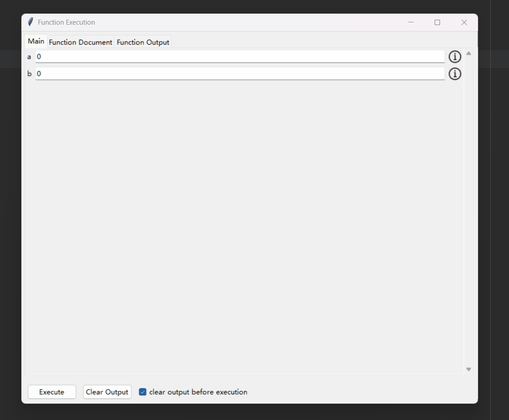

While the example above is quite simple, it demonstrates some fundamental features of `PyGUIAdapterLite`:

- `PyGUIAdapterLite` automatically generates an input widget for each function parameter. The widget type is determined by the parameter's type, which is typically inferred from its type annotation.`PyGUIAdapterLite` analyzes the type annotations of function parameters and selects appropriate input widgets accordingly.

> It is also possible to specify widget types without using type annotations through some additional  configurations. However, type-hinting every parameter of a function is always recommended as it significantly improves code readability and maintainability.

- `PyGUIAdapterLite` parses the function's docstring to generate help information in two forms: function-level description and parameter-specific descriptions. The function description is displayed in a separate tab, while parameter description text appears as tooltips alongside their corresponding input widgets.

> If you don't like docstrings or the description text is too long to put them in the docstring, both function and parameter description texts can be specified in other way , which will be explained later.

- When the `Execute`  button clicked, `PyGUIAdapterLite` calls the function and captures its return value. By default, the return will be shown in a popup window and printed to the output area (which looks like a terminal but fake) in the window.

> This behavior can be customized—for example, by disabling the popup window. These configuration options will be covered in detail later.

`PyGUIAdapterLite` comes with built-in input widgets for common data types including `int`, `float`, `str`, `bool`, and `enum`. Here is a comprehensive example:

```python
import time
from enum import Enum


class FileOperation(Enum):
    """文件操作类型"""

    COPY = "copy"
    MOVE = "move"
    RENAME = "rename"


class HashAlgorithm(Enum):
    """哈希算法类型"""

    MD5 = "md5"
    SHA1 = "sha1"
    SHA256 = "sha256"


def batch_process_files(
        source_dir: str,
        target_dir: str = "",
        file_pattern: str = "*",
        operation: FileOperation = FileOperation.COPY,
        new_name_pattern: str = "",
        calculate_hash: bool = False,
        hash_algorithm: HashAlgorithm = HashAlgorithm.MD5,
        create_backup: bool = True,
        overwrite_existing: bool = False,
        file_size_limit: int = 100,
) -> str:
    """
    批量处理文件的工具函数

    这个函数可以批量复制、移动或重命名文件，支持文件过滤、哈希计算等功能。
    非常适合用于文件整理、备份或数据迁移任务。

    Args:
        source_dir: 源目录路径（必须存在）
        target_dir: 目标目录路径（移动/复制操作时必需）
        file_pattern: 文件匹配模式，如 "*.txt"、"image_*.jpg"
        operation: 文件操作类型：复制、移动或重命名
        new_name_pattern: 重命名模式，如 "file_{index}.{ext}"（重命名操作时使用）
        calculate_hash: 是否计算文件哈希值
        hash_algorithm: 选择哈希算法
        create_backup: 是否创建备份（在目标目录创建backup文件夹）
        overwrite_existing: 是否覆盖已存在的文件
        file_size_limit: 文件大小限制（MB），超过此大小的文件将被跳过

    Returns:
        处理结果的摘要信息
    """
    uprint(f"源目录：{source_dir}")
    uprint(f"目标目录：{target_dir}")
    uprint(f"文件匹配模式：{file_pattern}")
    uprint(f"文件操作类型：{operation.value}")
    uprint(f"新文件名模式：{new_name_pattern}")
    uprint(f"是否计算哈希值：{calculate_hash}")
    uprint(f"哈希算法：{hash_algorithm.value}")
    uprint(f"是否创建备份：{create_backup}")
    uprint(f"是否覆盖已存在文件：{overwrite_existing}")
    uprint(f"文件大小限制：{file_size_limit} MB")

    uprint("开始处理...")
    # 假装在处理
    time.sleep(3)
    uprint("处理完成！")
    return "处理完成！"


if __name__ == "__main__":
    from pyguiadapterlite import GUIAdapter, uprint

    adapter = GUIAdapter()
    adapter.add(batch_process_files)
    adapter.run()
```


The example above demonstrates `PyGUIAdapterLite`'s support for basic types, while also showcasing the usage of the `uprint()` function. This function is similar to the built-in `print()` function and is used for outputting messages. However, unlike `print()`, it directs the output to the window's output area （fake terminal）instead of the standard output(stdout).

> The window's fake terminal provides limited support for ANSI, including some colors and styles, but does not support all features.

Meanwhile, there's a subtle detail hidden in the above code. Notice the line `time.sleep(3)` in the user function `batch_process_files()`, which simulates a time-consuming operation. When the program reaches this line, the GUI doesn't freeze. This indicates that, in its default implementation, `PyGUIAdapterLite` executes user functions in a separate thread rather than in the main thread (i.e., the UI thread), thus preventing time-consuming operations from blocking the UI thread.

> In some I/O bound tasks, users may still encounter UI freezes or become unresponsive. Based on my experience, one potential solution is to move the operation to a separate process. However, this topic falls outside the scope of this article, and interested readers can explore this approach independently.


## 3. Advanced Usage

### 3.1 More parameter types

In addition to the basic types, `PyGUIAdapterLite` also provides several extended types, which are essentially derived from the basic types but possess more specific and well-defined semantics.

> All extended types are defined in the `pyguiadapterlite.types.extendtype` module and can be imported directly from the `pyguiadapterlite.types` package.

For example, the `file_t` type derives from the `str` type but semantically represents a file path. To address the need for selecting  a file path, this type provides an input widget for choosing a file instead of the default line edit used for `str` type.

```python
from pyguiadapterlite import GUIAdapter, uprint
from pyguiadapterlite.types import file_t

def foo(str_arg: str, file_arg: file_t):
    """
    这个示例演示str、file_t类型参数控件的差异。

    Args:
        str_arg: 字符串参数。
        file_arg: 文件路径参数。

    """
    uprint(f"str_arg: {str_arg}")
    uprint(f"file_arg: {file_arg}")


if __name__ == "__main__":
    adapter = GUIAdapter()
    adapter.add(foo)
    adapter.run()
```

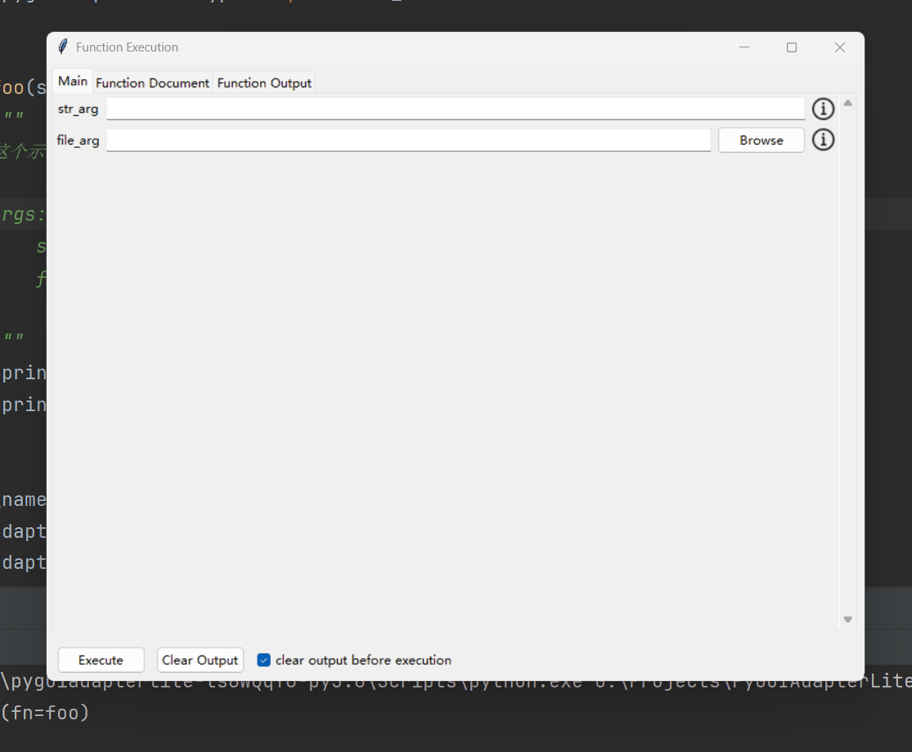

In addition to the `file_t` type, `PyGUIAdapterLite` provides many other extended types to meet developers' needs in most scenarios.

#### 3.1.1 `int-based` Types

##### (1) `int_r` Type: Integer with Range

Represents an integer with a defined range. The input widget is a Spin Box, with a default maximum value of `2**31 - 1`, a default minimum value of `-(2**31)`, and a default step size of `1`.

##### (2) `int_s` Type: Integer with Range (Slider - Style 1)

Represents an integer with a defined range. The input widget is a modern-style slider, with a default maximum value of `100` and a default minimum value of `0`.

##### (3) `int_ss` Type: Integer with Range (Slider - Style 2)

Represents an integer with a defined range. The input widget is an old-style slider, with a default maximum value of `100`, a default minimum value of `0`, a default step size of `1`, and a default tick interval of `10`.

##### (4) Example

```pycon
from pyguiadapterlite import GUIAdapter
from pyguiadapterlite.types import int_r, int_s, int_ss


def int_types_demo(
        normal_int: int = 64,
        int_r_arg: int_r = 3,
        int_s_arg: int_s = 29,
        int_ss_arg: int_ss = 32,
):
    """
    演示基于int类型的扩展类型及其对应输入控件
    """
    return int_r_arg + int_s_arg + int_ss_arg + normal_int


if __name__ == "__main__":
    adapter = GUIAdapter()
    adapter.add(int_types_demo)
    adapter.run()
```

It outputs:

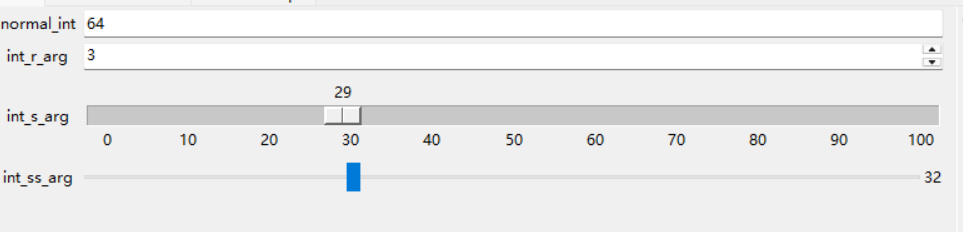

#### 3.1.2 `float-based` Types

##### (1) `float_r` Type: Float Number with Range

Represents a float number with a defined range. The input widget is a Spin Box, with a default maximum value of `2.0**31 - 1`, a default minimum value of `-(2.0**31 - 1)`, a default step size of `0.1`, and default decimal places set to `2`.

##### (2) `float_s` Type: Float Number with Range (Slider - Style 1)

Represents a floating-point number with a defined range. The input widget is a modern-style slider, with a default maximum value of `100.0` and a default minimum value of `-100.0`.

##### (3) `float_ss` Type: Float Number with Range (Slider - Style 2)

Represents a floating-point number with a defined range. The input widget is an old-style slider, with a default maximum value of `100.0`, a default minimum value of `-100.0`, a default step size of `0.5`, and a default tick interval of `10`.

##### (4) Example

```pycon
from pyguiadapterlite import GUIAdapter
from pyguiadapterlite.types import float_r, float_s, float_ss


def float_types_demo(
        normal_float: float = 64.0,
        float_r_arg: float_r = 3.14,
        float_s_arg: float_s = 29,
        float_ss_arg: float_ss = 32,
):
    """
    演示基于int类型的扩展类型及其对应输入控件
    """
    return normal_float + float_r_arg + float_s_arg + float_ss_arg


if __name__ == "__main__":
    adapter = GUIAdapter()
    adapter.add(float_types_demo)
    adapter.run()
```

It outputs:

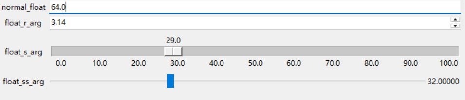

#### 3.1.3 `bool-based` Type

##### (1)`bool_t`Type：With a single check box

While the built-in `bool` type uses two mutually exclusive radio buttons to represent `True` and `False`, the `bool_t` type uses a single checkbox to do the same thing.

##### (2) Example

```python
from pyguiadapterlite import uprint, GUIAdapter
from pyguiadapterlite.types import bool_t


def bool_types_demo(normal_bool: bool, bool_t_arg: bool_t):
    uprint(f"Normal bool: {normal_bool}, bool_t bool: {bool_t_arg}")
    return normal_bool and bool_t_arg


if __name__ == "__main__":
    adapter = GUIAdapter()
    adapter.add(bool_types_demo)
    adapter.run()
```

It outputs:


#### 3.1.4 `str-based` Types

##### (1) `text_t` Type: Multi-line Text Input

Provides a widget for multi-line text input

##### (2) `file_t` Type: File Path Selector

Provides a widget for selecting file path

##### (3) `directory_t` Type: Directory Path Selector

Can also use its alias `dir_t`, provides a widget for selecting directory path

##### (4) `color_hex_t` Type: Color Picker

Provides a widget for color selection, color value is in hexadecimal strings starting with #, in RGB format

##### (5) Example

```python
from pyguiadapterlite import uprint, GUIAdapter
from pyguiadapterlite.types import text_t, file_t, dir_t, color_hex_t


def str_types_demo(
        long_string: text_t = "This is a long string",
        file_path: file_t = "/path/to/a/file.txt",
        dir_path: dir_t = "/path/to/a/directory",
        color_value: color_hex_t = "#FF0000",
):
    uprint("Long string:", long_string)
    uprint("File path:", file_path)
    uprint("Directory path:", dir_path)
    uprint("Color value:", color_value)


if __name__ == "__main__":
    adapter = GUIAdapter()
    adapter.add(str_types_demo)
    adapter.run()

```

It outputs:

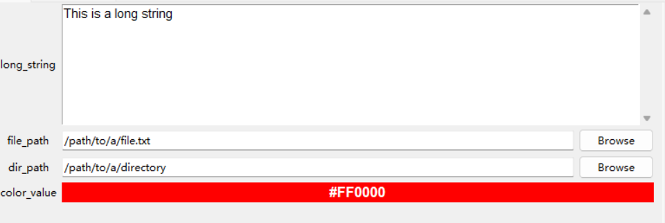

#### 3.1.5 `list-based` Types

`PyGUIAdapterLite` provides several extended types based on the `list` type, including:

##### (1)`string_list_t`  Type and Example

It can also be used through its aliases: `str_list`, `string_list`, designed for inputting a set of strings.

```python
from pyguiadapterlite import uprint, GUIAdapter
from pyguiadapterlite.types import string_list_t


def str_list_example(str_list_arg: string_list_t):
    uprint(f"len(str_list) == {len(str_list_arg)}")
    for s in str_list_arg:
        uprint(s)


if __name__ == "__main__":
    adapter = GUIAdapter()
    adapter.add(str_list_example)
    adapter.run()
```

It outputs:

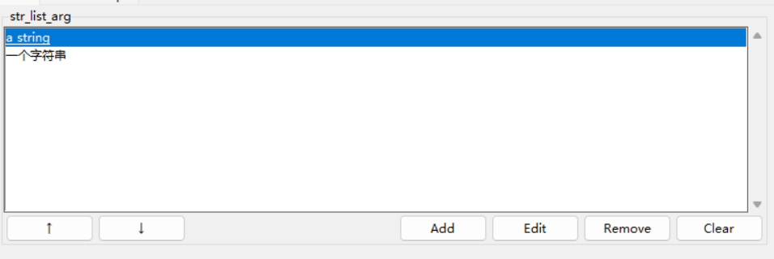

Add a item:

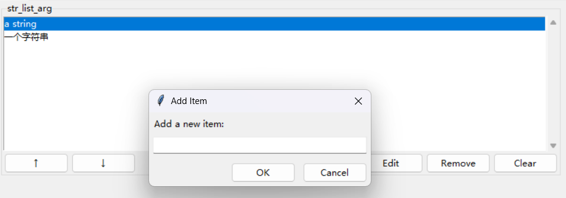

Edit a item:


##### (2)`path_list_t` Type and Example

It can also be used through its aliases: `path_list`、`paths_t`， designed for inputting a set of paths(including file path and directory path).

```python
from pyguiadapterlite import uprint, GUIAdapter
from pyguiadapterlite.types import path_list_t


def path_list_example(path_list_arg: path_list_t):
    for path in path_list_arg:
        uprint(path)


if __name__ == "__main__":
    adapter = GUIAdapter()
    adapter.add(path_list_example)
    adapter.run()
```

It outputs：


Add a path:


Edit a path:


##### (3)`file_list_t `Type and Example

It can also be used through its aliases: `file_list`、`files_t`，designed for inputting a set of paths, file path only.

```python
from pyguiadapterlite import uprint, GUIAdapter
from pyguiadapterlite.types import file_list_t


def file_list_example(file_list_arg: file_list_t):
    for file in file_list_arg:
        uprint(file)


if __name__ == "__main__":
    adapter = GUIAdapter()
    adapter.add(file_list_example)
    adapter.run()
```

It outputs:

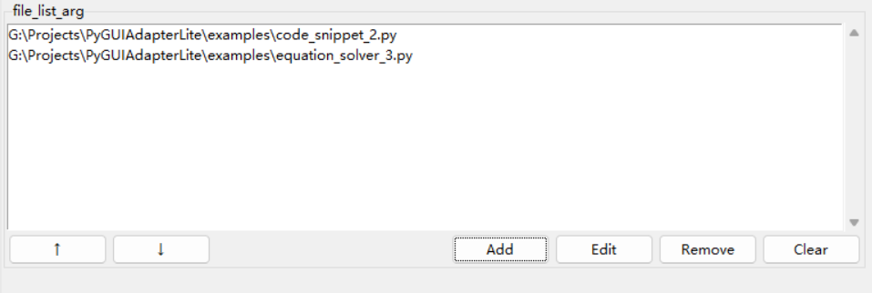

Add a file path:


Edit a file path:

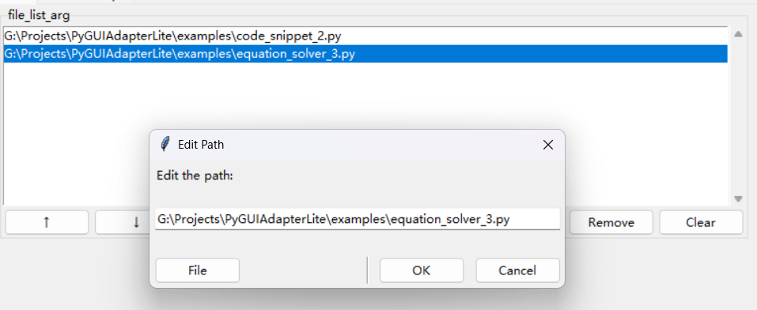

##### (4)`dir_list_t` Type and Example

It can also be used through its aliases: `dir_list`、`dirs_t`，designed for inputting a set of paths, 
directory path only.

```python
from pyguiadapterlite import uprint, GUIAdapter
from pyguiadapterlite.types import dir_list_t


def dir_list_example(dir_list_arg: dir_list_t):
    for dir_path in dir_list_arg:
        uprint(dir_path)


if __name__ == "__main__":
    adapter = GUIAdapter()
    adapter.add(dir_list_example)
    adapter.run()
```

It outputs:


Add a dir path:


Edit a dirpath:


#### 3.1.6 Choice Types

Sometimes, there may be a requirement to restrict user input to a predefined set of options. `PyGUIAdapterLite` provides several extended types to support this need , including both single-option types (for choosing one option from a set of values) and multiple-option types (for choosing multiple options from a set of values).

##### (1)`choice_t` Type and Example

Also usable through its alias `option_t`, designed to generate a radio button group.

You can specify the available options in the following way:

```python

def your_func(arg1: choice_t = ("opt1",  "opt2", "opt3")):
    ...
```

It also supports using a dictionary to specify the available options. In this case, the keys in the dictionary will serve as the displayed text for the options, while their corresponding values will be passed as the actual parameter values:

```python
def your_func(arg1: choice_t = {
    "Python": 1,
    "C++": 2,
    "Jave": 3,
    "Rust": 4
}):
    ...
```

Here is an example：

```python
from pyguiadapterlite import uprint, GUIAdapter
from pyguiadapterlite.types import choice_t

OPTIONS = {
    "Python": 1,
    "C/C++": 2,
    "Java": 3,
    "JavaScript": 4,
    "C#": 5,
    "Swift": 6,
}


def choice_t_example(
        choice_t_arg1: choice_t = ("choice1", "choice2", "choice3"),
        choice_t_arg2: choice_t = OPTIONS,
):
    uprint(f"choice_t_arg1: {choice_t_arg1}, type: {type(choice_t_arg1)}")
    uprint(f"choice_t_arg2: {choice_t_arg2}, type: {type(choice_t_arg2)}")


if __name__ == "__main__":
    adapter = GUIAdapter()
    adapter.add(choice_t_example)
    adapter.run()
```

It outputs:

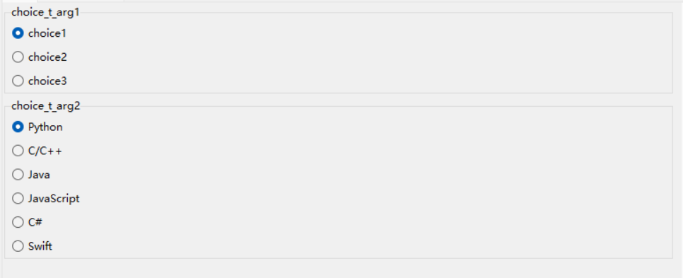


##### (2) `enum.Enum`、`typing.Literal` and Example

Besides `choice_t` type, `PyGUIAdapterLite` also supports automatically extracting options from `Enum` and `Literal` types to generate radio button group.

> For Enum types, the value ultimately passed to the parameter is the selected Enum member itself, rather than its name or value.

Here is an example:

```python
from enum import Enum
from typing import Literal

from pyguiadapterlite import uprint, GUIAdapter


class Weekday(Enum):
    Monday = 1
    Tuesday = 2
    Wednesday = 3
    Thursday = 4
    Friday = 5
    Saturday = 6
    Sunday = 7


def enum_and_literal_example(
        day: Weekday = Weekday.Saturday,
        favorite_fruit: Literal["apple", "banana", "orange", "grape"] = "orange",
):
    uprint(f"day: {day} (type: {type(day)})")
    uprint(f"favorite_fruit: {favorite_fruit} (type: {type(favorite_fruit)})")


if __name__ == "__main__":
    adapter = GUIAdapter()
    adapter.add(enum_and_literal_example)
    adapter.run()
```

It outputs:

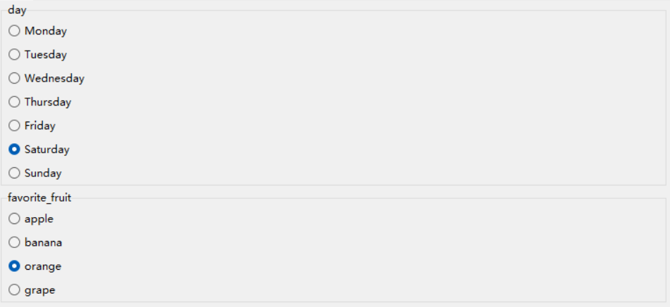


##### (3) `loose_choice_t` Type and Example

`choice_t`, `Enum`, and `Literal` can be considered **strict single-option types**, as users can only choose one option from the predefined set of options. However, there are scenarios where we may need to allow users to either select from a predefined set of options or input a custom value. To address this requirement, `PyGUIAdapterLite` provides another type of single-option, which I call it `loose_choice_t`.

```python
from pyguiadapterlite import uprint, GUIAdapter
from pyguiadapterlite.types import loose_choice_t


def loose_choice_example(
        arg1: loose_choice_t = ("Option 1", "Option 2", "Option 3", "Option 4")
):
    uprint(f"arg1: {arg1}")


if __name__ == "__main__":
    adapter = GUIAdapter()
    adapter.add(loose_choice_example)
    adapter.run()
```

It outputs:


##### (4)`choices_t` Type and Example

`PyGUIAdapterLite` provides the `choices_t` type, which allows users to select multiple options from a set of predefined values.

```python
from pyguiadapterlite import uprint, GUIAdapter
from pyguiadapterlite.types import choices_t

ALL_CHOICES = (
    "Choice 1",
    "Choice 2",
    "Choice 3",
    "Choice 4",
    "Choice 5",
    "Choice 6",
)


def choices_t_example(arg: choices_t = ALL_CHOICES):
    uprint(f"You selected {len(arg)} options")
    if arg:
        uprint(f"The options are: {arg}")


if __name__ == "__main__":
    adapter = GUIAdapter()
    adapter.add(choices_t_example)
    adapter.run()
```

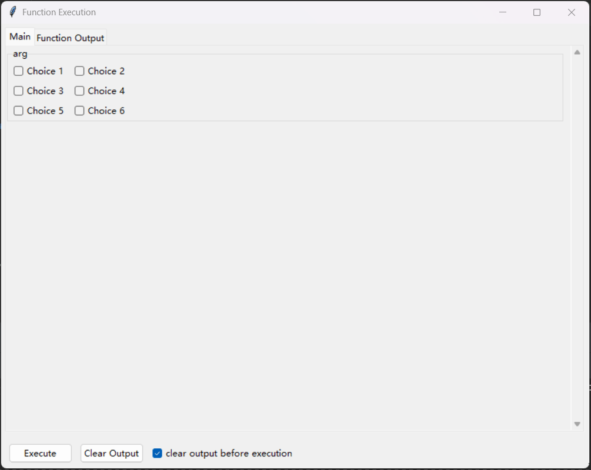

### 3.2 Error Handling and Parameter Validation

Two key aspects of enhancing program robustness are: first, validating user input in advance to find illegal values and preventing errors before they occur; second, anticipating where the program might fail, capturing potential errors, and recovering from them. The former relates to **parameter validation**, while the latter falls under **error handling**. The design philosophy of `PyGUIAdapterLite` is to keep the program in a usable state as much as possible, preventing the entire application from crashing due to errors in the user function. Therefore, `PyGUIAdapterLite` incorporates built-in mechanisms to help developers  to do **parameter validation** and **error handling** more easily.

#### 3.2.1 Error Handling

##### (1) Basic Strategy: Catch Any Exceptions Whenever Possible

By default, `PyGUIAdapterLite` attempts to catch any exceptions/errors that occur in the user function. As a result, exceptions in  the user functions generally will not cause the entire program to exit. When an exception is caught, the default behavior is to popup a dialog notifying the user that an exception has occurred (this default behavior can be disabled through configuration; see Section 3.7 for details). Additionally, detailed information about the exception, including traceback information, will be printed in the fake terminal of the window.


The following code will raise a `ZeroDivisionError` when you input `0` of parameter `b`。Please observe how `PyGUIAdapter` catches and handles this exception.

```python
from pyguiadapterlite import uprint, GUIAdapter


def divide(a: int, b: int = 1):
    """尝试b输入0，引发除0异常"""
    r = a / b
    uprint("a/b=", r)
    return r


if __name__ == "__main__":
    adapter = GUIAdapter()
    adapter.add(divide)
    adapter.run()
```


##### (2) Handling `sys.exit()` and `SystemExit`

In Python, `SystemExit` is a special type of exception, typically triggered by `sys.exit()` or `exit()` calls, designed for program termination rather than indicating an error. In other words, its purpose is to represent a controlled program termination, unlike other exceptions that signify unexpected situations. To maintain consistency in error handling logic, `PyGUIAdapterLite` also tryes to catch this type of exception. As a result, calls to `sys.exit()` in the user function  will not cause the program to exit. You can verify this behavior with the following code:

```python
from pyguiadapterlite import uprint, GUIAdapter


def system_exit_example_1(arg: int):
    if arg == 0:
        uprint("Exiting...")
        sys.exit()
    else:
        uprint("Not exiting...")


if __name__ == "__main__":
    adapter = GUIAdapter()
    adapter.add(system_exit_example_1)
    adapter.run()
```


This default behavior may not align with the user's expectation. Luckily,`PyGUIAdapterLite` provides a way to modify this behavior. The `GUIAdapter.add()` method has a parameter called `capture_system_exit_exception`. When this parameter is set to `False`, `PyGUIAdapterLite` will attempt to exit the application instead of catching the `SystemExit` exception.

```python
import sys

from pyguiadapterlite import uprint, GUIAdapter


def system_exit_example_1(arg: int):
    if arg == 0:
        uprint("Exiting...")
        sys.exit()
    else:
        uprint("Not exiting...")


if __name__ == "__main__":
    adapter = GUIAdapter()
    adapter.add(system_exit_example_1, capture_system_exit_exception=False)
    adapter.run()

```

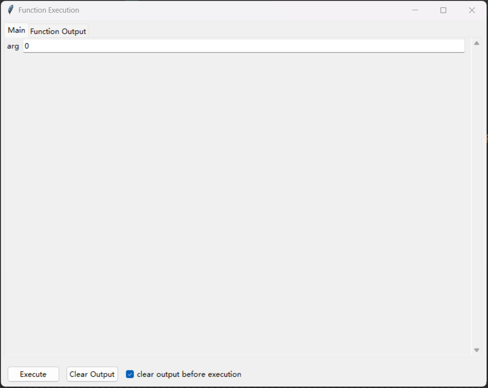

#### 3.2.2 Parameter Validation

`PyGUIAdapterLite` offers several mechanisms for parameter validation which are designed to simplify the validation process and provide clear feedback to users about invalid parameters and why they are invalid.

##### (1) Using `Exception` to Indicate Invalid Parameters and the Usage of `ParameterError`

Parameter validation can be integrated as part of the user function logic. For example, in the previous example, we can check the value of parameter `b` within the user function and raise a exception when we found it invalid:

```python
from pyguiadapterlite import uprint, GUIAdapter

def divide(a: int, b: int = 1):
    if b == 0:
        raise ValueError("b cannot be zero")
    r = a / b
    uprint("a/b=", r)
    return r

if __name__ == "__main__":
    adapter = GUIAdapter()
    adapter.add(divide)
    adapter.run()

```

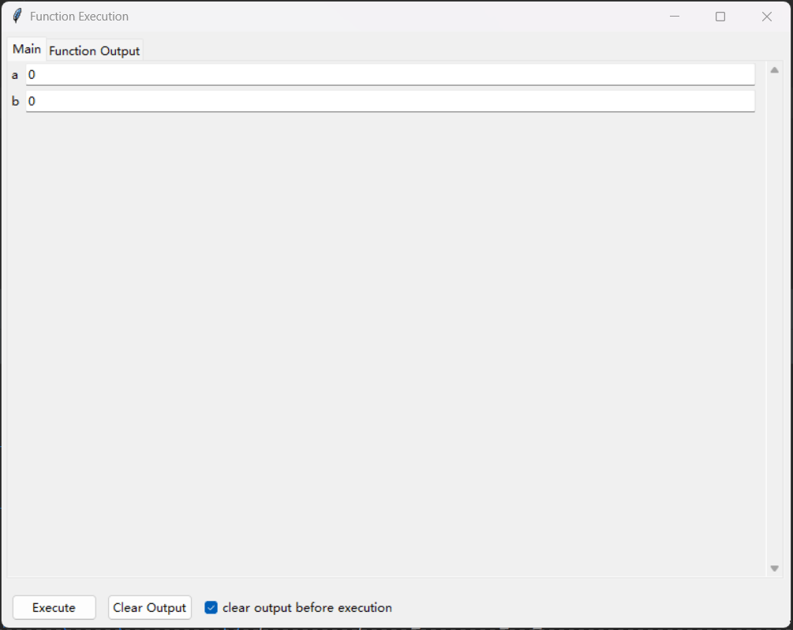

The downside of this straightforward approach is that it does not clearly indicate which parameter is invalid. To address this, `PyGUIAdapterLite` provides the `ParameterError` type. By raising this exception, `PyGUIAdapterLite` can automatically identify the invalid parameter and prompt the user by flashing the border of the corresponding input widget.


> To create a ParameterError instance:
>
> ```python
> def foo():
    >    	...
>        raise ParameterError(parameter_name="name_of_invalid_paramter",message="why it is invalid")
>
> ```

```python
from pyguiadapterlite import uprint, GUIAdapter, ParameterError


def divide(a: int, b: int = 1):
    if b == 0:
        raise ParameterError(parameter_name="b", message="b cannot be zero")
    r = a / b
    uprint("a/b=", r)
    return r


if __name__ == "__main__":
    adapter = GUIAdapter()
    adapter.add(divide)
    adapter.run()

```


##### (2) Parameter Validation Using a Validation Function

In addition to the aforementioned method, `PyGUIAdapterLite` also allows developers to define a dedicated function for parameter validation. Before actually invoking the user function, `PyGUIAdapterLite` will call this function first to validate the current parameter values.

The validation function must meet the following requirements:

- The function name can be arbitrary.
- The first parameter in the function's parameter list is used to receive the name of the function being validated. The parameters after the first one are the parameters to be checked.
- The function should return a dictionary where the keys represent the names of invalid parameters, and the values indicate the reasons for their invalidity. An empty dictionary indicates that no invalid parameters were found.

For example, if the user function is defined as follows:

```python
def user_func(param1: int, param2: str, param3: file_t):
    ...
```

Then, the parameter validation function can be defined in either of the following ways:

- **Using keyword argument to receive the parameter values**

```python
def validate_user_func(func_name: str, **params) -> Dict[str, str]:
    param1 = params.get("param1")
    param2 = params.get("param2")
    param3 = params.get("param3")
    ...
    return {
        "param1": "too big",
        "param2": "empty string not allowed!",
        "param3": "file not found!"
    }

```

- **Define the parameters the same way as the user function does.**

```python
def validate_user_func(func_name: str, *, param1: int, param2: str, param3: file_t) -> Dict[str, str]:
    ...
    return {
        "param1": "too big",
        "param2": "empty string not allowed!",
        "param3": "file not found!"
    }
```

Once a parameter validation function is specified, `PyGUIAdapterLite` will invoke it with the collected parameter values before actually calling the user function. If the validation function returns an empty dict, the user function proceeds. If a non-empty dict returns, it indicates invalid parameters found, causing `PyGUIAdapterLite` to abort the user function call and list each invalid parameter along with the reason.

Developers can specify the parameter validation function using the `parameters_validator` parameter in the `GUIAdapter.add()` method.

Here is a simple example. In the `validate()` function, we check each parameter of `backup_folder()` . 

```python
import os
from typing import Dict

from pyguiadapterlite import uprint, GUIAdapter
from pyguiadapterlite.types import dir_t


def validate(
        func_name: str, *, src_folder: dir_t, dst_folder: dir_t, max_recursion: int
) -> Dict[str, str]:
    uprint(f"Validating parameters for function '{func_name}'...")

    validate_errors = {}

    if max_recursion < 1:
        validate_errors["max_recursion"] = "Max recursion cannot be less than 1."

    if not src_folder:
        validate_errors["src_folder"] = "Source folder cannot be empty."
    elif not os.path.isdir(src_folder):
        validate_errors["src_folder"] = "Source folder does not exist."
    else:
        pass

    if not dst_folder:
        validate_errors["dst_folder"] = "Destination folder cannot be empty."
    elif os.path.isdir(dst_folder) and len(os.listdir(dst_folder)) > 0:
        validate_errors["dst_folder"] = "Destination folder is not empty."
    else:
        pass

    return validate_errors


def backup_folder(src_folder: dir_t, dst_folder: dir_t, max_recursion: int = 10):
    uprint(f"Backing up '{src_folder}' to '{dst_folder}'...")


if __name__ == "__main__":
    adapter = GUIAdapter()
    adapter.add(backup_folder, parameters_validator=validate)
    adapter.run()
```

When the validation function return a dict with invalid parameters：


When the validation function return a empty dict：


### 3.3 Configuring the Parameter Input Widgets(Parameter Widget)

Earlier, we introduced the built-in types and extended types supported by `PyGUIAdapterLite` and their corresponding input widgets. `PyGUIAdapterLite` allows developers to configure these parameter input widgets to adjust their appearance and behavior.

#### 3.3.1 Configurable Properties of Parameter Widgets

From an implementation perspective, all parameter widgets in `PyGUIAdapterLite` inherit from the [`BaseParameterWidget`](https://pyguiadapterlite/components/valuewidget.py) base class, and a `BaseParameterWidget` is configured by an object of the [`BaseParameterWidgetConfig`](https://pyguiadapterlite/components/valuewidget.py) class.

`BaseParameterWidgetConfig` defines the properties common to all parameter widgets, including:

- `default_value`: The initital value displayed in the widget.
- `label`: The function parameter label, displayed to the left of the input widget. By default, it displays the name of the function parameter.
- `description`: Descriptive information about the function parameter. If provided, a small icon (typically a question mark) will appear to the right of the input widget, and hovering over it will display the description text via a tooltip.
- `group`: Specify the group the function parameter belongs. When there are many parameters, they can be organized into different tab pages via grouping. If not specified, the parameter will be added to the default group, usually named "Main".
- `hide_label`: Whether to hide the function parameter label.

>Source code of the `BaseParameterWidgetConfig` class:
>
>```python
>@dataclasses.dataclass(frozen=True)
>class BaseParameterWidgetConfig(object):
    >    	default_value: Any = None
>	label: str = ""
>    	description: str = ""
>    	group: str = ""
>    	hide_label: bool = False
>
>    	# noinspection PyAbstractClass
>	@classmethod
>    	@abstractmethod
>    	def target_widget_class(cls) -> Type["BaseParameterWidget"]:
    >       		raise NotImplementedError()
>
>     	@classmethod
>	def new(cls, **kwargs) -> "BaseParameterWidgetConfig":
    >       		return cls(**kwargs)
>
>     	def serialize(self) -> dict:
    >   		return dataclasses.asdict(self)
>
>     	@classmethod
>	def deserialize(cls, json_obj: dict) -> "BaseParameterWidgetConfig":
    >       		return cls.new(**json_obj)
>    ```


Subclasses of `BaseParameterWidget` typically define their own configuration classes (subclasses of `BaseParameterWidgetConfig`)  with additional properties.

For example, the parameter widget class for the `str` type is [`StringValueWidget`](https://pyguiadapterlite/types/strs/line.py#L43), and its corresponding configuration class is [`StringValue`](https://pyguiadapterlite/types/strs/line.py#L18). The `StringValue` class defines properties specific to `StringValueWidget`, including:

- `echo_char`: The echo character. If set, the value entered in the input widget will be displayed as this character instead of the actual one. This is very useful for password input scenarios.

- `justify`: Text alignment, which can be set to `left`, `center`, or `right`.

>Source code of the `StringValue` class:
>
>```python
    >@dataclasses.dataclass(frozen=True)
   >class StringValue(BaseParameterWidgetConfig):
    >    	default_value: str = ""
>         echo_char: str = ""
>         justify: Literal["left", "center", "right"] = "left"
>
>         @classmethod
>         def target_widget_class(cls) -> Type["StringValueWidget"]:
    >             return StringValueWidget
>    ```


- Another example is the `int_r` type, whose parameter widget class is [`RangedIntValueWidget`](https://pyguiadapterlite/types/ints/ranged.py#L79), and its corresponding configuration class is [`RangedIntValue`](https://pyguiadapterlite/types/ints/ranged.py#L20). The `RangedIntValue` class defines properties specific to `RangedIntValueWidget`, including:
  - `min_value`: The minimum value.
  - `max_value`: The maximum value.
  - `step`: The step size for single adjustments.
  - `wrap`: Whether wrapping is supported (i.e., whether the value cycles back to the minimum when exceeding the maximum, or to the maximum when falling below the minimum).

>```python
    >@dataclasses.dataclass(frozen=True)
   >class RangedIntValue(BaseParameterWidgetConfig):
    >    	default_value: int = 0
>    	min_value: int = MIN_VALUE
>    	max_value: int = MAX_VALUE
>    	step: int = 1
>    	wrap: bool = False
>
>    @classmethod
>    def target_widget_class(cls) -> Type["RangedIntValueWidget"]:
    >        return RangedIntValueWidget
>
>```


**Summary**: In `PyGUIAdapterLite`, each supported parameter type corresponds to an parameter widget class (a subclass of `BaseParameterWidget`), and each parameter widget corresponds to a configuration class (a subclass of `BaseParameterWidgetConfig`). The configuration class manages the configurable properties of the parameter widget. Configuring a parameter widget essentially involves modifying the properties defined in its configuration class.

#### 3.3.2 How to Configure Parameter Widgets

`PyGUIAdapterLite` provides multiple methods for configuring parameter widgets.

##### （1）A simple way to specify the `description` and `default_value`

If you only need to set the default value and description of a parameter, there is a simple and natural approach.

-  `default_value`: For most types,  just use `def foo(a: int = 100, b: str = "bar")`.

> There are some exceptions to this. For option-related types such as `choice_t`, `loose_choice_t`, and `choices_t`, the default value of the parameter is generally used to define the available options set instead of the default value of the parameter. Demonstrations of this behavior can be found in the section **3.1.6 **.

- For `description` of each parameter, we can use the `docstring` of the function . `PyGUIAdapterLite` supports various `docstring` styles, including `ReST`, `Google`, `Numpydoc-style`, and `Epydoc`.


`PyCharm` usually generates docstring in the following style which is supported by `PyGUIAdapterLite`:

```python
def my_function(
        param1: int = 100,
        param2: str = "Hello World",
        param3: float = 3.14,
        param4: bool = True,
):
    """
    This is the function description.
    :param param1: description of the param1
    :param param2: description of the param2
    :param param3: description of the param3
    :param param4: description of the param4
    :return:
    """
    pass
```

The following docstring  style is also supported: 

```python
def my_function(
        param1: int = 100,
        param2: str = "Hello World",
        param3: float = 3.14,
        param4: bool = True,
):
    """
    This is the function description.
    Args:
        param1: description of the param1
        param2: description of the param2
        param3: description of the param3
        param4: description of the param4

    Returns:

    """
    pass
```

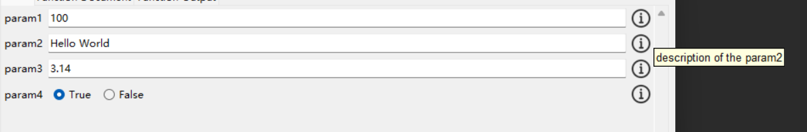

#####	（2）Configuring Parameter Widget Properties via the `GUIAdapter.add()` Method

The `GUIAdapter.add()` method provides a parameter  named  `widget_configs` for configuring the parameter widgets of each parameter in the user function. Developers need to pass a `dict` to this parameter, where the `key` is the name of the function parameter, and the `value` is an instance of the corresponding widget configuration class (the subclass of `BaseParameterWidgetConfig` ). 

For example, for the following function:

```python
def foo(arg1: int, arg2: float, arg3: str):
    pass
```

The parameter widgets can be configured as follows:

```python

{
    "arg1": IntValue(
        label="Argument 1",
        description="This is the description of arg1",
        default_value=10,
        auto_correct=True,
    ),
    "arg2": FloatValue(
        label="Argument 2",
        description="This is the description of arg2",
        default_value=20.0,
    ),
    "arg3": StringValue(
        label="Argument 3",
        description="This is the description of arg3",
        default_value="Hello",
        echo_char="*",
        justify="center",
    ),
}
```

Complete code:

```python
from pyguiadapterlite import GUIAdapter
from pyguiadapterlite.types import IntValue, FloatValue, StringValue


def foo(arg1: int, arg2: float, arg3: str):
    pass


if __name__ == "__main__":
    PARAM_CONFIGS = {
        "arg1": IntValue(
            label="Argument 1",
            description="This is the description of arg1",
            default_value=10,
            auto_correct=True,
        ),
        "arg2": FloatValue(
            label="Argument 2",
            description="This is the description of arg2",
            default_value=20.0,
        ),
        "arg3": StringValue(
            label="Argument 3",
            description="This is the description of arg3",
            default_value="Hello",
            echo_char="*",
            justify="center",
        ),
    }

    adapter = GUIAdapter()
    adapter.add(foo, widget_configs=PARAM_CONFIGS)
    adapter.run()
```


Besides `widget_configs`, `GUIAdapter.add()` now supports the following approach:

```python
from pyguiadapterlite import GUIAdapter, uprint
from pyguiadapterlite.types import IntValue, FloatValue, StringValue


def foo(arg1: int, arg2: float, arg3: str):
    uprint(f"arg1: {arg1}, arg2: {arg2}, arg3: {arg3}")


if __name__ == "__main__":
    adapter = GUIAdapter()
    adapter.add(
        foo,
        arg1=IntValue(
            label="Argument 1",
            description="This is the description of arg1",
            default_value=10,
            auto_correct=True,
        ),
        arg2=FloatValue(
            label="Argument 2",
            description="This is the description of arg2",
            default_value=20.0,
        ),
        arg3=StringValue(
            label="Argument 3",
            description="This is the description of arg3",
            default_value="Hello",
            echo_char="*",
            justify="center",
        ),
    )
    adapter.run()

```

Compared to passing a `dict` to `widget_configs`, this approach may appear more intuitive.

Here is a more complex example：

```python
import os

from pyguiadapterlite import uprint, GUIAdapter
from pyguiadapterlite.types import (
    choice_t,
    int_ss,
    file_t,
    SingleChoiceValue,
    ScaleIntValue2,
    FileValue,
    StringValue,
    bool_t,
    BoolValue2,
)


def my_function(
        param1: str, param2: choice_t, param3: int_ss, param4: file_t, param5: bool_t
):
    """
    This is the function description. The parameters of this function will be configured using `GUIAdapter.add()` method.
    """
    uprint("param1:", param1)
    uprint("param2:", param2)
    uprint("param3:", param3)
    uprint("param4:", param4)
    uprint("param5:", param5)


if __name__ == "__main__":
    PARAM_CONFIGS = {
        "param1": StringValue(
            label="Password",
            default_value="default value of param1",
            description="Input your password",
            echo_char="*",
            justify="center",
        ),
        "param2": SingleChoiceValue(
            label="Hash Algorithm",
            choices=["MD5", "SHA1", "SHA256", "SHA512"],
            default_value="SHA256",
            description="Select a hash algorithm",
        ),
        "param3": ScaleIntValue2(
            label="Keep Alive Time",
            default_value=10,
            description="Keep alive time in minutes",
            min_value=0,
            max_value=20,
            step=5,
            tick_interval=5,
        ),
        "param4": FileValue(
            label="File to Upload",
            default_value="",
            description="Select a file to upload",
            filters=[
                ("Text Files", "*.txt"),
                ("Python Files", "*.py"),
                ("All Files", "*.*"),
            ],
            start_dir=os.getcwd(),
            select_button_text="Select File",
        ),
        "param5": BoolValue2(
            label="Enable SSL",
            default_value=True,
            description="Enable SSL encryption",
        ),
    }

    adapter = GUIAdapter()
    adapter.add(my_function, widget_configs=PARAM_CONFIGS)
    adapter.run()

```


##### (3) Utilizing Default Values to Configure Parameter Widgets

If the default value of a function parameter is assigned a object of `BaseParameterWidgetConfig` class, then `PyGUIAdapterLite` will use this object as the configuration object for the corresponding parameter widget. Using this mechanism, the above example can be rewritten as:

```python
import os

from pyguiadapterlite import uprint, GUIAdapter
from pyguiadapterlite.types import (
    choice_t,
    int_ss,
    file_t,
    SingleChoiceValue,
    ScaleIntValue2,
    FileValue,
    StringValue,
    bool_t,
    BoolValue2,
)


#Configurations of the parameters for the function my_function
PARMA1_CONF = StringValue(
    label="Password",
    default_value="default value of param1",
    description="Input your password",
    echo_char="*",
    justify="center",
)
PARMA2_CONF = SingleChoiceValue(
    label="Hash Algorithm",
    choices=["MD5", "SHA1", "SHA256", "SHA512"],
    default_value="SHA256",
    description="Select a hash algorithm",
)
PARMA3_CONF = ScaleIntValue2(
    label="Keep Alive Time",
    default_value=10,
    description="Keep alive time in minutes",
    min_value=0,
    max_value=20,
    step=5,
    tick_interval=5,
)
PARMA4_CONF = FileValue(
    label="File to Upload",
    default_value="",
    description="Select a file to upload",
    filters=[
        ("Text Files", "*.txt"),
        ("Python Files", "*.py"),
        ("All Files", "*.*"),
    ],
    start_dir=os.getcwd(),
    select_button_text="Select File",
)
PARMA5_CONF = BoolValue2(
    label="Enable SSL",
    default_value=True,
    description="Enable SSL encryption",
)

#function defined here
def my_function(
        param1: str = PARMA1_CONF,
        param2: choice_t = PARMA2_CONF,
        param3: int_ss = PARMA3_CONF,
        param4: file_t = PARMA4_CONF,
        param5: bool_t = PARMA5_CONF,
):
    """
    The parameters of this function will be configured using the default value of its parameters.
    """
    uprint("param1:", param1)
    uprint("param2:", param2)
    uprint("param3:", param3)
    uprint("param4:", param4)
    uprint("param5:", param5)


if __name__ == "__main__":
    adapter = GUIAdapter()
    adapter.add(my_function)
    adapter.run()
```

##### (4) Configuring Parameter Widget Properties in `docstring`

Developers can configure parameter widgets within the function's `docstring`. `PyGUIAdapterLite` treats the text block enclosed between `@params` and `@end` in the `docstring` as a configuration block for parameter widgets, formatted in `TOML`. 

```toml
[parameter_name]
label = "bar"
description = "i am a description"
property_n = value_n
```

Here is a simple example：

```python
from pyguiadapterlite import uprint, GUIAdapter
from pyguiadapterlite.types import int_r, bool_t


def my_function(username: str, password: str, age: int_r, keep_logged_in: bool_t):
    """
    The parameter widgets of this function will be configured in the docstring below using config block syntax.

    @params
    [username]
    label = "Username"
    default_value = "admin"
    description = "Please enter your username"

    [password]
    label = "Password"
    default_value = "123456"
    description = "Please enter your password"
    echo_char = "*"

    [age]
    label = "Age"
    default_value = 25
    description = "Please enter your age"
    min_value = 18
    max_value = 100

    [keep_logged_in]
    label = "Keep me logged in"
    default_value = true

    @end

    """
    uprint(f"Username: {username}")
    uprint(f"Password: {password}")
    uprint(f"Age: {age}")
    uprint(f"Keep logged in: {keep_logged_in}")


if __name__ == "__main__":
    adapter = GUIAdapter()
    adapter.add(my_function)
    adapter.run()

```


##### (5) Summary

Several approaches for configuring parameter widget properties have been introduced above. Each has its own suitable scenarios and limitations. Developers can choose the appropriate approach to configure function parameter widgets based on their needs and preferences.

#### 3.3.3 Parameter Types and Their Parameter widget class/Configuration Class

The following document lists the parameter types supported by `PyGUIAdapterLite`, along with their corresponding parameter widget classes, configuration classes, and commonly used configurable properties, while also providing relevant example code. Readers can refer to it as needed.

[__Parameter types and widgets in`PyGUIAdapterLite`__](docs/types_and_widgets.md)


### 3.4 Adding More than One Function

We can add multiple functions to a `GUIAdapter` instance. When multiple functions are added to a `GUIAdapter` instance, `PyGUIAdapterLite` will display a function selection window for users to choose which function to execute.

For example, the following sample adds three functions to the same `GUIAdapter` instance:

```python
from pyguiadapterlite import GUIAdapter
from pyguiadapterlite.types import dir_t, bool_t, DirectoryValue, BoolValue2


def convert_to_pngs(input_dir: dir_t, output_dir: dir_t, recursive: bool_t = False):
    """Converts all image files in the input directory to PNG format and saves them in the output directory."""
    pass


def convert_to_pdfs(input_dir: dir_t, output_dir: dir_t, recursive: bool_t = False):
    """Converts all image files in the input directory to PDF format and saves them in the output directory."""
    pass


def convert_to_jpgs(input_dir: dir_t, output_dir: dir_t, recursive: bool_t = False):
    """Converts all image files in the input directory to JPG format and saves them in the output directory."""
    pass


PARAM_CONFS = {
    "input_dir": DirectoryValue(
        label="Input Directory",
        default_value="",
        start_dir="./",
        dialog_title="Select Input Directory",
        select_button_text="Browse",
        normalize_path=True,
        absolutize_path=True,
    ),
    "output_dir": DirectoryValue(
        label="Output Directory",
        default_value="",
        start_dir="./",
        dialog_title="Select Output Directory",
        select_button_text="Browse",
        normalize_path=True,
        absolutize_path=True,
    ),
    "recursive": BoolValue2(
        label="Find files recursively",
        default_value=False,
    ),
}

if __name__ == "__main__":
    adapter = GUIAdapter()
    adapter.add(convert_to_pngs, widget_configs=PARAM_CONFS)
    adapter.add(convert_to_pdfs, widget_configs=PARAM_CONFS)
    adapter.add(convert_to_jpgs, widget_configs=PARAM_CONFS)
    adapter.run()

```

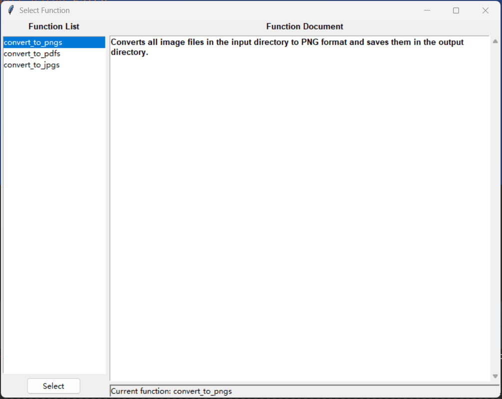


By default, the function list displays the function names. Developers may wish to specify display names for functions rather than showing the actual function names. This can be achieved using the `display_name` parameter:

```python
...
if __name__ == "__main__":
    adapter = GUIAdapter()
    adapter.add(
        convert_to_pngs, display_name="PNG Converter", widget_configs=PARAM_CONFS
    )
    adapter.add(
        convert_to_pdfs, display_name="PDF Converter", widget_configs=PARAM_CONFS
    )
    adapter.add(
        convert_to_jpgs, display_name="JPG Converter", widget_configs=PARAM_CONFS
    )
    adapter.run()
```


### 3.5 Cancelable Functions

Sometimes we may allow users to terminate a function while it is in execution. To address this requirement, `PyGUIAdapterLite` provides a simple mechanism. However, it should be noted that `PyGUIAdapterLite` does not support forcibly interrupting a running function. This is because the default function executor implemented in `PyGUIAdapterLite` is thread-based, meaning your function and the GUI run in the same process but in different threads. If users were allowed to forcibly terminate the user function thread at any time, it could lead to unpredictable consequences, such as resource leaks, program crashes, or data corruption.

Therefore, `PyGUIAdapterLite` implements a so-called "cooperative cancellation" mechanism. As the name implies, `PyGUIAdapterLite` does not attempt to forcibly terminate the execution of a function. Instead, when a user wishes to cancel the execution, it "notifies" the running function that the user has expressed an intent to terminate. However, whether the function actually terminates is entirely up to the function itself to decide.

To enable this：

```python
adapter.add(your_func, cancelable=True)
```

after that, a  "Cancel" button will shown. By clicking this button, the user signals the intent to terminate the running function.

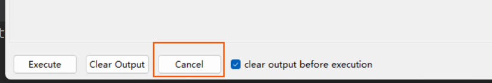

In the user function,  we need to periodically call the `is_function_cancelled()` function to check whether the user has signaled an intent to terminate, and decide whether to abort execution based on the specific circumstances.

Here is a simple example:

```python
import time

from pyguiadapterlite import uprint, is_function_cancelled, GUIAdapter


def mock_heavy_task(mount: int = 100, delay: float = 0.05):
    uprint("Starting heavy task...")
    cancelled = False
    total = 0
    for i in range(mount):
        if is_function_cancelled():
            uprint("User asked to cancel the task.")
            cancelled = True
            break
        total += i
        uprint(f"Progress: {i+1}/{mount}")
        time.sleep(delay)

    if cancelled:
        uprint("Task cancelled by user.")
        return -1
    uprint("Task completed successfully.")
    return total


if __name__ == "__main__":
    adapter = GUIAdapter()
    adapter.add(mock_heavy_task, cancelable=True)
    adapter.run()
```

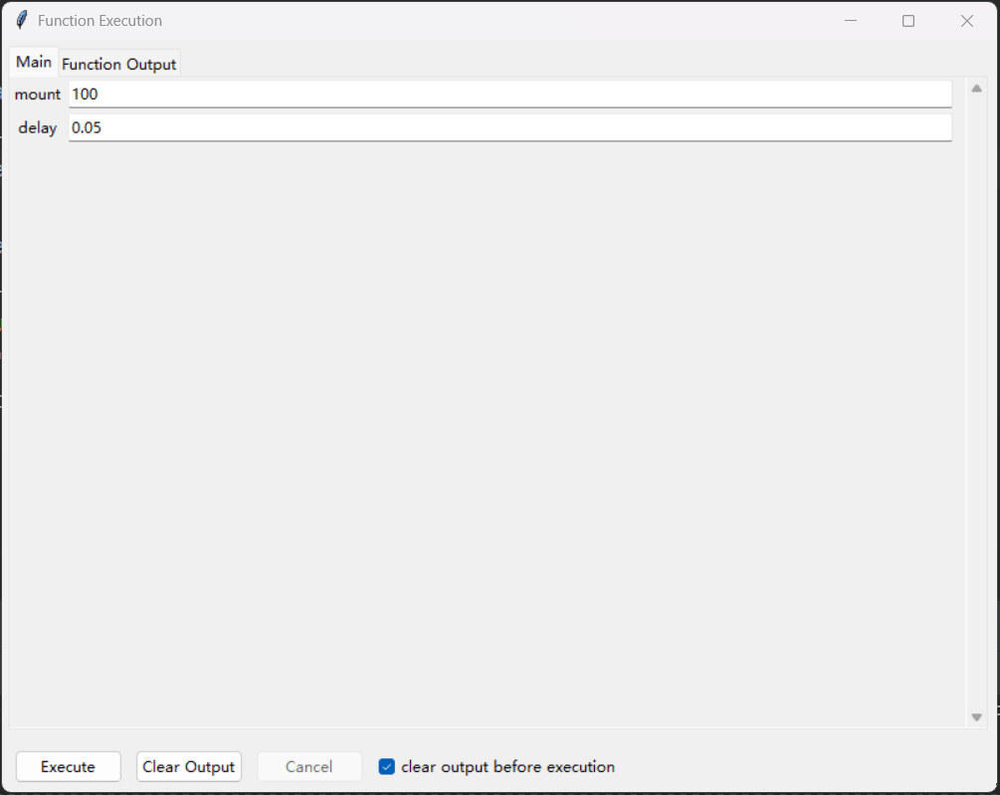


### 3.6 Progress Bar

The fake terminal in the  execution window primarily supports plain text output via `uprint()` as well as text colored using ANSI codes. However, it currently does not support advanced ANSI features such as cursor movement and screen management. Therefore, it is not possible to display fancy console progress bars.

The following example demonstrates how to print colored text using ANSI codes:

```python
from pyguiadapterlite import GUIAdapter, uprint


def foo(message: str = "Hello World!"):
    uprint(message)
    uprint(f"\x1b[1m{message}\x1b[0m")
    uprint(f"\x1b[3m{message}\x1b[0m")
    uprint(f"\x1b[4m{message}\x1b[0m")
    uprint(f"\x1b[7m{message}\x1b[0m")
    uprint(f"\x1b[6m{message}\x1b[0m")
    uprint(f"\x1b[5m{message}\x1b[0m")
    uprint(f"\x1b[31m{message}\x1b[0m")
    uprint(f"\x1b[32m{message}\x1b[0m")
    uprint(f"\x1b[33m{message}\x1b[0m")
    uprint(f"\x1b[34m{message}\x1b[0m")
    uprint(f"\x1b[35m{message}\x1b[0m")
    uprint(f"\x1b[36m{message}\x1b[0m")
    uprint("")
    # 组合样式
    uprint(f"\x1b[1;31m{message}\x1b[0m")
    uprint(f"\x1b[1;32;44m{message}\x1b[0m")
    uprint(f"\x1b[1;4;33m{message}\x1b[0m")
    uprint("")

if __name__ == "__main__":
    adapter = GUIAdapter()
    adapter.add(foo)
    adapter.run()

```

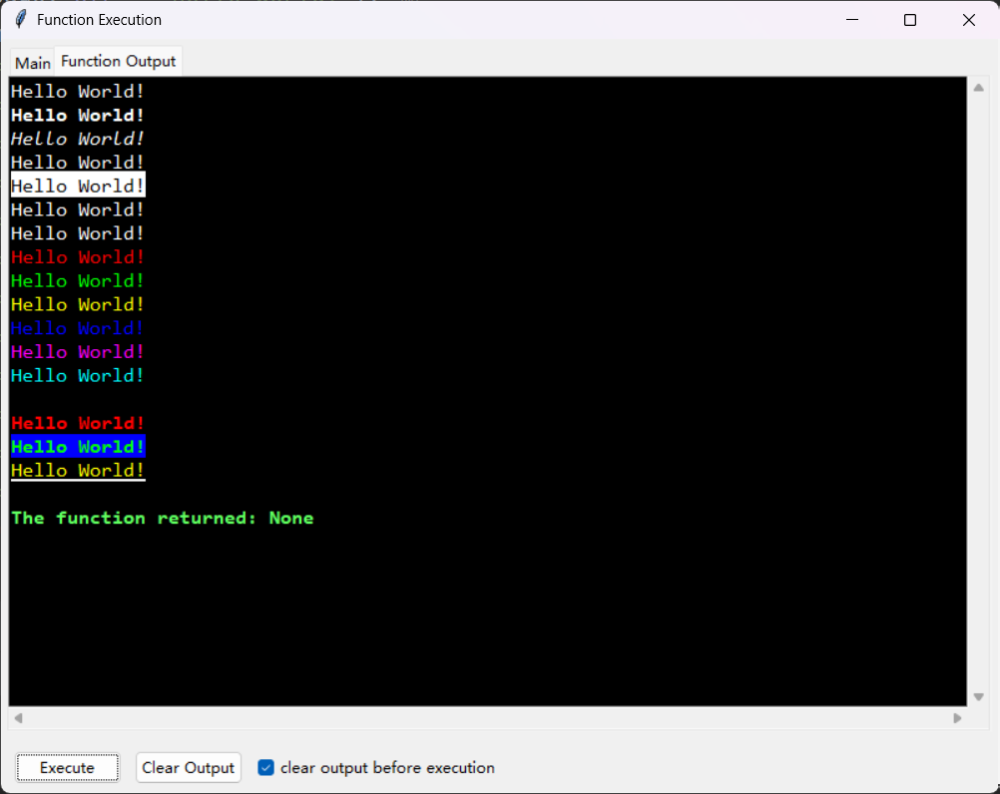

`PyGUIAdapterLite` implements a "physical " progress bar that can be displayed, updated, and hidden. The progress bar consists of two components: the progress bar itself and a message label located beneath it. We can dynamically update the current progress and the content of the message label during function execution. To enable the progress bar and its message label, set both `enable_progressbar` and `enable_progress_label` to `True` when calling `GUIAdapter.add()`.

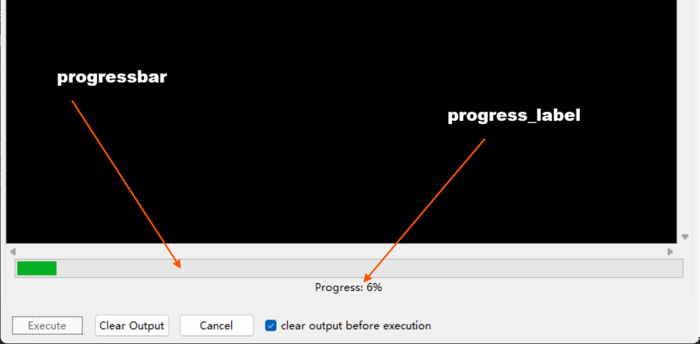


`PyGUIAdapterLite` provides the following functions:

- `is_progressbar_enabled() -> bool`

Checks whether the progress bar is enabled.


- ` is_progress_label_enabled() -> bool`

Checks whether the progress message label is enabled.


- `show_progressbar()`

Displays the progress bar.


-  `hide_progressbar()`

Hides the progress bar.


- `start_progressbar()`

Starts the progress bar, or initializes progress bar-related parameters.

```python
def start_progressbar(
        total: int,
        mode: Literal["determinate", "indeterminate"] = "determinate",
        initial_value: int = 0,
        initial_msg: Optional[str] = "",
):
    ...
```

- `total`: Total progress value

- `mode`: Progress bar mode, generally keep the default `"determinate"`.
- `initial_value`: Initial progress value
- `initial_msg`: Initial progress message text


- `update_progressbar()`

```python
def update_progressbar(value: int, msg: Optional[str] = None):
    ...
```

Updates the current progress and message text.


- ` stop_progressbar(hide_after_stop: bool = True)`

Stops the progress bar. The `hide_after_stop` indicates whether to hide the progress bar after stopping it. If set to `False`, the user is responsible for whether and when to hide the progress bar (by calling `hide_progressbar()`).


Here is a example of progress bar and cancelable function:

```python
import time

from pyguiadapterlite import GUIAdapter, uprint, is_function_cancelled
from pyguiadapterlite import (
    is_progressbar_enabled,
    is_progress_label_enabled,
    start_progressbar,
    update_progressbar,
    stop_progressbar,
)


def progressbar_demo(delay: int = 100, hide_after_stop: bool = True):
    #Check if progressbar and progress label are enabled
    progressbar_enabled = is_progressbar_enabled()
    progress_label_enabled = is_progress_label_enabled()
    uprint("is progressbar enabled:", progressbar_enabled)
    uprint("is progress label enabled:", progress_label_enabled)

    #initialize progressbar
    start_progressbar(total=100, initial_value=0, initial_msg="Starting...")
    cancelled = False
    for i in range(100):
        current_progress = i
        #check if user clicked the cancel button
        #if so, quit the loop and update the progressbar
        if is_function_cancelled():
            update_progressbar(current_progress, "Cancelling...")
            #delay for a while to mock the cancellation process
            time.sleep(delay / 1000)
            cancelled = True
            break
        #update progress of the progressbar and the progress label
        update_progressbar(i + 1, f"Progress: {i+1}%")
        current_progress += 1
        #delay for a while to mock some heavy work
        time.sleep(delay / 1000)

    if cancelled:
        update_progressbar(0, "Task Cancelled!")
    #stop the progressbar and update the progress label
    #when hide_after_stop=False to keep the progressbar visible after the function returned
    #otherwise, the progressbar will disappear after the function returned
    stop_progressbar(hide_after_stop=hide_after_stop)


if __name__ == "__main__":
    adapter = GUIAdapter()
    adapter.add(
        progressbar_demo,
        cancelable=True,
        enable_progressbar=True,
        enable_progress_label=True,
    )
    adapter.run()

```

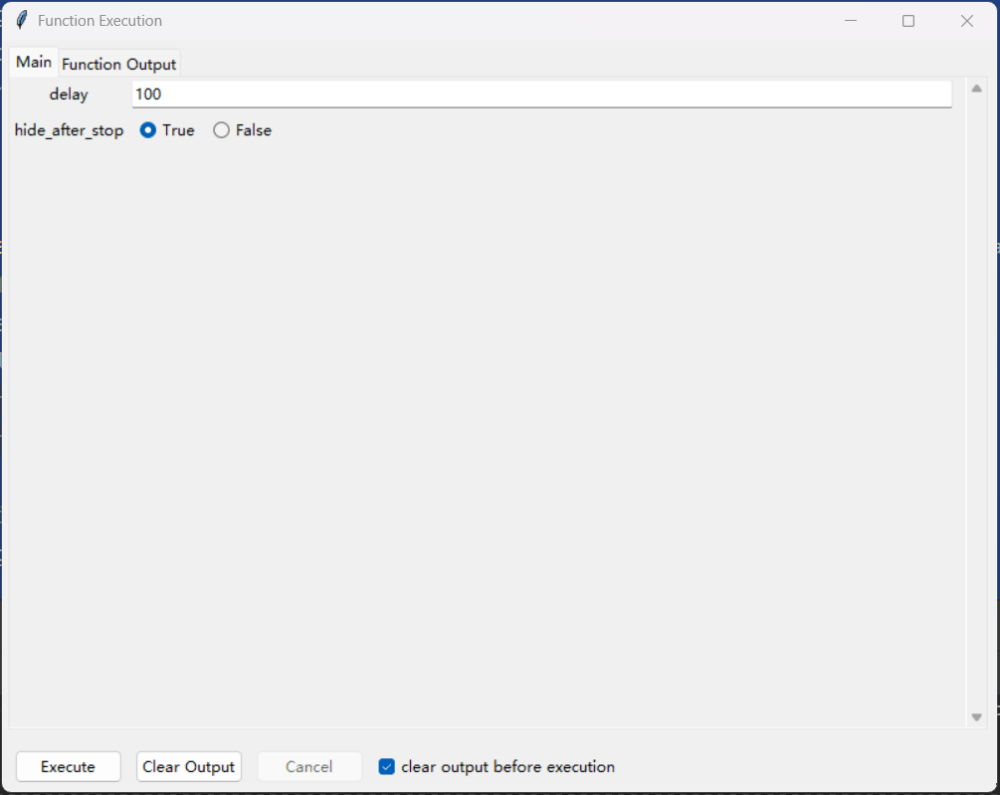


### 3.7 Configuring the Window

In addition to configuring the widgets of the function parameters, `PyGUIAdapterLite` also allows developers to configure the window itself, such as setting its size, position, icon, title,  etc.

For the function execution window, developers need to pass an configuration object of `FnExecuteWindowConfig` class to the `window_config` parameter when calling `GUIAdapter.add()` .

For the function selection window, the `select_window_config` parameter should be passed with a instance of  `FnSelectWindowConfig` class when calling `GUIAdapter.run()`.

Both the function selection window and the function execution window support the following properties:

| Property      | Type                                     | Default Value  | Description                         |
| :------------ | :--------------------------------------- | :------------- | :---------------------------------- |
| always_on_top | `bool`                                   | `False`        | Whether the window is always on top |
| icon          | `Optional[str]`                          | `None`         | Window icon path (ICO format)       |
| menus         | `Optional[List[Union[Menu, Separator]]]` | `None`         | Window menus                        |
| position      | `Tuple[Optional[int], Optional[int]]`    | `(None, None)` | Window position                     |
| size          | `Tuple[int, int]`                        | `(800, 605)`   | Window size                         |
| title         | `str`                                    | `""`           | Window title                        |


Configurable properties for execution window:

| Property                       | Type                                                         | Default Value                                 | Description                                                  |
| :----------------------------- | :----------------------------------------------------------- | :-------------------------------------------- | :----------------------------------------------------------- |
| cancel_button_text             | `str`                                                        | `"Cancel"`                                    | Text for the cancel button                                   |
| clear_button_text              | `str`                                                        | `"Clear Output"`                              | Text for the clear button                                    |
| clear_button_visible           | `bool`                                                       | `True`                                        | Whether to display the clear button                          |
| clear_checkbox_checked         | `bool`                                                       | `True`                                        | Whether the clear checkbox is selected by default            |
| clear_checkbox_text            | `str`                                                        | `"clear output before execution"`             | Text for the clear checkbox                                  |
| clear_checkbox_visible         | `bool`                                                       | `True`                                        | Whether to display the clear checkbox                        |
| default_parameter_group_name   | `str`                                                        | `"Main"`                                      | Default parameter group name                                 |
| disable_widgets_on_execute     | `bool`                                                       | `False`                                       | Whether to disable all widgets in the window during function execution(not implemented yet) |
| document_font                  | `tuple`                                                      | `('Arial', 12)`                               | Font for the function documentation                          |
| document_tab                   | `bool`                                                       | `True`                                        | Whether to display the function documentation                |
| document_tab_title             | `str`                                                        | `"Function Document"`                         | Title for the function documentation tab                     |
| enable_output_default_menu     | `bool`                                                       | `True`                                        | Whether to display the default right-click menu in the fake terminal area |
| enable_progress_label          | `bool`                                                       | `False`                                       | Whether to display the progress label                        |
| enable_progressbar             | `bool`                                                       | `False`                                       | Whether to display the progress bar                          |
| error_dialog_title             | `str`                                                        | `"Error"`                                     | Title for the error dialog                                   |
| execute_button_text            | `str`                                                        | `"Execute"`                                   | Text for the execute button                                  |
| function_error_message         | `str`                                                        | `"{}: {}`                                     | Message template for function exceptions/errors. First `{}`: exception type, second `{}`: exception message |
| function_error_traceback       | `bool`                                                       | `True`                                        | Whether to display detailed stack trace for function exceptions/errors |
| function_executing_message     | `str`                                                        | `"The function is executing, please wait..."` | Message indicating the function is executing                 |
| function_not_executing_message | `str`                                                        | `"The function is not executing."`            | Message indicating the function is not currently executing   |
| function_result_message        | `str`                                                        | `"The function returned: {}"`                 | Message template for function return value. Use `{}` to capture the return value |
| output_background              | `str`                                                        | `"black"`                                     | Background color of the fake terminal                        |
| output_font                    | `tuple`                                                      | `('Consolas', 12)`                            | Font of the fake terminal                                    |
| output_foreground              | `str`                                                        | `"white"`                                     | Foreground color (default text color) of the fake terminal   |
| output_tab_title               | `str`                                                        | `"Function Output"`                           | Title for the output area (fake terminal ) tab               |
| parameter_error_message        | `str`                                                        | `"{}: {}"`                                    | Message template for `ParameterError` exceptions. First `{}`: parameter name, second `{}`: exception message |
| print_function_error           | `bool`                                                       | `True`                                        | Whether to print function exception/error information        |
| print_function_result          | `bool`                                                       | `True`                                        | Whether to print function return value                       |
| progress_label_anchor          | `Literal['nw', 'n', 'ne', 'w', 'center', 'e', 'sw', 's', 'se']` | `"center"`                                    | Text alignment for the progress label                        |
| progress_label_font            | `Union[tuple, NoneType]`                                     | `None`                                        | Text alignment for the progress label                        |
| result_dialog_title            | `str`                                                        | `"Result"`                                    | Font for the progress label                                  |
| show_function_error            | `bool`                                                       | `True`                                        | Title for the function return value dialog                   |
| show_function_result           | `bool`                                                       | `True`                                        | Whether to show function return value in a popup dialog      |
| uncancelable_function_message  | `str`                                                        | `"The function is not cancellable."`          | Message indicating the function cannot be cancelled          |


Configurable properties for selection window:

| Property                 | Type    | Default Value                 | Description                                 |
| :----------------------- | :------ | :---------------------------- | :------------------------------------------ |
| current_view_status_text | `str`   | `"Current function: "`        | Current view status message                 |
| document_font            | `tuple` | `('Arial', 10, 'bold')`       | Documentation font                          |
| document_view_title      | `str`   | `"Function Document"`         | Documentation area title                    |
| function_list_title      | `str`   | `"Function List"`             | Function list title                         |
| label_text_font          | `tuple` | `('Arial', 10, 'bold')`       | Label font                                  |
| no_document_text         | `str`   | `"No documentation provided"` | Prompt message when no documentation exists |
| no_selection_status_text | `str`   | `"Select a function first!"`  | Prompt message when no function is selected |
| select_button_text       | `str`   | `"Select"`                    | Select button text                          |


Here is a comprehensive example:

```python
from pyguiadapterlite import (
    GUIAdapter,
    uprint,
    FnSelectWindowConfig,
    FnExecuteWindowConfig,
)
from pyguiadapterlite.types import dir_t


def convert_pngs(input_dir: dir_t, output_dir: dir_t):
    """Convert PNGs to JPGs."""
    uprint(f"Converting PNGs from {input_dir} to {output_dir}")


def converts_gifs(input_dir: dir_t, output_dir: dir_t):
    """Convert GIFs to PNGs."""
    uprint(f"Converting GIFs from {input_dir} to {output_dir}")


if __name__ == "__main__":
    adapter = GUIAdapter()
    adapter.add(
        convert_pngs,
        display_name="PNG Converter",
        window_config=FnExecuteWindowConfig(
            title="PNG Converter",
            icon="pic_32.ico",
            execute_button_text="Convert",
            clear_button_text="Clear Output",
            clear_checkbox_visible=False,
            default_parameter_group_name="Input/Output",
            output_tab_title="Output",
            output_background="#300A24",
            document_tab_title="Description",
            show_function_result=False,
            print_function_result=False,
        ),
    )
    adapter.add(converts_gifs, display_name="GIF Converter", icon="gif_64.ico")
    adapter.run(
        select_window_config=FnSelectWindowConfig(
            title="Image ToolBox",
            icon="toolkit_64.ico",
            select_button_text="Go",
            function_list_title="Image Tools",
            document_view_title="Description",
            no_document_text="No description available",
            no_selection_status_text="Please select an image tool",
            current_view_status_text="Current Function: ",
        )
    )

```

for selection window:


for execution window of `convert_pngs()` function:

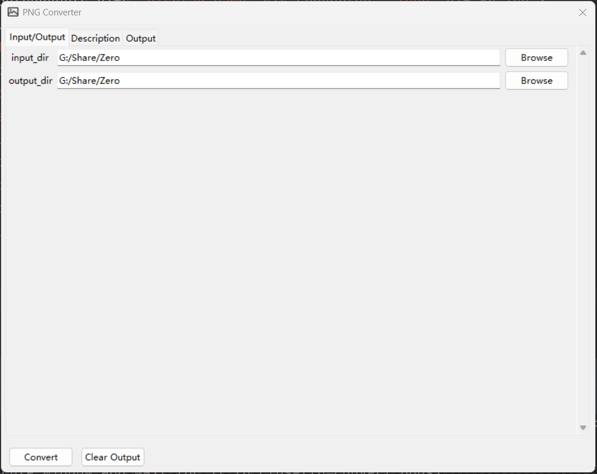


**For function execution window, setting `show_function_result=False` and `print_function_result=False` can be very useful, as there are often cases where we prefer not to display the function's return value in a pop-up dialog or automatically print it to the fake terminal.**


### 3.8 Window Menus

`PyGUIAdapterLite` provides support for window menus. Developers can add menus to both the **Function Selection Window** and **Function Execution Window**  and set response functions for the menu items.

#### 3.8.1 Basic Usage

The window menu support in `PyGUIAdapterLite` is implemented through the following classes: `Action`, `Separator`, and `Menu`.


**`Action`**: An `Action` represents a menu item.

| Field Name      | Type                                             | Default Value | Description                                                  |
| :-------------- | :----------------------------------------------- | :------------ | :----------------------------------------------------------- |
| checkable       | `bool`                                           | `False`       | Whether the menu item is **checkable**.                      |
| data            | `Optional[object]`                               | `None`        | User-defined data.                                           |
| enabled         | `bool`                                           | `True`        | Whether the menu item is enabled(not implemented yet).       |
| initial_checked | `bool`                                           | `False`       | Whether the menu item is initially in the "checked" state. Only effective when `checkable` is `True`. |
| on_triggered    | `Optional[Callable[[BaseWindow, Action], None]]` | `None`        | Callback function triggered when the menu item is activated (usually by click or shortcut key, if specified). |
| shortcut        | `Optional[str]`                                  | `None`        | Shortcut key for the menu item, e.g., `Control+o`.           |
| text            | `str`                                            | `""`          | The text displayed for the menu item.                        |

`Separator`：Used to separate two menu items.


`Menu`：Used to organize a group of menu items and can also support submenus by nesting `Menu` objects.


| Field Name       | Type                                   | Default Value | Description                                                  |
| :--------------- | :------------------------------------- | :------------ | :----------------------------------------------------------- |
| actions          | `List[Union[Action, Separator, Menu]]` | `[]`          | The items under the menu, can be: menu items (`Action`), separators (`Separator`), or submenus (`Menu`). |
| exclusive        | `bool`                                 | `False`       | Whether to add the menu items (`Action`) under this menu to an exclusive group. Only menu items (`Action`) with `checkable=True` will be added to the exclusive group. |
| tear_off_enabled | `bool`                                 | `True`        | Whether the menu can be "torn off". If `True`, the menu includes a special "tear-off" item (typically displayed as a dashed line at the top). |
| title            | `str`                                  | `""`          | The title of the menu.                                       |


Here is a simple example that adds two menus (`Menu`) to the function execution window, and  adds some menu items (`Action`) under each menu.

```python
from pyguiadapterlite import (
    uprint,
    GUIAdapter,
    Menu,
    FnExecuteWindow,
    Action,
    Separator,
)
from pyguiadapterlite.utils import show_information, show_question


def _on_action_open(window: FnExecuteWindow, action: Action):
    print("Action Open triggered")
    show_information("Action Open triggered", parent=window.parent)


def _on_action_save(window: FnExecuteWindow, action: Action):
    print("Action Save triggered")
    show_information("Action Save triggered", parent=window.parent)


def _on_action_close(window: FnExecuteWindow, action: Action):
    print("Action Close triggered")
    ret = show_question("Are you sure to close the window?", parent=window.parent)
    if ret == "yes":
        window.close()


def _on_action_about(window: FnExecuteWindow, action: Action):
    print("Action About triggered")
    show_information("Action About triggered", parent=window.parent)


def _on_action_help(window: FnExecuteWindow, action: Action):
    print("Action Help triggered")
    show_information("Action Help triggered", parent=window.parent)


def foo(arg1: str, arg2: int):
    uprint(f"arg1 is {arg1} and arg2 is {arg2}")


if __name__ == "__main__":
    adapter = GUIAdapter()
    adapter.add(
        foo,
        window_menus=[
            Menu(
                title="File",
                actions=[
                    Action(
                        text="Open", on_triggered=_on_action_open, shortcut="Control-o"
                    ),
                    Action(
                        text="Save", on_triggered=_on_action_save, shortcut="Control-s"
                    ),
                    Separator(),
                    Action(
                        text="Close",
                        on_triggered=_on_action_close,
                        shortcut="Control-w",
                    ),
                ],
            ),
            Menu(
                title="Help",
                actions=[
                    Action(text="About", on_triggered=_on_action_about),
                    Action(text="Help", on_triggered=_on_action_help),
                ],
            ),
        ],
    )
    adapter.run()
```


>  To set menus to the function selection window, simply pass a list of Menu objects to `select_window_menus` when calling the `adapter.run()` method.

#### 3.8.2 What Can Be Done in the Menu Item Callback Function?

Since the callback function of a menu item is called in the main (UI) thread, we can do a lot things  including directly manipulating the UI, such as calling the `show_xxx()` or `ask_xxx()` functions from the `pyguiadapterlite.utils` module to display information. Of course, since the callback function has access to the current execution window instance, we can also call various methods of it, including:\


```python
def get_parameter_values(self) -> Dict[str, Union[Any, InvalidValue]]:
    pass
```

Gets the current values of all parameters from the GUI.


```python
def set_parameter_values(self, values: Dict[str, Any], ignore_not_exist: bool = True):
    ...
```

Updates the current values of parameters on the GUI.


```python
def save_parameter_values(
        self,
        save_path: Union[str, Path, None] = None,
        serializer: Optional[Callable[[Dict[str, Any]], str]] = None,
        **filedialog_args,
):
    ...
```

Serializes the current parameter values and saves them to a file. Developers can provide a custom serialization function; the default uses JSON.


```python
def load_parameter_values(
        self,
        load_path: Union[str, Path, None] = None,
        ignore_not_exist: bool = True,
        deserializer: Optional[Callable[[str], Dict[str, Any]]] = None,
        **filedialog_args,
):
    ...
```

Loads serialized parameters from an external file, deserializes them, and updates the GUI.


```python
def close(self):
    ...
```

Attempts to close the current window.


```python
def clear_output(self):
    ...
```

Clears the output of the fake terminal.


```python
def is_function_cancellable(self) -> bool:
    ...
```

Checks if the current function is cancellable.


```python
def is_function_executing(self) -> bool:
    ...
```

Checks if the function is currently executing.


```python
def try_cancel(self):
    ...
```

Attempts to cancel the currently executing function.


```python
def print(self, *messages: str, sep: str = " ", end: str = "\n"):
    ...
```

Prints message to the fake terminal area.


```python
def show_function_document(self):
    ...
```

Pops up a window to display the function's documentation.


```python
def show_custom_dialog(
        self, dialog_class: Type[BaseDialog], title: str, **dialog_kwargs
) -> Any:
```

> This method is experimental.

Pops up a custom dialog and retrieves its result. The first parameter, `dialog_class`, specifies the class of the custom dialog to pop up. By subclassing `BaseDialog`, developers can implement a dialog with a very complex GUI, making this a very powerful method. Refer to the file [pyguiadapterlite/components/dialog.py](https://pyguiadapterlite/components/dialog.py) for details on `BaseDialog` and how to subclass it to create complex GUI.


```python
def show_sub_window(
        self,
        window_class: Type["BaseWindow"],
        config: BaseWindowConfig,
        modal: bool = False,、
):
    ...
```

> This method is experimental.

Displays a sub-window. The `window_class` parameter specifies the class of the sub-window;  this class must be a subclass of [BaseWindow](https://pyguiadapterlite/windows/basewindow.py). The `config` parameter, which must be an instance of [BaseWindowConfig](https://pyguiadapterlite/windows/basewindow.py) (or its subclass), is passed to the sub-window's constructor. This method offers more flexibility than `show_custom_dialog()`, allowing users to display any tkinter/ttk GUI .

The following example demonstrates how to implement a settings window  by subclassing `BaseWindow` and how to use `show_sub_window()` to show it.

```python
import dataclasses
import tkinter as tk
from tkinter import Toplevel, Tk, messagebox, ttk
from typing import Union, Any, Tuple

from pyguiadapterlite import (
    BaseWindow,
    BaseWindowConfig,
    FnExecuteWindow,
    Action,
    uprint,
    GUIAdapter,
    Menu,
)


class SettingsFrame(ttk.Frame):
    def __init__(self, parent: "SettingsWindow"):
        super().__init__(parent.parent, padding="10")
        self.parent: "SettingsWindow" = parent

        self.theme_var = tk.StringVar(value="light")
        self.auto_save_var = tk.BooleanVar(value=True)
        self.font_size_var = tk.IntVar(value=12)
        self.language_var = tk.StringVar(value="中文")

        self.create_widgets()
        self.setup_layout()

    def create_widgets(self):
        """创建所有界面控件"""
        self.title_label = ttk.Label(self, text="设置", font=("Arial", 16, "bold"))

        self.theme_frame = ttk.LabelFrame(self, text="主题设置", padding="5")
        self.light_radio = ttk.Radiobutton(
            self.theme_frame, text="浅色主题", variable=self.theme_var, value="light"
        )
        self.dark_radio = ttk.Radiobutton(
            self.theme_frame, text="深色主题", variable=self.theme_var, value="dark"
        )
        self.auto_radio = ttk.Radiobutton(
            self.theme_frame, text="跟随系统", variable=self.theme_var, value="auto"
        )

        self.general_frame = ttk.LabelFrame(self, text="常规设置", padding="5")
        self.auto_save_check = ttk.Checkbutton(
            self.general_frame, text="自动保存", variable=self.auto_save_var
        )
        self.language_combo = ttk.Combobox(
            self.general_frame,
            textvariable=self.language_var,
            values=["中文", "English", "日本語", "Español"],
            state="readonly",
        )
        ttk.Label(self.general_frame, text="界面语言:").grid(
            row=0, column=0, sticky="w"
        )
        self.language_combo.grid(row=0, column=1, sticky="ew", padx=(10, 0))

        self.font_frame = ttk.LabelFrame(self, text="字体设置", padding="5")
        ttk.Label(self.font_frame, text="字体大小:").grid(row=0, column=0, sticky="w")
        self.font_scale = ttk.Scale(
            self.font_frame,
            from_=8,
            to=24,
            variable=self.font_size_var,
            orient="horizontal",
        )
        self.font_value_label = ttk.Label(self.font_frame, text="12")
        self.font_scale.configure(command=self.update_font_value)

        self.button_frame = ttk.Frame(self)
        self.save_btn = ttk.Button(
            self.button_frame, text="保存设置", command=self.save_settings
        )
        self.cancel_btn = ttk.Button(
            self.button_frame, text="取消", command=self.cancel
        )
        self.reset_btn = ttk.Button(
            self.button_frame, text="恢复默认", command=self.reset_settings
        )

    def setup_layout(self):
        """设置控件布局"""
        self.title_label.grid(row=0, column=0, columnspan=2, pady=(0, 20))

        self.theme_frame.grid(row=1, column=0, columnspan=2, sticky="ew", pady=(0, 10))
        self.light_radio.grid(row=0, column=0, sticky="w", padx=(0, 20))
        self.dark_radio.grid(row=0, column=1, sticky="w", padx=(0, 20))
        self.auto_radio.grid(row=0, column=2, sticky="w")

        self.general_frame.grid(
            row=2, column=0, columnspan=2, sticky="ew", pady=(0, 10)
        )
        self.auto_save_check.grid(
            row=1, column=0, columnspan=2, sticky="w", pady=(5, 0)
        )
        self.general_frame.columnconfigure(1, weight=1)

        self.font_frame.grid(row=3, column=0, columnspan=2, sticky="ew", pady=(0, 20))
        self.font_scale.grid(row=0, column=1, sticky="ew", padx=(10, 10))
        self.font_value_label.grid(row=0, column=2)
        self.font_frame.columnconfigure(1, weight=1)

        self.button_frame.grid(row=4, column=0, columnspan=2, pady=(10, 0))
        self.save_btn.grid(row=0, column=0, padx=(0, 10))
        self.cancel_btn.grid(row=0, column=1, padx=(0, 10))
        self.reset_btn.grid(row=0, column=2)

        self.columnconfigure(0, weight=1)
        self.columnconfigure(1, weight=1)

    def update_font_value(self, value):
        """更新字体大小显示"""
        self.font_value_label.config(text=str(int(float(value))))

    def save_settings(self):
        """模拟保存设置"""
        messagebox.showinfo("成功", "设置已保存！", parent=self.parent.parent)
        self.parent.close()

    def cancel(self):
        """取消设置"""
        self.parent.close()

    def reset_settings(self):
        """恢复默认设置"""
        self.theme_var.set("light")
        self.auto_save_var.set(True)
        self.font_size_var.set(12)
        self.language_var.set("中文")
        messagebox.showinfo("提示", "已恢复默认设置", parent=self.parent.parent)


@dataclasses.dataclass(frozen=True)
class SettingsWindowConfig(BaseWindowConfig):
    title: str = "设置"
    size: Tuple[int, int] = (400, 600)
    move_to_center: bool = True


class SettingsWindow(BaseWindow):
    def __init__(self, parent: Union[Tk, Toplevel], config: SettingsWindowConfig):
        self._center_frame = None

        super().__init__(parent, config)

        if config.move_to_center:
            self.move_to_center()

    def create_main_area(self) -> Any:
        self._center_frame = SettingsFrame(self)
        self._center_frame.pack(fill="both", expand=True)

    def on_close(self):
        super().on_close()
        print("SettingsWindow closed")


def on_action_settings_window(window: FnExecuteWindow, action: Action):
    _ = action  # 忽略 action 参数
    settings_window_config = SettingsWindowConfig()
    window.show_sub_window(SettingsWindow, settings_window_config, modal=True)


def foo(arg1: int, arg2: str, arg3: bool):
    uprint("arg1:", arg1, "arg2:", arg2, "arg3:", arg3)


if __name__ == "__main__":
    adapter = GUIAdapter()
    adapter.add(
        foo,
        window_menus=[
            Menu("文件", [Action("设置", on_triggered=on_action_settings_window)])
        ],
    )
    adapter.run()
```


#### 3.8.3 Saving/Loading Function Parameters

Sometimes, the functionality of saving current values of the parameters to an external file and loading them back into the GUI is very useful . This reduces repetitive input and facilitates the exchange of pre-configured parameters between users, significantly enhancing the user experience.

`PyGUIAdapterLite` offers built-in support for this need through the methods `save_parameter_values()` and `load_parameter_values()`. Here is a simple example demonstrating this functionality .

> By default, `save_parameter_values()` and `load_parameter_values()` use the built-in `json` module for serialization and deserialization of function parameters. If certain parameters cannot be serialized, developers can define custom serialization/deserialization methods and pass them to `save_parameter_values`/`load_parameter_values()` via  `serializer`/`deserializer`  parameter. 
>
> The `serializer` function must adhere to the following form:
>
> ```python
> def my_serializer(params: Dict[str, Any]) -> str:
>     """The `params` is the current states of all user function parameters, where the key is the parameter name and the value is the current value. The developer must return a serialized string."""
>  ...
>  return serialized_str
> 
> ```
>
> The `deserializer` function must adhere to the following form:
>
> ```python
> def my_deserializer(serialized_str: str) -> Dict[str, Any]:
>     """The `serialized_str` is the serialized string of user function parameters. The developer must return a dictionary where the keys are the user function's parameter names and the values are the parsed parameter values."""
>  ...
>  return params
> ```


```python
from typing import Literal

from pyguiadapterlite import uprint, FnExecuteWindow, Action, Menu, GUIAdapter
from pyguiadapterlite.types import choices_t, choice_t


def load_and_save_demo(
        arg1: int,
        arg2: float,
        arg3: bool,
        arg4: str,
        arg5: choices_t = (
                "apple",
                "banana",
                "orange",
                "pear",
                "grape",
                "pineapple",
                "watermelon",
                "kiwi",
        ),
        arg6: choice_t = ("java", "python", "javascript", "c++", "c#"),
        arg7: Literal["opt1", "opt2", "opt3"] = "opt2",
):
    """
    This demo shows how to save the parameters to a file and load them back later.
    """
    uprint(f"arg1: {arg1}, arg2: {arg2}, arg3: {arg3}, arg4: {arg4}")
    uprint(f"arg5: {arg5}")
    uprint(f"arg6: {arg6}")
    uprint(f"arg7: {arg7}")


if __name__ == "__main__":

    def save_params(wind: FnExecuteWindow, action: Action):
        print("Save current parameters of the window to a file")
        wind.save_parameter_values()

    def load_params(wind: FnExecuteWindow, action: Action):
        print("Load parameters from a file and apply to the window")
        wind.load_parameter_values()

    action_save = Action("Save Parameters", save_params, shortcut="Control-s")
    action_load = Action("Load Parameters", load_params, shortcut="Control-l")

    menu_file = Menu(title="File", actions=[action_save, action_load])

    adapter = GUIAdapter()
    adapter.add(load_and_save_demo, window_menus=[menu_file])
    adapter.run(show_select_window=True)
```

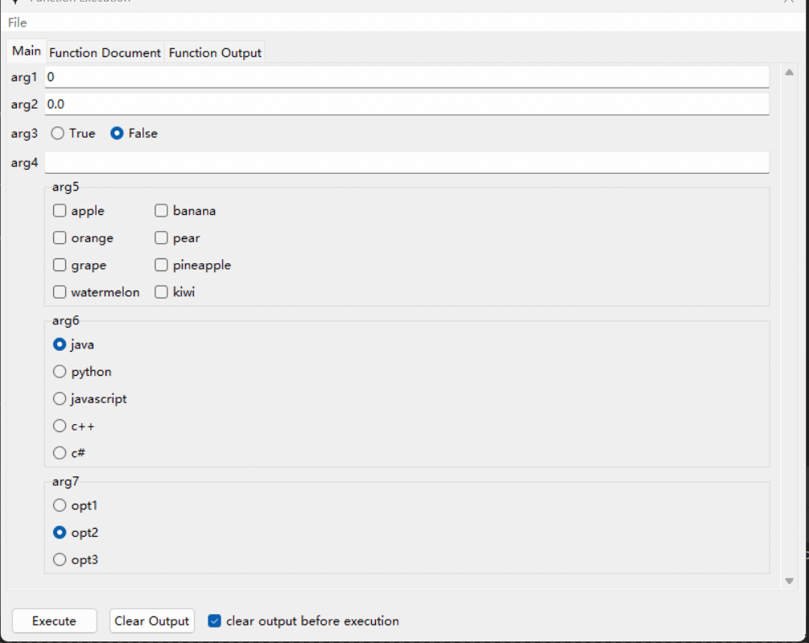


### 3.9 Making a Custom Parameter Widget

Although `PyGUIAdapterLite` provides many built-in parameter widget types and is able to cover most scenarios,  it still provide a very simple way to create custom parameter widget types for custom parameter types. 

To create a custom parameter widget, you need to:

1. Inherit from `BaseParameterWidget` to create your own widget class
2. Inherit from `BaseParameterWidgetConfig` to create a configuration class for your custom widget


Here is simple but complete example：


Suppose we want to create a parameter widget for the a custom data type `Point2D`:

```python
class Point2D(object):
    def __init__(self, x: int, y: int):
        self.x = x
        self.y = y
```

`Point2D` contains two `int` members, `x`and`y`. Therefore, we plan to create a custom parameter widget containing two `Spinbox` widgets as the input widget for `Point2D.x` and `Point2D.y` . By convention, we can name the parameter widget class `Point2DValueWidget`,  the widget configuration class named `Point2DValue`.

First, let's set up the basic framework for both classes:

```python
@dataclasses.dataclass(frozen=True)
class Point2DValue(BaseParameterWidgetConfig):
    default_value: Point2D = dataclasses.field(default_factory=lambda: Point2D(0, 0))

    @classmethod
    def target_widget_class(cls) -> Type["BaseParameterWidget"]:
        return Point2DValueWidget


class Point2DValueWidget(BaseParameterWidget):

    ConfigClass = Point2DValue

    def __init__(self, parent: Widget, parameter_name: str, config: Point2DValue):
        super().__init__(parent, parameter_name, config)

    def get_value(self) -> Union[Point2D, InvalidValue]:
        pass

    def set_value(self, value: Any) -> Union[Point2D, InvalidValue]:

        pass

    def build(self) -> "BaseParameterWidget":
        pass
```

Here are some important points to note:

- The configuration class `Point2DValue` must be a `dataclass` that inherits from `BaseParameterWidgetConfig` and must specify `frozen=True`
- In the configuration class `Point2DValue`, you must override the parent class's `target_widget_class()` method. This is a class method that returns the associated parameter widget class, i.e., `Point2DValueWidget`. (Note: This returns the parameter widget class `Point2DValueWidget` itself, not an instance of it!)
- In the configuration class `Point2DValue`, you typically need to override the `default_value` field and provide an appropriate value. This value will serve as the parameter's default value and the initial value displayed in the widget. Since `Point2D` is an object type, we should specify its  value using `dataclasses.field(default_factory=...)`.
- The parameter widget class `Point2DValueWidget` needs to define a class member variable named `ConfigClass`, whose value is the corresponding configuration class, i.e., `Point2DValue`. (Again, note that this should be set to the configuration class itself, not an instance of it!)
- In the custom parameter widget class `Point2DValueWidget`, we need to implement three abstract methods:
  - `get_value()`: This method is used to get the current value from the parameter widget. If retrieval fails (e.g., the user entered an invalid value in the widget), the method should return an `InvalidValue` object.
  - `set_value()`: This method is used to set the value passed by the user into the widget. If setting fails (e.g., the user passed an invalid object), this method should return an `InvalidValue` object.
  - `build()`: This method is used to actually create the input widgets.


Next, let's gradually complete the above code framework.  

Define some properties in `Point2DValue` that will be used later in `Point2DValueWidget`, such as the maximum, minimum, and step values for the Spinboxes:

```python
@dataclasses.dataclass(frozen=True)
class Point2DValue(BaseParameterWidgetConfig):
    default_value: Point2D = dataclasses.field(default_factory=lambda: Point2D(0, 0))
    max_x: int = 100
    max_y: int = 100
    min_x: int = -100
    min_y: int = -100
    x_step: int = 1
    y_step: int = 1

    @classmethod
    def target_widget_class(cls) -> Type["BaseParameterWidget"]:
        return Point2DValueWidget
```

Implement the three abstract methods in the `Point2DValueWidget` class. It's recommended to implement `build()` first, as this method creates the actual input widgets—the two Spinboxes representing the x and y fields:

```python
def build(self) -> "BaseParameterWidget":
    if self._is_build:
        return self
    config: Point2DValue = self.config
    self._x_spinbox = Spinbox(
        self,
        from_=config.min_x,
        to=config.max_x,
        increment=config.x_step,
    )
    self._y_spinbox = Spinbox(
        self,
        from_=config.min_y,
        to=config.max_y,
        increment=config.y_step,
    )
    self._x_spinbox.pack(side="left", padx=5)
    self._y_spinbox.pack(side="left", padx=5)
    #将default_value设置x、y控件的初始值
    if config.default_value is not None:
        self._x_spinbox.set(config.default_value.x)
        self._y_spinbox.set(config.default_value.y)
    self._is_build = True
    return self

```

A few points to note:

- Generally, we define a `_is_build` member variable to mark whether `build()` has been called, preventing duplicate widget creation.
- we can use the `self.config` to get the configuration object(Point2DValue object).

Implement `get_value()`. This method is relatively simple—we just gets the values from the x and y Spinboxes, then creates `Point2D` object with the values and return it in the end. Of course, we can return an `InvalidValue` in certain cases to indicate that the current value on GUI is invalid. For example, the following situations can be considered invalid:

- The value on the current Spinbox cannot be converted to an int
- The value on the current Spinbox is out of the range

```python
def get_value(self) -> Union[Point2D, InvalidValue]:
    raw_x = self._x_spinbox.get()
    raw_y = self._y_spinbox.get()
    try:
        x = int(raw_x)
        y = int(raw_y)
    except BaseException as e:
        return InvalidValue(
            raw_value=(raw_x, raw_y),
            msg="cannot convert x or y to an integer",
            exception=e,
        )
    config: Point2DValue = self.config
    if x < config.min_x or x > config.max_x:
        return InvalidValue(
            raw_value=(raw_x, raw_y),
            msg=f"x value should be between {config.min_x} and {config.max_x}"
        )
    if y < config.min_y or y > config.max_y:
        return InvalidValue(
            raw_value=(raw_x, raw_y),
            msg=f"y value should be between {config.min_y} and {config.max_y}"
        )
    return Point2D(x, y)
```


Implement the `set_value()` method. The logic here is also quite straightforward—it updates the x and y spinbox with the value passed by the user. However, we cannot assume that the user passed a valid `Point2D` object; it could be anything! Therefore, it's best to perform checks on the passed value as well and return an `InvalidValue` object when an invalid value is received:

```python
def set_value(self, value: Any) -> Union[Point2D, InvalidValue]:
    if not isinstance(value, Point2D):
        return InvalidValue(
            raw_value=value,
            msg="value should be a Point2D object",
        )
    config: Point2DValue = self.config
    if value.x < config.min_x or value.x > config.max_x:
        return InvalidValue(
            raw_value=value,
            msg=f"x value should be between {config.min_x} and {config.max_x}",
        )
    if value.y < config.min_y or value.y > config.max_y:
        return InvalidValue(
            raw_value=value,
            msg=f"y value should be between {config.min_y} and {config.max_y}",
        )
    self._x_spinbox.set(value.x)
    self._y_spinbox.set(value.y)
    return value
```


At this point, we have implemented the essential elements required for a custom parameter widget class. To allow `PyGUIAdapterLite` to automatically recognize the `Point2D` as a annotation, we have one final step: associate `Point2D` with its widget class `Point2DValueWidget`. For this, we need to call the `ParameterWidgetFactory.register()` method:

```python
ParameterWidgetFactory.register(Point2D, Point2DValueWidget)
```


Now, we can use `Point2D`  just like built-in types:

```python
def test_point2d(point1: Point2D, point2: Point2D = Point2D(50, 60)):
    uprint(f"point1:({point1.x},{point1.y}), type: {type(point1)}")
    uprint(f"point2:({point2.x},{point2.y}), type: {type(point2)}")


if __name__ == "__main__":
    ParameterWidgetFactory.register(Point2D, Point2DValueWidget)
    adapter = GUIAdapter()
    adapter.add(
        test_point2d,
        point1=Point2DValue(
            default_value=Point2D(10, 20),
            min_x=0,
            max_x=100,
            min_y=0,
            max_y=100,
            x_step=10,
            y_step=10,
        ),
    )
    adapter.run()
```


Below is the complete example code:

```python
import dataclasses
from tkinter import Widget
from tkinter.ttk import Spinbox
from typing import Type, Any, Union, Optional

from pyguiadapterlite import uprint, GUIAdapter, ParameterWidgetFactory
from pyguiadapterlite.components.valuewidget import (
    BaseParameterWidgetConfig,
    BaseParameterWidget,
    InvalidValue,
)


class Point2D(object):
    def __init__(self, x: int, y: int):
        self.x = x
        self.y = y


@dataclasses.dataclass(frozen=True)
class Point2DValue(BaseParameterWidgetConfig):
    default_value: Point2D = dataclasses.field(default_factory=lambda: Point2D(0, 0))
    max_x: int = 100
    max_y: int = 100
    min_x: int = -100
    min_y: int = -100
    x_step: int = 1
    y_step: int = 1

    @classmethod
    def target_widget_class(cls) -> Type["BaseParameterWidget"]:
        return Point2DValueWidget


class Point2DValueWidget(BaseParameterWidget):

    ConfigClass = Point2DValue

    def __init__(self, parent: Widget, parameter_name: str, config: Point2DValue):
        self._x_spinbox: Optional[Spinbox] = None
        self._y_spinbox: Optional[Spinbox] = None
        self._is_build = False

        super().__init__(parent, parameter_name, config)

    def get_value(self) -> Union[Point2D, InvalidValue]:
        raw_x = self._x_spinbox.get()
        raw_y = self._y_spinbox.get()
        try:
            x = int(raw_x)
            y = int(raw_y)
        except BaseException as e:
            return InvalidValue(
                raw_value=(raw_x, raw_y),
                msg="cannot convert x or y to an integer",
                exception=e,
            )
        config: Point2DValue = self.config
        if x < config.min_x or x > config.max_x:
            return InvalidValue(
                raw_value=(raw_x, raw_y),
                msg=f"x value should be between {config.min_x} and {config.max_x}",
            )
        if y < config.min_y or y > config.max_y:
            return InvalidValue(
                raw_value=(raw_x, raw_y),
                msg=f"y value should be between {config.min_y} and {config.max_y}",
            )
        return Point2D(x, y)

    def set_value(self, value: Any) -> Union[Point2D, InvalidValue]:
        if not isinstance(value, Point2D):
            return InvalidValue(
                raw_value=value,
                msg="value should be a Point2D object",
            )
        config: Point2DValue = self.config
        if value.x < config.min_x or value.x > config.max_x:
            return InvalidValue(
                raw_value=value,
                msg=f"x value should be between {config.min_x} and {config.max_x}",
            )
        if value.y < config.min_y or value.y > config.max_y:
            return InvalidValue(
                raw_value=value,
                msg=f"y value should be between {config.min_y} and {config.max_y}",
            )
        self._x_spinbox.set(value.x)
        self._y_spinbox.set(value.y)
        return value

    def build(self) -> "BaseParameterWidget":
        if self._is_build:
            return self
        config: Point2DValue = self.config
        self._x_spinbox = Spinbox(
            self,
            from_=config.min_x,
            to=config.max_x,
            increment=config.x_step,
        )
        self._y_spinbox = Spinbox(
            self,
            from_=config.min_y,
            to=config.max_y,
            increment=config.y_step,
        )
        self._x_spinbox.pack(side="left", padx=5)
        self._y_spinbox.pack(side="left", padx=5)
        if config.default_value is not None:
            self._x_spinbox.set(config.default_value.x)
            self._y_spinbox.set(config.default_value.y)
        self._is_build = True
        return self


def test_point2d(point1: Point2D, point2: Point2D = Point2D(50, 60)):
    uprint(f"point1:({point1.x},{point1.y}), type: {type(point1)}")
    uprint(f"point2:({point2.x},{point2.y}), type: {type(point2)}")


if __name__ == "__main__":
    ParameterWidgetFactory.register(Point2D, Point2DValueWidget)
    adapter = GUIAdapter()
    adapter.add(
        test_point2d,
        point1=Point2DValue(
            default_value=Point2D(10, 20),
            min_x=0,
            max_x=100,
            min_y=0,
            max_y=100,
            x_step=10,
            y_step=10,
        ),
    )
    adapter.run()
```


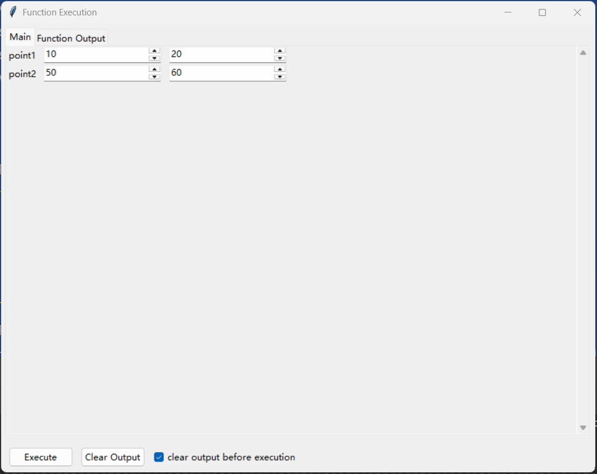


### 3.10 Additional Notes

#### About i18n

`PyGUIAdapterLite` implements a simple i18n mechanism based on `gettext` 
module. It has created a translation template file 
[`pyguiadapterlite/_assets/locales/pyguiadapterlite.pot`](pyguiadapterlite/_assets/locales/pyguiadapterlite.pot) ，provide built-in 
Chinese translation file [`pyguiadapterlite/_assets/locales/zh_CN.po`](pyguiadapterlite/_assets/locales/zh_CN.po) and the pre-compiled mo file of 
it [`pyguiadapterlite/_assets/locales/zh_CN/LC_MESSAGES/pyguiadapterlite.mo`](pyguiadapterlite/_assets/locales/zh_CN/LC_MESSAGES/pyguiadapterlite.mo).

By default, `PyGUIAdapterLite` automatically detects the current `locale` of the system. If a corresponding translation file exists in the specified `localedir` for the `locale`, it will use that file. If not found, it falls back to the original strings (English). `PyGUIAdapterLite` allows developers to specify the `localedir` and current `locale`, enabling them to add or use custom `locales`.

Environment variables related to i18n:

- `PYGUIADAPTERLITE_LOCALE`: Used to specify the current `locale`. If not specified or set to `auto`, it will attempt to automatically detect the current system `locale`.
- `PYGUIADAPTERLITE_LOCALE_DIR`: Used to specify a custom locales directory (i.e., the directory containing locale files). If not specified, it will look for translation files in `PyGUIAdapterLite`'s built-in locales directory.
- `PYGUIADAPTERLITE_EXPORT_LOCALES`: This environment variable should be used in conjunction with `PYGUIADAPTERLITE_LOCALE_DIR`. If the developer specifies a locales directory via `PYGUIADAPTERLITE_LOCALE_DIR`, `PyGUIAdapterLite` will attempt to export the built-in locale files to that directory, provided the specified locales directory is empty or does not exist. If the custom locales directory already contains files, the built-in translation files will not be exported to avoid accidentally overwriting the developer's files. Through `PYGUIADAPTERLITE_EXPORT_LOCALES`, developers can obtain the built-in translation files, allowing them to modify existing translations or add new translations for other languages using the template file.

We can set these three environment variables via `os.environ` in code. However, note that the statements setting these environment variables must be placed before importing the `pyguiadapter` package and its subpackages; otherwise, translations may not take effect. Therefore, it is recommended to place the relevant statements at the beginning of the main file, as shown below:

```python
import os
from pathlib import Path


# set current locale to "en_US"
# if this environment variable is not set, the locale will be automatically detected
os.environ["PYGUIADAPTERLITE_LOCALE"] = "en_US"
# os.environ["PYGUIADAPTERLITE_LOCALE"] = "zh_CN"
# os.environ["PYGUIADAPTERLITE_LOCALE"] = "auto"

# set custom locale directory
# if this environment variable is not set, the built-in locale directory will be used
os.environ["PYGUIADAPTERLITE_LOCALE_DIR"] = (
        Path(__file__).parent / "locales"
).as_posix()

# export built-in locale files to the custom locale directory specified by PYGUIADAPTERLITE_LOCALE_DIR,
# the custom locale directory should be empty or non-existent, if not empty, nothing will be exported
os.environ["PYGUIADAPTERLITE_EXPORT_LOCALES"] = "true"


from pyguiadapterlite import GUIAdapter


def foo(a: int, b: int):
    pass


if __name__ == "__main__":
    adapter = GUIAdapter()
    adapter.add(foo)
    adapter.run()

```


## Packaging with PyInstaller


Here is an example of how to use `PyInstaller` to package your project using `PyGUIAdapterLite`.

Because `PyGUIAdapterLite` contains some resource files, they must be included in the final executable file to avoid runtime errors.


Here we use the so-called pyinstaller hooks mechanism to automatically collect teh resources files required by `PyGUIAdapterLite`, and include them in the final executable file.

Assume we need to package an app named `foo-app`, its directory structure is as follows:

```text
foo-app 
├── foo_app/
│   ├── __init__.py
│   ├── ...
├── main.py
├── ...
```

First of all, we need to install `pyinstaller` (assuming you use `pip`):

```bash
pip install pyinstaller
```


> Note: Make sure all the dependencies (including `pyguiadapterlite`) your project needs are installed 
> properly before packaging. Otherwise, the packaging may be successful, but the resulting 
> executable may not work properly.


Then, create a file named `hook-pyguiadapterlite.py` in the root directory 
of your project, 
and add the following codes to it:

```python
from PyInstaller.utils.hooks import collect_data_files
datas = collect_data_files("pyguiadapterlite")
```

This file tells `PyInstaller` to collect all the resource files required by `pyguiadapterlite` and include them in the final executable file.

Finally, we can run the following command to package the app:

```bash
pyinstaller --additional-hooks-dir=. ./main.py
```

If everything goes well, a `build` directory and a `dist` directory will be 
generated in the root directory of your project, the executable file and its
runtime dependencies will be placed in the `dist` directory.

```text
foo-app 
├── foo_app/
│   ├── __init__.py
│   ├── ...
├── main.py
├── build/
└── dist/
    ├── main
        ├── _internal
        ├── main.exe
```

If the  `dist/main/_internal/pyguiadapterlite/_assets` directory is present, 
it means the resource files have been collected successfully.

Here is a minimal example of this topic: [examples/foo-app](examples/foo-app/)

## Showcase

Here are some real-world projects using `PyGUIAdapterLite`, you can learn 
every detail of developing a complete GUI program using `PyGUIAdapterLite` 
from them:

- [ico-converter](https://github.com/zimolab/ico-converter)
- [amake](https://github.com/zimolab/amake)
- [zipapp-creator](https://github.com/zimolab/zipapp-creator)


## License

This project is licensed under the MIT License. See the [LICENSE](./LICENSE) 
file for details.


## Licenses of Third-party libs

The following lib are used by `PyGUIAdapterLite`：

- **IconPark**
  - Usage: Uses some icons from this library.
  - License: Apache License 2.0
  - License File: `licenses/IconPark-LICENSE.txt`
  - Repo: https://github.com/bytedance/IconPark

- **tomlkit**
  - Purpose: Parsing config block in TOML format.
  - License: MIT License
  - License File: `licenses/tomlkit-LICENSE.txt`
  - Project Address: https://github.com/python-poetry/tomlkit/
- **docstring_parser**
  - Purpose: Parsing docstrings in Python files.
  - License: MIT License
  - License File: `licenses/docstring_parser-LICENSE.md`
  - Project Address: https://github.com/rr-/docstring_parser
