### `PyGUIAdapterLite`支持的参数类型及其控件

[TOC]

#### （1）`str` ——> `StringValue`

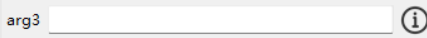

默认控件类：[`StringValueWidget`](pyguiadapterlite/types/strs/line.py#L47)

默认配置类：[`StringValue`](pyguiadapterlite/types/strs/line.py#L18)

可配置属性：

| 字段名    | 类型                                        | 默认值   | 描述                                                         |
| :-------- | :------------------------------------------ | :------- | :----------------------------------------------------------- |
| echo_char | `str`                                       | ""       | 回显字符，如果不为空，则用户输入的字符会以该字符显示。可以用于模拟密码输入框，比如将echo_char设置为'*' |
| justify   | `typing.Literal['left', 'center', 'right']` | `"left"` | 文本对齐方式，默认为左对齐（`"left"`）                       |


#### （2）`int` ——> `IntValue`

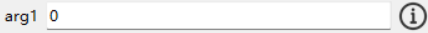

默认控件类：[`IntValueWidget`](pyguiadapterlite/types/ints/common.py#L87)

默认配置类：[`IntValue`](pyguiadapterlite/types/ints/common.py#L18)

可配置属性：

| 字段名       | 类型   | 默认值  | 描述                                       |
| :----------- | :----- | :------ | :----------------------------------------- |
| auto_correct | `bool` | `False` | 用户输入非法值时，是否尝试自动修正为默认值 |


#### （3）`bool` ——> `BoolValue`

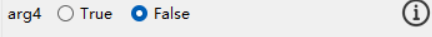

默认控件类：[`BoolValueWidget`](pyguiadapterlite/types/booleans/common.py#L73)

默认配置类：[`BoolValue`](pyguiadapterlite/types/booleans/common.py#L17)

可配置属性：

| 字段名      | 类型                                       | 默认值         | 描述                                                         |
| :---------- | :----------------------------------------- | :------------- | :----------------------------------------------------------- |
| false_text  | `str`                                      | `"False"`      | 代表假值的选项框的文本                                       |
| orientation | `typing.Literal['horizontal', 'vertical']` | `"horizontal"` | 选项框的排列方向，'horizontal': 横向排列，'vertical': 纵向排列 |
| true_text   | `str`                                      | `"True"`       | 代表真值的选项框的文本                                       |


#### （4）`float` ——> `FloatValue`

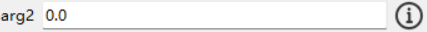

默认控件类：[`FloatValueWidget`](pyguiadapterlite/types/floats/common.py#L87)

默认配置类：[`FloatValue`](pyguiadapterlite/types/floats/common.py#L17)

可配置属性：

| 字段名       | 类型   | 默认值  | 描述                                         |
| :----------- | :----- | :------ | :------------------------------------------- |
| auto_correct | `bool` | `False` | 当用户输入非法字符时是否尝试自动纠正为默认值 |


#### （5）`Literal` ——> `SingleChoiceValue`

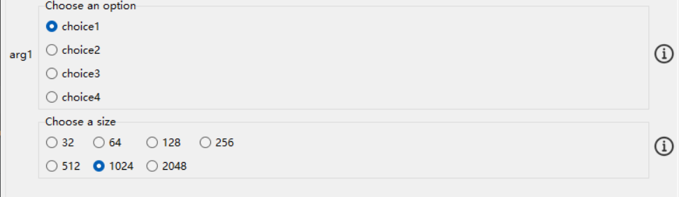

默认控件类：[`SingleChoiceValueWidget`](pyguiadapterlite/types/choices/singlechoice.py#L36)

默认配置类：[`SingleChoiceValue`](pyguiadapterlite/types/choices/singlechoice.py#L16)

可配置属性：

| 字段名        | 类型                                                         | 默认值 | 描述                                                         |
| :------------ | :----------------------------------------------------------- | :----- | :----------------------------------------------------------- |
| choices       | `typing.Union[typing.List[typing.Any], typing.Dict[str, typing.Any]]` | ""     | 可选项，可以是字典或列表，如果是字典，则键值对的`key`为展示给用户的名称，`value`为选项实际值 |
| columns       | `int`                                                        | `1`    | 单选框列数                                                   |
| content_title | `str`                                                        | ""     | 选项外框标题，若为空则将参数名称作为标题                     |

```python
from typing import Literal
from pyguiadapterlite import uprint, GUIAdapter
from pyguiadapterlite.types import SingleChoiceValue


def foo(
    arg1: Literal["choice1", "choice2", "choice3", "choice4"],
    arg2: Literal[32, 64, 128, 256, 512, 1024, 2048],
):
    uprint(f"arg1: {arg1}, type: {type(arg1)}")
    uprint(f"arg2: {arg2}, type: {type(arg2)}")


if __name__ == "__main__":
    adapter = GUIAdapter()
    adapter.add(
        foo,
        widget_configs={
            "arg1": SingleChoiceValue(
                default_value="choice1",
                choices=["choice1", "choice2", "choice3", "choice4"],
                content_title="Choose an option",
                hide_label=False,
                description="Choose an option for the first argument",
            ),
            "arg2": SingleChoiceValue(
                default_value=1024,
                content_title="Choose a size",
                columns=4,
                description="Choose a size for the new file",
            ),
        },
    )
    adapter.run()

```


#### （6）`bool_t` ——> `BoolValue2`

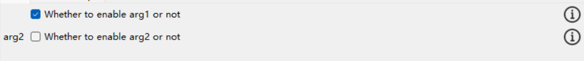

默认控件类：[`BoolValueWidget2`](pyguiadapterlite/types/booleans/boolcheck.py#L57)

默认配置类：[`BoolValue2`](pyguiadapterlite/types/booleans/boolcheck.py#L17)

可配置属性：

| 字段名    | 类型  | 默认值 | 描述                                                         |
| :-------- | :---- | :----- | :----------------------------------------------------------- |
| hint_text | `str` | ""     | 选项提示文本，如果为空则使用label或description作为提示文本，默认为空 |

```python
from pyguiadapterlite import uprint, GUIAdapter
from pyguiadapterlite.types import bool_t, BoolValue2


def foo(arg1: bool_t, arg2: bool_t):
    uprint("arg1:", arg1)
    uprint("arg2:", arg2)


if __name__ == "__main__":
    adapter = GUIAdapter()
    adapter.add(
        foo,
        widget_configs={
            "arg1": BoolValue2(
                default_value=True,
                hint_text="Whether to enable arg1 or not",
                description="This is a bool value with check box",
            ),
            "arg2": BoolValue2(
                default_value=False,
                hint_text="Whether to enable arg2 or not",
                hide_label=False,
                description="This is a bool value with check box",
            ),
        },
    )
    adapter.run()
```


#### （7）`int_r` ——> `RangedIntValue`

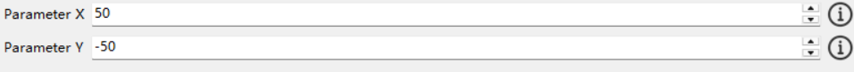

默认控件类：[`RangedIntValueWidget`](pyguiadapterlite/types/ints/ranged.py#L87)

默认配置类：[`RangedIntValue`](pyguiadapterlite/types/ints/ranged.py#L20)

可配置属性：

| 字段名    | 类型   | 默认值        | 描述                                               |
| :-------- | :----- | :------------ | :------------------------------------------------- |
| max_value | `int`  | `2147483647`  | 允许的最大值                                       |
| min_value | `int`  | `-2147483647` | 允许的最小值                                       |
| step      | `int`  | `1`           | 步长（即单次增加/减少的数量）                      |
| wrap      | `bool` | `False`       | 是否允许循环，即当值超出范围时，是否回到另一端边界 |

```python
from pyguiadapterlite import uprint, GUIAdapter
from pyguiadapterlite.types import int_r, RangedIntValue


def foo(x: int_r, y: int_r):
    uprint(f"x: {x}")
    uprint(f"y: {y}")


if __name__ == "__main__":
    adapter = GUIAdapter()
    adapter.add(
        foo,
        widget_configs={
            "x": RangedIntValue(
                label="Parameter X",
                min_value=0,
                max_value=100,
                step=1,
                wrap=True,
                default_value=50,
                description="This is parameter X",
            ),
            "y": RangedIntValue(
                label="Parameter Y",
                min_value=-100,
                max_value=100,
                step=1,
                wrap=True,
                default_value=-50,
                description="This is parameter Y",
            ),
        },
    )
    adapter.run()
```


#### （8）`int_s` ——> `ScaleIntValue2`

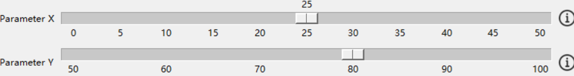

默认控件类：[`ScaleIntValueWidget2`](pyguiadapterlite/types/ints/scale.py#L236)

默认配置类：[`ScaleIntValue2`](pyguiadapterlite/types/ints/scale.py#L176)

可配置属性：

| 字段名        | 类型   | 默认值    | 描述           |
| :------------ | :----- | :-------- | :------------- |
| cursor        | `str`  | `"hand2"` | 鼠标指针样式   |
| digits        | `int`  | `0`       | 滑块的精度     |
| max_value     | `int`  | `100`     | 允许的最大值   |
| min_value     | `int`  | `0`       | 允许的最小值   |
| show_value    | `bool` | `True`    | 是否显示当前值 |
| step          | `int`  | `1`       | 滑块的步长     |
| tick_interval | `int`  | `10`      | 滑块的刻度间隔 |

```python
from pyguiadapterlite import uprint, GUIAdapter
from pyguiadapterlite.types import int_s, ScaleIntValue2

def foo(x: int_s, y: int_s):
    uprint(f"x: {x}")
    uprint(f"y: {y}")

if __name__ == "__main__":
    adapter = GUIAdapter()
    adapter.add(
        foo,
        widget_configs={
            "x": ScaleIntValue2(
                label="Parameter X",
                default_value=25,
                min_value=0,
                max_value=50,
                show_value=True,
                cursor="hand2",
                tick_interval=5,
                step=5,
                description="This is a description",
            ),
            "y": ScaleIntValue2(
                label="Parameter Y",
                default_value=75,
                min_value=50,
                max_value=100,
                show_value=False,
                tick_interval=10,
                cursor="arrow",
                step=10,
                description="This is a description",
            ),
        },
    )
    adapter.run()
```


#### （9）`int_ss` ——> `ScaleIntValue`

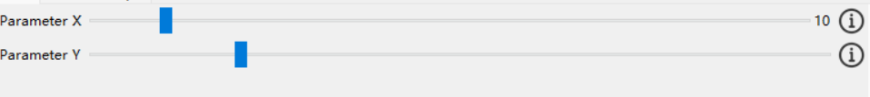

默认控件类：[`ScaleIntValueWidget`](pyguiadapterlite/types/ints/scale.py#L120)

默认配置类：[`ScaleIntValue`](pyguiadapterlite/types/ints/scale.py#L79)

可配置属性：

| 字段名     | 类型   | 默认值    | 描述           |
| :--------- | :----- | :-------- | :------------- |
| cursor     | `str`  | `"hand2"` | 鼠标指针样式   |
| max_value  | `int`  | `100`     | 允许的最大值   |
| min_value  | `int`  | `0`       | 允许的最小值   |
| show_value | `bool` | `True`    | 是否显示当前值 |

```python
from pyguiadapterlite import uprint, GUIAdapter
from pyguiadapterlite.types import int_ss, ScaleIntValue


def foo(x: int_ss, y: int_ss):
    uprint(f"x: {x}")
    uprint(f"y: {y}")


if __name__ == "__main__":
    adapter = GUIAdapter()
    adapter.add(
        foo,
        widget_configs={
            "x": ScaleIntValue(
                label="Parameter X",
                default_value=10,
                min_value=0,
                max_value=100,
                show_value=True,
                cursor="hand2",
                description="This is parameter x",
            ),
            "y": ScaleIntValue(
                label="Parameter Y",
                default_value=20,
                min_value=0,
                max_value=100,
                show_value=False,
                cursor="arrow",
                description="This is parameter y",
            ),
        },
    )
    adapter.run()

```


#### （10）`float_r` ——> `RangedFloatValue`

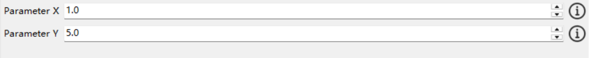

默认控件类：[`RangedFloatValueWidget`](pyguiadapterlite/types/floats/ranged.py#L163)

默认配置类：[`RangedFloatValue`](pyguiadapterlite/types/floats/ranged.py#L24)

可配置属性：

| 字段名       | 类型                                                 | 默认值          | 描述                                                         |
| :----------- | :--------------------------------------------------- | :-------------- | :----------------------------------------------------------- |
| auto_correct | `bool`                                               | `False`         | 是否自动纠正非法的值                                         |
| correct_to   | `typing.Literal['default', 'min', 'max', 'nearest']` | `"nearest"`     | 触发自动纠正时的目标值，'default': 纠正到默认值，'min': 纠正到最小值，'max': 纠正到最大值，'nearest': 纠正到最近的合法值 |
| decimals     | `int`                                                | `2`             | 小数点后保留的位数                                           |
| max_value    | `float`                                              | `2147483647.0`  | 允许的最大值                                                 |
| min_value    | `float`                                              | `-2147483647.0` | 允许的最小值                                                 |
| step         | `float`                                              | `0.1`           | 步长（即单次增加/减少的值）                                  |

```python
from pyguiadapterlite import uprint, GUIAdapter
from pyguiadapterlite.types import float_r, RangedFloatValue


def foo(x: float_r, y: float_r):
    uprint(f"x: {x}")
    uprint(f"y: {y}")


if __name__ == "__main__":
    adapter = GUIAdapter()
    adapter.add(
        foo,
        x=RangedFloatValue(
            label="Parameter X",
            default_value=1.0,
            min_value=0.5,
            max_value=10.0,
            step=0.1,
            decimals=5,
            auto_correct=False,
            description="This is a description of parameter X",
        ),
        y=RangedFloatValue(
            label="Parameter Y",
            default_value=5.0,
            min_value=-10.0,
            max_value=10.0,
            step=0.005,
            decimals=3,
            auto_correct=True,
            correct_to="nearest",
            description="This is a description of parameter Y",
        ),
    )
    adapter.run()
```


#### （11）`float_s` ——> `ScaleFloatValue`

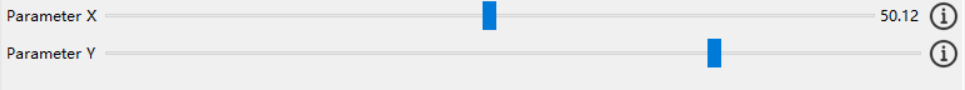

默认控件类：[`ScaleFloatValueWidget`](pyguiadapterlite/types/floats/ttkscale.py#L99)

默认配置类：[`ScaleFloatValue`](pyguiadapterlite/types/floats/ttkscale.py#L23)

可配置属性：

| 字段名     | 类型    | 默认值    | 描述           |
| :--------- | :------ | :-------- | :------------- |
| cursor     | `str`   | `"hand2"` | 鼠标指针样式   |
| digits     | `int`   | `5`       | 显示的小数位数 |
| max_value  | `float` | `100.0`   | 允许的最大值   |
| min_value  | `float` | `0.0`     | 允许的最小值   |
| show_value | `bool`  | `True`    | 是否显示当前值 |

```python
from pyguiadapterlite import uprint, GUIAdapter
from pyguiadapterlite.types import float_s, ScaleFloatValue


def foo(x: float_s, y: float_s):
    uprint("x: ", x)
    uprint("y: ", y)


if __name__ == "__main__":
    adapter = GUIAdapter()
    adapter.add(
        foo,
        x=ScaleFloatValue(
            label="Parameter X",
            default_value=50.12,
            min_value=0.0,
            max_value=100.0,
            digits=2,
            show_value=True,
            description="This is the X parameter",
        ),
        y=ScaleFloatValue(
            label="Parameter Y",
            default_value=175.34,
            min_value=100.0,
            max_value=200.0,
            digits=5,
            show_value=False,
            description="This is the Y parameter",
        ),
    )
    adapter.run()
```


#### （12）`float_ss` ——> `ScaleFloatValue2`

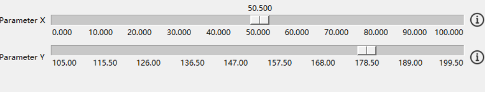

默认控件类：[`ScaleFloatValueWidget2`](pyguiadapterlite/types/floats/scale.py#L85)

默认配置类：[`ScaleFloatValue2`](pyguiadapterlite/types/floats/scale.py#L26)

可配置属性：

| 字段名        | 类型    | 默认值    | 描述                                           |
| :------------ | :------ | :-------- | :--------------------------------------------- |
| cursor        | `str`   | `"hand2"` | 鼠标指针样式                                   |
| digits        | `int`   | `0`       | 显示的总的位数，包含整数部分位数和小数部分位数 |
| max_value     | `float` | `100.0`   | 允许的最大值                                   |
| min_value     | `float` | `0.0`     | 允许的最小值                                   |
| show_value    | `bool`  | `True`    | 是否显示当前值                                 |
| step          | `float` | `0.5`     | 步长（即单次滑动的距离）                       |
| tick_interval | `float` | `10`      | 刻度线间隔                                     |

```python
from pyguiadapterlite import uprint, GUIAdapter
from pyguiadapterlite.types import float_ss, ScaleFloatValue2


def foo(x: float_ss, y: float_ss):
    uprint("x: ", x)
    uprint("y: ", y)


if __name__ == "__main__":
    adapter = GUIAdapter()
    adapter.add(
        foo,
        x=ScaleFloatValue2(
            label="Parameter X",
            default_value=50.5,
            min_value=0.0,
            max_value=100.0,
            show_value=True,
            digits=6,
            step=0.5,
            tick_interval=10,
            description="This is the X parameter",
        ),
        y=ScaleFloatValue2(
            label="Parameter Y",
            default_value=175.5,
            min_value=100.0,
            max_value=200.0,
            step=10.5,
            digits=5,
            show_value=False,
            description="This is the Y parameter",
        ),
    )
    adapter.run()
```


#### （13）`text_t` ——> `TextValue`

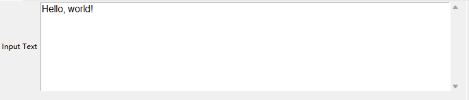

默认控件类：[`TextValueWidget`](pyguiadapterlite/types/strs/text.py#L57)

默认配置类：[`TextValue`](pyguiadapterlite/types/strs/text.py#L17)

可配置属性：

| 字段名       | 类型                                     | 默认值          | 描述                                     |
| :----------- | :--------------------------------------- | :-------------- | :--------------------------------------- |
| default_menu | `bool`                                   | `True`          | 是否显示默认菜单                         |
| font         | `tuple`                                  | `('Arial', 11)` | 字体                                     |
| height       | `int`                                    | `8`             | 文本框高度，注意单位为行，而非像素       |
| wrap         | `typing.Literal['none', 'char', 'word']` | `"word"`        | 断行方式，若设置为'none'则不进行自动断行 |

```python
from pyguiadapterlite import uprint, GUIAdapter
from pyguiadapterlite.types import text_t, TextValue


def foo(x: text_t):
    uprint(x)


if __name__ == "__main__":
    adapter = GUIAdapter()
    adapter.add(
        foo,
        x=TextValue(
            label="Input Text",
            default_value="Hello, world!",
            wrap="word",
            font=("Arial", 12),
        ),
    )
    adapter.run()
```


#### （14）`directory_t` ——> `DirectoryValue`

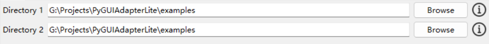

默认控件类：[`DirectoryValueWidget`](pyguiadapterlite/types/paths/dirselect.py#L119)

默认配置类：[`DirectoryValue`](pyguiadapterlite/types/paths/dirselect.py#L23)

可配置属性：

| 字段名             | 类型   | 默认值               | 描述                                                       |
| :----------------- | :----- | :------------------- | :--------------------------------------------------------- |
| absolutize_path    | `bool` | `False`              | 是否绝对化路径                                             |
| allow_backspace    | `bool` | `False`              | 在路径输入框为只读状态时，是否允许使用回退键删除输入框内容 |
| dialog_title       | `str`  | `"Select Directory"` | 目录选择对话框标题                                         |
| normalize_path     | `bool` | `False`              | 是否规范化路径                                             |
| readonly           | `bool` | `False`              | 路径输入框是否为只读状态                                   |
| select_button_text | `str`  | `"Browse"`           | 浏览按钮文本                                               |
| start_dir          | `str`  | ""                   | 起始目录                                                   |

```python
import os

from pyguiadapterlite import uprint, GUIAdapter
from pyguiadapterlite.types import directory_t, dir_t, DirectoryValue


def foo(x: directory_t, y: dir_t):
    uprint(f"x: {x}, exists: {os.path.exists(x)}")
    uprint(f"y: {y}, exists: {os.path.exists(y)}")


if __name__ == "__main__":
    adapter = GUIAdapter()
    adapter.add(
        foo,
        x=DirectoryValue(
            label="Directory 1",
            default_value=os.curdir,
            start_dir=os.getcwd(),
            readonly=False,
            normalize_path=True,
            absolutize_path=True,
            description="Directory 1 description",
        ),
        y=DirectoryValue(
            label="Directory 2",
            default_value=os.curdir,
            start_dir=os.getcwd(),
            readonly=True,
            allow_backspace=True,
            normalize_path=True,
            absolutize_path=True,
            description="Directory 2 description",
        ),
    )
    adapter.run()
```


#### （15）`dir_t` ——> `DirectoryValue`

> `dir_t`与`directory_t`相同，参考`directory_t`

默认控件类：[`DirectoryValueWidget`](pyguiadapterlite/types/paths/dirselect.py#L119)

默认配置类：[`DirectoryValue`](pyguiadapterlite/types/paths/dirselect.py#L23)

可配置属性：

| 字段名             | 类型   | 默认值               | 描述                                                       |
| :----------------- | :----- | :------------------- | :--------------------------------------------------------- |
| absolutize_path    | `bool` | `False`              | 是否绝对化路径                                             |
| allow_backspace    | `bool` | `False`              | 在路径输入框为只读状态时，是否允许使用回退键删除输入框内容 |
| dialog_title       | `str`  | `"Select Directory"` | 目录选择对话框标题                                         |
| normalize_path     | `bool` | `False`              | 是否规范化路径                                             |
| readonly           | `bool` | `False`              | 路径输入框是否为只读状态                                   |
| select_button_text | `str`  | `"Browse"`           | 浏览按钮文本                                               |
| start_dir          | `str`  | ""                   | 起始目录                                                   |


#### （16）`file_t` ——> `FileValue`

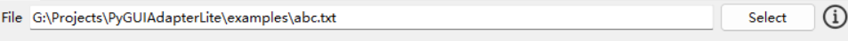

默认控件类：[`FileValueWidget`](pyguiadapterlite/types/paths/fileselect.py#L144)

默认配置类：[`FileValue`](pyguiadapterlite/types/paths/fileselect.py#L24)

可配置属性：

| 字段名             | 类型                                  | 默认值          | 描述                                                         |
| :----------------- | :------------------------------------ | :-------------- | :----------------------------------------------------------- |
| absolutize_path    | `bool`                                | `False`         | 是否绝对化路径                                               |
| allow_backspace    | `bool`                                | `False`         | 在路径输入框为只读状态时，是否允许使用回退键删除输入框内容   |
| dialog_title       | `str`                                 | `"Select File"` | 文件选择对话框标题                                           |
| filters            | `typing.List[typing.Tuple[str, str]]` | `None`          | 文件类型过滤器，格式为[(描述, 后缀名),...]，例如[("Text files", "*.txt"), ("All files", "*")] |
| normalize_path     | `bool`                                | `False`         | 是否将路径规范化                                             |
| readonly           | `bool`                                | `False`         | 是否为只读模式                                               |
| save_file          | `bool`                                | `False`         | 是否为保存文件模式                                           |
| select_button_text | `str`                                 | `"Browse"`      | 浏览按钮文本                                                 |
| start_dir          | `str`                                 | ""              | 起始目录                                                     |

```python
import os.path

from pyguiadapterlite import uprint, GUIAdapter
from pyguiadapterlite.types import file_t, FileValue


def foo(x: file_t):
    uprint(f"x: {x}, {os.path.isfile(x)}")


if __name__ == "__main__":
    adapter = GUIAdapter()
    adapter.add(
        foo,
        x=FileValue(
            label="File",
            default_value="abc.txt",
            start_dir=os.curdir,
            save_file=False,
            filters=[
                ("Python files", "*.py"),
                ("Text files", "*.txt"),
                ("All files", "*.*"),
            ],
            select_button_text="Select",
            normalize_path=True,
            absolutize_path=True,
            readonly=True,
            allow_backspace=True,
            description="Select a file to open",
        ),
    )
    adapter.run()

```


#### （17）`color_hex_t` ——> `HexColorValue`

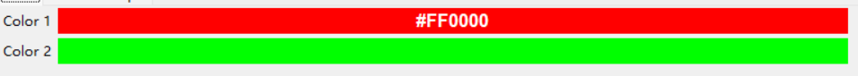

默认控件类：[`HexColorValueWidget`](pyguiadapterlite/types/colors/color.py#L49)

默认配置类：[`HexColorValue`](pyguiadapterlite/types/colors/color.py#L17)

可配置属性：

| 字段名             | 类型                                                         | 默认值                  | 描述                                                         |
| :----------------- | :----------------------------------------------------------- | :---------------------- | :----------------------------------------------------------- |
| borderwidth        | `int`                                                        | `1`                     | 颜色标签的边框宽度                                           |
| color_picker_title | `str`                                                        | ""                      | 颜色选择对话框的标题                                         |
| font               | `typing.Union[tuple, str]`                                   | `('Arial', 13, 'bold')` | 颜色标签的字体                                               |
| height             | `typing.Union[int, NoneType]`                                | `1`                     | 颜色标签的高度                                               |
| relief             | `typing.Literal['flat', 'raised', 'sunken', 'groove', 'ridge']` | `"flat"`                | 颜色标签的边框样式                                           |
| show_color_code    | `bool`                                                       | `True`                  | 是否显示颜色代码                                             |
| show_color_picker  | `bool`                                                       | `True`                  | 是否启用颜色选择对话框，启用时单击颜色标签会弹出颜色选择对话框 |
| width              | `typing.Union[int, NoneType]`                                | `None`                  | 颜色标签的宽度                                               |

```python
from pyguiadapterlite import uprint, GUIAdapter
from pyguiadapterlite.types import color_hex_t, color_t, HexColorValue


def foo(color1: color_hex_t, color2: color_t):
    uprint(f"color1: {color1}")
    uprint(f"color2: {color2}")


if __name__ == "__main__":
    adapter = GUIAdapter()
    adapter.add(
        foo,
        color1=HexColorValue(
            label="Color 1",
            default_value="#FF0000",
            color_picker_title="Choose a color",
            show_color_code=True,
        ),
        color2=HexColorValue(
            label="Color 2",
            default_value="#00FF00",
            color_picker_title="Pick a color",
            show_color_code=False,
        ),
    )
    adapter.run()
```


#### （18）`color_t` ——> `HexColorValue`

> `color_t`与`color_hex_t`相同，参考`color_hex_t`

默认控件类：[`HexColorValueWidget`](pyguiadapterlite/types/colors/color.py#L49)

默认配置类：[`HexColorValue`](pyguiadapterlite/types/colors/color.py#L17)

可配置属性：

| 字段名             | 类型                                                         | 默认值                  | 描述                                                         |
| :----------------- | :----------------------------------------------------------- | :---------------------- | :----------------------------------------------------------- |
| borderwidth        | `int`                                                        | `1`                     | 颜色标签的边框宽度                                           |
| color_picker_title | `str`                                                        | ""                      | 颜色选择对话框的标题                                         |
| font               | `typing.Union[tuple, str]`                                   | `('Arial', 13, 'bold')` | 颜色标签的字体                                               |
| height             | `typing.Union[int, NoneType]`                                | `1`                     | 颜色标签的高度                                               |
| relief             | `typing.Literal['flat', 'raised', 'sunken', 'groove', 'ridge']` | `"flat"`                | 颜色标签的边框样式                                           |
| show_color_code    | `bool`                                                       | `True`                  | 是否显示颜色代码                                             |
| show_color_picker  | `bool`                                                       | `True`                  | 是否启用颜色选择对话框，启用时单击颜色标签会弹出颜色选择对话框 |
| width              | `typing.Union[int, NoneType]`                                | `None`                  | 颜色标签的宽度                                               |


#### （19）`choice_t` ——> `SingleChoiceValue`

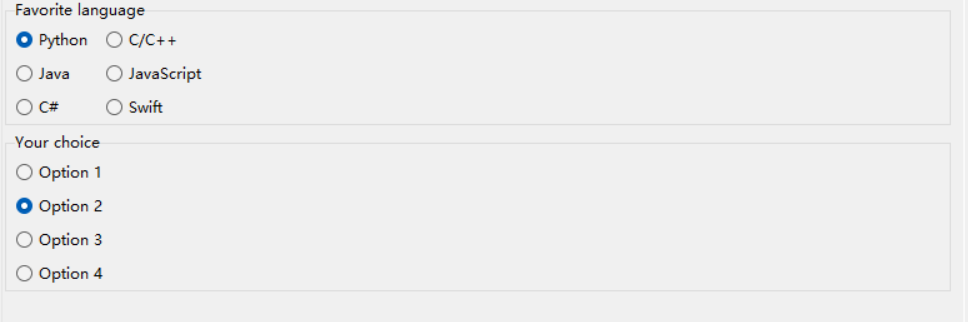

默认控件类：[`SingleChoiceValueWidget`](pyguiadapterlite/types/choices/singlechoice.py#L36)

默认配置类：[`SingleChoiceValue`](pyguiadapterlite/types/choices/singlechoice.py#L16)

可配置属性：

| 字段名        | 类型                                                         | 默认值 | 描述                                                         |
| :------------ | :----------------------------------------------------------- | :----- | :----------------------------------------------------------- |
| choices       | `typing.Union[typing.List[typing.Any], typing.Dict[str, typing.Any]]` | ""     | 可选项，可以是字典或列表，如果是字典，则键值对的`key`为展示给用户的名称，`value`为选项实际值 |
| columns       | `int`                                                        | `1`    | 单选框列数                                                   |
| content_title | `str`                                                        | ""     | 选项外框标题，若为空则将参数名称作为标题                     |

```python
from pyguiadapterlite import uprint, GUIAdapter
from pyguiadapterlite.types import choice_t, SingleChoiceValue


def choice_t_example(arg1: choice_t, arg2: choice_t):
    uprint(f"arg1: {arg1}, type: {type(arg1)}")
    uprint(f"arg2: {arg2}, type: {type(arg2)}")


if __name__ == "__main__":
    adapter = GUIAdapter()
    adapter.add(
        choice_t_example,
        arg1=SingleChoiceValue(
            label="Favorite language",
            choices={
                "Python": 1,
                "C/C++": 2,
                "Java": 3,
                "JavaScript": 4,
                "C#": 5,
                "Swift": 6,
            },
            default_value=1,
            columns=2,
            hide_label=True,
        ),
        arg2=SingleChoiceValue(
            label="Your choice",
            choices=["Option 1", "Option 2", "Option 3", "Option 4"],
            default_value="Option 2",
            columns=1,
        ),
    )
    adapter.run()
```


#### （20）`option_t` ——> `SingleChoiceValue`


> `color_t`与`color_hex_t`相同，参考`color_hex_t`

默认控件类：[`SingleChoiceValueWidget`](pyguiadapterlite/types/choices/singlechoice.py#L36)

默认配置类：[`SingleChoiceValue`](pyguiadapterlite/types/choices/singlechoice.py#L16)

可配置属性：

| 字段名        | 类型                                                         | 默认值 | 描述                                                         |
| :------------ | :----------------------------------------------------------- | :----- | :----------------------------------------------------------- |
| choices       | `typing.Union[typing.List[typing.Any], typing.Dict[str, typing.Any]]` | ""     | 可选项，可以是字典或列表，如果是字典，则键值对的`key`为展示给用户的名称，`value`为选项实际值 |
| columns       | `int`                                                        | `1`    | 单选框列数                                                   |
| content_title | `str`                                                        | ""     | 选项外框标题，若为空则将参数名称作为标题                     |


#### （21）`loose_choice_t` ——> `LooseChoiceValue`

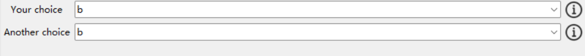

默认控件类：[`LooseChoiceValueWidget`](pyguiadapterlite/types/choices/loosechoice.py#L35)

默认配置类：[`LooseChoiceValue`](pyguiadapterlite/types/choices/loosechoice.py#L15)

可配置属性：

| 字段名         | 类型                                        | 默认值   | 描述                                                         |
| :------------- | :------------------------------------------ | :------- | :----------------------------------------------------------- |
| add_user_input | `bool`                                      | `False`  | 是否将用户输入自定义值添加到可选项列表中                     |
| choices        | `typing.List[str]`                          | ""       | 可选项列表                                                   |
| justify        | `typing.Literal['left', 'center', 'right']` | `"left"` | 对齐方式                                                     |
| readonly       | `bool`                                      | `False`  | 是否只读，若为True则用户只能从可选项列表中选择，为False则用户可以输入自定义值 |

```python
from pyguiadapterlite import uprint, GUIAdapter
from pyguiadapterlite.types import loose_choice_t, LooseChoiceValue


def loose_choice_example(arg1: loose_choice_t, arg2: loose_choice_t):
    uprint(f"arg1: {arg1}")
    uprint(f"arg2: {arg2}")

if __name__ == "__main__":
    adapter = GUIAdapter()
    adapter.add(
        loose_choice_example,
        arg1=LooseChoiceValue(
            label="Your choice",
            choices=["a", "b", "c"],
            default_value="b",
            readonly=False,
            add_user_input=True,
            description="Choose one of the options",
        ),
        arg2=LooseChoiceValue(
            label="Another choice",
            choices=["a", "b", "c"],
            default_value="b",
            readonly=True,
            description="Choose one of the options",
        ),
    )
    adapter.run()
```


#### （22）`choices_t` ——> `MultiChoiceValue`

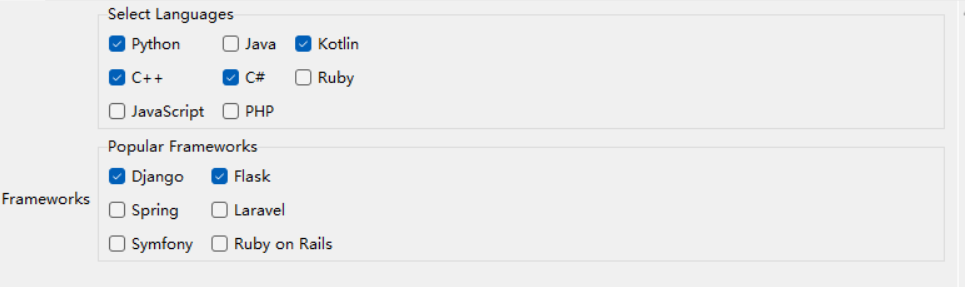

默认控件类：[`MultiChoiceValueWidget`](pyguiadapterlite/types/choices/multichoice.py#L38)

默认配置类：[`MultiChoiceValue`](pyguiadapterlite/types/choices/multichoice.py#L16)

可配置属性：

| 字段名        | 类型                                                         | 默认值 | 描述                                         |
| :------------ | :----------------------------------------------------------- | :----- | :------------------------------------------- |
| choices       | `typing.Union[typing.Dict[str, typing.Any], typing.Iterable[typing.Any]]` | ""     | 可选项列表                                   |
| columns       | `int`                                                        | `2`    | 多选框的列数                                 |
| content_title | `str`                                                        | ""     | 选项外框的标题，如果为空则将参数名称作为标题 |

```python
from pyguiadapterlite import uprint, GUIAdapter
from pyguiadapterlite.types import choices_t, MultiChoiceValue


def choices_t_example(arg1: choices_t, arg2: choices_t):
    uprint(f"arg1: {arg1}, len: {len(arg1)}")
    uprint(f"arg2: {arg2}, len: {len(arg2)}")


if __name__ == "__main__":
    adapter = GUIAdapter()
    adapter.add(
        choices_t_example,
        arg1=MultiChoiceValue(
            label="Select Languages",
            choices=[
                "Python",
                "Java",
                "Kotlin",
                "C++",
                "C#",
                "Ruby",
                "JavaScript",
                "PHP",
            ],
            default_value=["Python", "Kotlin", "C++", "C#"],
            columns=3,
        ),
        arg2=MultiChoiceValue(
            label="Frameworks",
            choices=[
                "Django",
                "Flask",
                "Spring",
                "Laravel",
                "Symfony",
                "Zend",
                "Ruby on Rails",
            ],
            default_value=["Django", "Flask"],
            columns=2,
            content_title="Popular Frameworks",
            hide_label=False,
        ),
    )
    adapter.run()
```


#### （23）`options_t` ——> `MultiChoiceValue`

> `options_t`与`choices_t`相同，参考`choices_t`

默认控件类：[`MultiChoiceValueWidget`](pyguiadapterlite/types/choices/multichoice.py#L38)

默认配置类：[`MultiChoiceValue`](pyguiadapterlite/types/choices/multichoice.py#L16)

可配置属性：

| 字段名        | 类型                                                         | 默认值 | 描述                                         |
| :------------ | :----------------------------------------------------------- | :----- | :------------------------------------------- |
| choices       | `typing.Union[typing.Dict[str, typing.Any], typing.Iterable[typing.Any]]` | ""     | 可选项列表                                   |
| columns       | `int`                                                        | `2`    | 多选框的列数                                 |
| content_title | `str`                                                        | ""     | 选项外框的标题，如果为空则将参数名称作为标题 |


#### （24）`string_list_t` ——> `StringListValue`

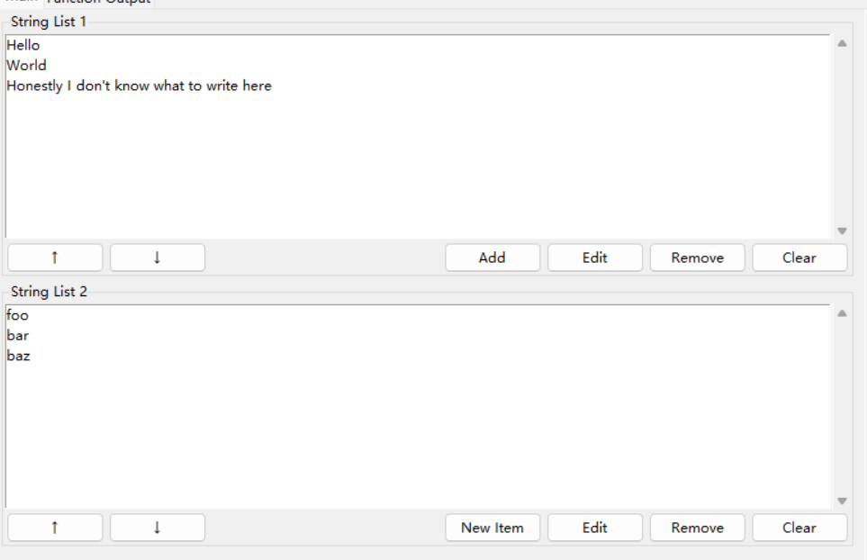

默认控件类：[`StringListValueWidget`](pyguiadapterlite/types/lists/strlist.py#L157)

默认配置类：[`StringListValue`](pyguiadapterlite/types/lists/strlist.py#L26)

可配置属性：

| 字段名                      | 类型                                  | 默认值                                          | 描述                                                         |
| :-------------------------- | :------------------------------------ | :---------------------------------------------- | :----------------------------------------------------------- |
| accept_duplicates           | `bool`                                | `True`                                          | 是否接受重复项                                               |
| accept_empty                | `bool`                                | `True`                                          | 是否接受空字符串                                             |
| add_button                  | `bool`                                | `True`                                          | 是否显示添加按钮                                             |
| add_button_text             | `str`                                 | `"Add"`                                         | 添加按钮文本                                                 |
| add_item_dialog_label_text  | `str`                                 | `"Add a new item:"`                             | 添加项对话框标签文本                                         |
| add_item_dialog_title       | `str`                                 | `"Add Item"`                                    | 添加项对话框标题                                             |
| add_method                  | `typing.Literal['append', 'prepend']` | `"append"`                                      | 添加方法，append表示在列表尾部添加，prepend表示在列表头部添加 |
| duplicate_message           | `str`                                 | `"An item with the same value already exists!"` | 重复项警告信息                                               |
| edit_item_dialog_label_text | `str`                                 | `"Edit the item:"`                              | 编辑项对话框标签文本                                         |
| edit_item_dialog_title      | `str`                                 | `"Edit Item"`                                   | 编辑项对话框标题                                             |
| empty_string_message        | `str`                                 | `"The string to be added cannot be empty!"`     | 空字符串警告信息                                             |
| multi_selection_message     | `str`                                 | `"Please select only one item!"`                | 多选警告信息                                                 |
| strip                       | `bool`                                | `False`                                         | 是否去除输入字符串两端的空格                                 |

```python
from pyguiadapterlite import uprint, GUIAdapter
from pyguiadapterlite.types import string_list, str_list, StringListValue


def foo(arg1: string_list, arg2: str_list):
    uprint("arg1:", arg1)
    uprint("arg2:", arg2)


if __name__ == "__main__":
    adapter = GUIAdapter()
    adapter.add(
        foo,
        arg1=StringListValue(
            label="String List 1",
            default_value=[
                "Hello",
                "World",
                "Honestly I don't know what to write here",
            ],
            add_button=True,
            add_button_text="Add",
            add_method="append",
            strip=False,
            accept_empty=True,
            accept_duplicates=True,
        ),
        arg2=StringListValue(
            label="String List 2",
            default_value=["foo", "bar", "baz"],
            add_button=True,
            add_button_text="New Item",
            add_method="append",
            strip=True,
            accept_empty=False,
            accept_duplicates=False,
        ),
    )
    adapter.run()
```


#### （25）`string_list` ——> `StringListValue`

> 同`string_list_t`，参考`string_list_t`

默认控件类：[`StringListValueWidget`](pyguiadapterlite/types/lists/strlist.py#L157)

默认配置类：[`StringListValue`](pyguiadapterlite/types/lists/strlist.py#L26)

可配置属性：

| 字段名                      | 类型                                  | 默认值                                          | 描述                                                         |
| :-------------------------- | :------------------------------------ | :---------------------------------------------- | :----------------------------------------------------------- |
| accept_duplicates           | `bool`                                | `True`                                          | 是否接受重复项                                               |
| accept_empty                | `bool`                                | `True`                                          | 是否接受空字符串                                             |
| add_button                  | `bool`                                | `True`                                          | 是否显示添加按钮                                             |
| add_button_text             | `str`                                 | `"Add"`                                         | 添加按钮文本                                                 |
| add_item_dialog_label_text  | `str`                                 | `"Add a new item:"`                             | 添加项对话框标签文本                                         |
| add_item_dialog_title       | `str`                                 | `"Add Item"`                                    | 添加项对话框标题                                             |
| add_method                  | `typing.Literal['append', 'prepend']` | `"append"`                                      | 添加方法，append表示在列表尾部添加，prepend表示在列表头部添加 |
| duplicate_message           | `str`                                 | `"An item with the same value already exists!"` | 重复项警告信息                                               |
| edit_item_dialog_label_text | `str`                                 | `"Edit the item:"`                              | 编辑项对话框标签文本                                         |
| edit_item_dialog_title      | `str`                                 | `"Edit Item"`                                   | 编辑项对话框标题                                             |
| empty_string_message        | `str`                                 | `"The string to be added cannot be empty!"`     | 空字符串警告信息                                             |
| multi_selection_message     | `str`                                 | `"Please select only one item!"`                | 多选警告信息                                                 |
| strip                       | `bool`                                | `False`                                         | 是否去除输入字符串两端的空格                                 |


#### （26）`str_list` ——> `StringListValue`

>同`string_list_t`，参考`string_list_t`

默认控件类：[`StringListValueWidget`](pyguiadapterlite/types/lists/strlist.py#L157)

默认配置类：[`StringListValue`](pyguiadapterlite/types/lists/strlist.py#L26)

可配置属性：

| 字段名                      | 类型                                  | 默认值                                          | 描述                                                         |
| :-------------------------- | :------------------------------------ | :---------------------------------------------- | :----------------------------------------------------------- |
| accept_duplicates           | `bool`                                | `True`                                          | 是否接受重复项                                               |
| accept_empty                | `bool`                                | `True`                                          | 是否接受空字符串                                             |
| add_button                  | `bool`                                | `True`                                          | 是否显示添加按钮                                             |
| add_button_text             | `str`                                 | `"Add"`                                         | 添加按钮文本                                                 |
| add_item_dialog_label_text  | `str`                                 | `"Add a new item:"`                             | 添加项对话框标签文本                                         |
| add_item_dialog_title       | `str`                                 | `"Add Item"`                                    | 添加项对话框标题                                             |
| add_method                  | `typing.Literal['append', 'prepend']` | `"append"`                                      | 添加方法，append表示在列表尾部添加，prepend表示在列表头部添加 |
| duplicate_message           | `str`                                 | `"An item with the same value already exists!"` | 重复项警告信息                                               |
| edit_item_dialog_label_text | `str`                                 | `"Edit the item:"`                              | 编辑项对话框标签文本                                         |
| edit_item_dialog_title      | `str`                                 | `"Edit Item"`                                   | 编辑项对话框标题                                             |
| empty_string_message        | `str`                                 | `"The string to be added cannot be empty!"`     | 空字符串警告信息                                             |
| multi_selection_message     | `str`                                 | `"Please select only one item!"`                | 多选警告信息                                                 |
| strip                       | `bool`                                | `False`                                         | 是否去除输入字符串两端的空格                                 |


#### （27）`path_list_t` ——> `PathListValue`

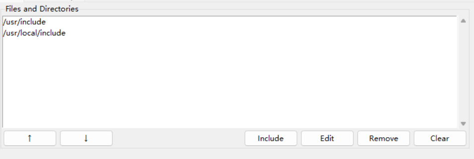

> 部分字段继承自StringListValue，参考`string_list_t`

默认控件类：[`PathListValueWidget`](pyguiadapterlite/types/lists/pathlist.py#L226)

默认配置类：[`PathListValue`](pyguiadapterlite/types/lists/pathlist.py#L35)

可配置属性：

| 字段名                      | 类型                                  | 默认值                                           | 描述                                                         |
| :-------------------------- | :------------------------------------ | :----------------------------------------------- | :----------------------------------------------------------- |
| absolutize_path             | `bool`                                | `True`                                           | 是否将路径绝对化                                             |
| accept_duplicates           | `bool`                                | `False`                                          | 是否接受重复路径                                             |
| accept_empty                | `bool`                                | `False`                                          | 是否接受空路径                                               |
| add_button_text             | `str`                                 | `"Add"`                                          | 添加按钮文本                                                 |
| add_dir_button_text         | `typing.Union[str, NoneType]`         | `"Folder"`                                       | 添加目录按钮文本                                             |
| add_file_button_text        | `typing.Union[str, NoneType]`         | `"File"`                                         | 添加文件按钮文本                                             |
| add_method                  | `typing.Literal['append', 'prepend']` | `"append"`                                       | 添加方法，append表示在列表尾部添加，prepend表示在列表头部添加 |
| add_path_dialog_label_text  | `str`                                 | `"Add a new path:"`                              | 添加路径对话框标签文本                                       |
| add_path_dialog_title       | `str`                                 | `"Add Path"`                                     | 添加路径对话框标题                                           |
| dir_dialog_title            | `str`                                 | `"Select Directory"`                             | 目录对话框标题                                               |
| duplicate_message           | `str`                                 | `"The path has already been added to the list!"` | 重复路径警告信息                                             |
| edit_path_dialog_label_text | `str`                                 | `"Edit the path:"`                               | 编辑路径对话框标签文本                                       |
| edit_path_dialog_title      | `str`                                 | `"Edit Path"`                                    | 编辑路径对话框标题                                           |
| empty_path_message          | `str`                                 | `"The path cannot be empty!"`                    | 空路径警告信息                                               |
| file_dialog_action          | `typing.Literal['open', 'save']`      | `"open"`                                         | 文件对话框的行为，open表示打开文件，save表示保存文件         |
| file_dialog_title           | `str`                                 | `"Select File"`                                  | 文件对话框标题                                               |
| filters                     | `typing.List[typing.Tuple[str, str]]` | ""                                               | 文件类型过滤器                                               |
| multi_selection_message     | `str`                                 | `"Please select only one item!"`                 | 多选警告信息                                                 |
| normalize_path              | `bool`                                | `True`                                           | 是否将路径规范化                                             |
| start_dir                   | `str`                                 | ""                                               | 打开文件对话框的初始目录                                     |
| strip                       | `bool`                                | `True`                                           | 是否去除路径两端的空格                                       |

```python
import os

from pyguiadapterlite import uprint, GUIAdapter
from pyguiadapterlite.types import path_list_t, PathListValue


def foo(paths_1: path_list_t):
    uprint("paths_1:", paths_1)


if __name__ == "__main__":
    adapter = GUIAdapter()
    adapter.add(
        foo,
        paths_1=PathListValue(
            label="Files and Directories",
            default_value=["/usr/include", "/usr/local/include"],
            add_button_text="Include",
            start_dir=os.path.expanduser("~"),
            filters=[("Header files", "*.h"), ("All files", "*")],
            file_dialog_title="Select File",
            dir_dialog_title="Select Directory",
            add_file_button_text="Add File",
            add_dir_button_text="Add Directory",
            strip=True,
            accept_empty=False,
            accept_duplicates=False,
            normalize_path=True,
            absolutize_path=True,
        ),
    )
    adapter.run()
```


#### （28）`path_list` ——> `PathListValue`

> 同`path_list_t`，参考`path_list_t`

默认控件类：[`PathListValueWidget`](pyguiadapterlite/types/lists/pathlist.py#L226)

默认配置类：[`PathListValue`](pyguiadapterlite/types/lists/pathlist.py#L35)

可配置属性：

| 字段名                      | 类型                                  | 默认值                                           | 描述                                                         |
| :-------------------------- | :------------------------------------ | :----------------------------------------------- | :----------------------------------------------------------- |
| absolutize_path             | `bool`                                | `True`                                           | 是否将路径绝对化                                             |
| accept_duplicates           | `bool`                                | `False`                                          | 是否接受重复路径                                             |
| accept_empty                | `bool`                                | `False`                                          | 是否接受空路径                                               |
| add_button_text             | `str`                                 | `"Add"`                                          | 添加按钮文本                                                 |
| add_dir_button_text         | `typing.Union[str, NoneType]`         | `"Folder"`                                       | 添加目录按钮文本                                             |
| add_file_button_text        | `typing.Union[str, NoneType]`         | `"File"`                                         | 添加文件按钮文本                                             |
| add_method                  | `typing.Literal['append', 'prepend']` | `"append"`                                       | 添加方法，append表示在列表尾部添加，prepend表示在列表头部添加 |
| add_path_dialog_label_text  | `str`                                 | `"Add a new path:"`                              | 添加路径对话框标签文本                                       |
| add_path_dialog_title       | `str`                                 | `"Add Path"`                                     | 添加路径对话框标题                                           |
| dir_dialog_title            | `str`                                 | `"Select Directory"`                             | 目录对话框标题                                               |
| duplicate_message           | `str`                                 | `"The path has already been added to the list!"` | 重复路径警告信息                                             |
| edit_path_dialog_label_text | `str`                                 | `"Edit the path:"`                               | 编辑路径对话框标签文本                                       |
| edit_path_dialog_title      | `str`                                 | `"Edit Path"`                                    | 编辑路径对话框标题                                           |
| empty_path_message          | `str`                                 | `"The path cannot be empty!"`                    | 空路径警告信息                                               |
| file_dialog_action          | `typing.Literal['open', 'save']`      | `"open"`                                         | 文件对话框的行为，open表示打开文件，save表示保存文件         |
| file_dialog_title           | `str`                                 | `"Select File"`                                  | 文件对话框标题                                               |
| filters                     | `typing.List[typing.Tuple[str, str]]` | ""                                               | 文件类型过滤器                                               |
| multi_selection_message     | `str`                                 | `"Please select only one item!"`                 | 多选警告信息                                                 |
| normalize_path              | `bool`                                | `True`                                           | 是否将路径规范化                                             |
| start_dir                   | `str`                                 | ""                                               | 打开文件对话框的初始目录                                     |
| strip                       | `bool`                                | `True`                                           | 是否去除路径两端的空格                                       |


#### （29）`paths_t` ——> `PathListValue`

> 同`path_list_t`，参考`path_list_t`

默认控件类：[`PathListValueWidget`](pyguiadapterlite/types/lists/pathlist.py#L226)

默认配置类：[`PathListValue`](pyguiadapterlite/types/lists/pathlist.py#L35)

可配置属性：

| 字段名                      | 类型                                  | 默认值                                           | 描述                                                         |
| :-------------------------- | :------------------------------------ | :----------------------------------------------- | :----------------------------------------------------------- |
| absolutize_path             | `bool`                                | `True`                                           | 是否将路径绝对化                                             |
| accept_duplicates           | `bool`                                | `False`                                          | 是否接受重复路径                                             |
| accept_empty                | `bool`                                | `False`                                          | 是否接受空路径                                               |
| add_button_text             | `str`                                 | `"Add"`                                          | 添加按钮文本                                                 |
| add_dir_button_text         | `typing.Union[str, NoneType]`         | `"Folder"`                                       | 添加目录按钮文本                                             |
| add_file_button_text        | `typing.Union[str, NoneType]`         | `"File"`                                         | 添加文件按钮文本                                             |
| add_method                  | `typing.Literal['append', 'prepend']` | `"append"`                                       | 添加方法，append表示在列表尾部添加，prepend表示在列表头部添加 |
| add_path_dialog_label_text  | `str`                                 | `"Add a new path:"`                              | 添加路径对话框标签文本                                       |
| add_path_dialog_title       | `str`                                 | `"Add Path"`                                     | 添加路径对话框标题                                           |
| dir_dialog_title            | `str`                                 | `"Select Directory"`                             | 目录对话框标题                                               |
| duplicate_message           | `str`                                 | `"The path has already been added to the list!"` | 重复路径警告信息                                             |
| edit_path_dialog_label_text | `str`                                 | `"Edit the path:"`                               | 编辑路径对话框标签文本                                       |
| edit_path_dialog_title      | `str`                                 | `"Edit Path"`                                    | 编辑路径对话框标题                                           |
| empty_path_message          | `str`                                 | `"The path cannot be empty!"`                    | 空路径警告信息                                               |
| file_dialog_action          | `typing.Literal['open', 'save']`      | `"open"`                                         | 文件对话框的行为，open表示打开文件，save表示保存文件         |
| file_dialog_title           | `str`                                 | `"Select File"`                                  | 文件对话框标题                                               |
| filters                     | `typing.List[typing.Tuple[str, str]]` | ""                                               | 文件类型过滤器                                               |
| multi_selection_message     | `str`                                 | `"Please select only one item!"`                 | 多选警告信息                                                 |
| normalize_path              | `bool`                                | `True`                                           | 是否将路径规范化                                             |
| start_dir                   | `str`                                 | ""                                               | 打开文件对话框的初始目录                                     |
| strip                       | `bool`                                | `True`                                           | 是否去除路径两端的空格                                       |


#### （30）`file_list_t` ——> `FileListValue`

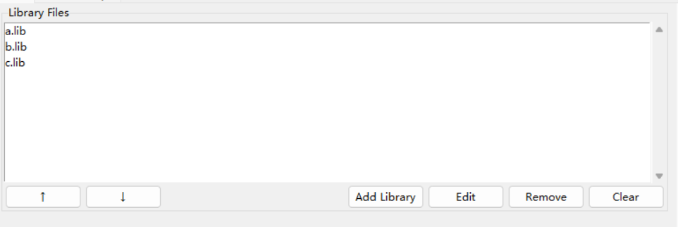

默认控件类：[`FileListValueWidget`](pyguiadapterlite/types/lists/pathlist.py#L257)

默认配置类：[`FileListValue`](pyguiadapterlite/types/lists/pathlist.py#L249)

可配置属性：

```python
from pyguiadapterlite import uprint, GUIAdapter
from pyguiadapterlite.types import file_list, FileListValue


def foo(files_arg: file_list):
    uprint("files:", files_arg)


if __name__ == "__main__":
    adapter = GUIAdapter()
    adapter.add(
        foo,
        files_arg=FileListValue(
            label="Library Files",
            default_value=["a.lib", "b.lib", "c.lib"],
            filters=[("Library Files", "*.lib"), ("All Files", "*.*")],
            start_dir="./",
            strip=True,
            absolutize_path=True,
            normalize_path=True,
            accept_duplicates=False,
            accept_empty=False,
            add_button_text="Add Library",
            add_file_button_text="Select Library File",
            add_method="prepend",
            file_dialog_title="Select Library File",
        ),
    )
    adapter.run()
```


#### （31）`file_list` ——> `FileListValue`

> 同`file_list_t`

默认控件类：[`FileListValueWidget`](pyguiadapterlite/types/lists/pathlist.py#L257)

默认配置类：[`FileListValue`](pyguiadapterlite/types/lists/pathlist.py#L249)


#### （32）`files_t` ——> `FileListValue`

> 同`file_list_t`

默认控件类：[`FileListValueWidget`](pyguiadapterlite/types/lists/pathlist.py#L257)

默认配置类：[`FileListValue`](pyguiadapterlite/types/lists/pathlist.py#L249)


#### （33）`dir_list_t` ——> `DirectoryListValue`

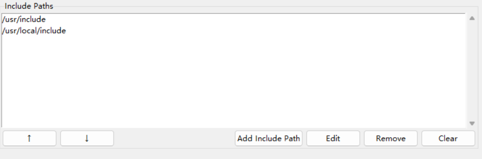

默认控件类：[`DirectoryListValueWidget`](pyguiadapterlite/types/lists/pathlist.py#L275)

默认配置类：[`DirectoryListValue`](pyguiadapterlite/types/lists/pathlist.py#L267)

可配置属性：参考`path_list_t`、`file_list_t`

```python
from pyguiadapterlite import uprint, GUIAdapter
from pyguiadapterlite.types import dir_list, DirectoryListValue


def foo(dir_paths: dir_list):
    uprint("dir_paths:", dir_paths)


if __name__ == "__main__":
    adapter = GUIAdapter()
    adapter.add(
        foo,
        dir_paths=DirectoryListValue(
            label="Include Paths",
            default_value=["/usr/include", "/usr/local/include"],
            start_dir="/",
            add_button_text="Add Include Path",
            add_path_dialog_label_text="Select Include Path",
            add_dir_button_text="Add Include Directory",
            dir_dialog_title="Select Include Directory",
            strip=True,
            accept_empty=False,
            accept_duplicates=False,
            normalize_path=False,
            absolutize_path=True,
        ),
    )
    adapter.run()
```


#### （34）`dir_list` ——> `DirectoryListValue`

> 同`dir_list_t`

默认控件类：[`DirectoryListValueWidget`](pyguiadapterlite/types/lists/pathlist.py#L275)

默认配置类：[`DirectoryListValue`](pyguiadapterlite/types/lists/pathlist.py#L267)

可配置属性：


#### （35）`dirs_t` ——> `DirectoryListValue`

> 同`dir_list_t`

默认控件类：[`DirectoryListValueWidget`](pyguiadapterlite/types/lists/pathlist.py#L275)

默认配置类：[`DirectoryListValue`](pyguiadapterlite/types/lists/pathlist.py#L267)

可配置属性：